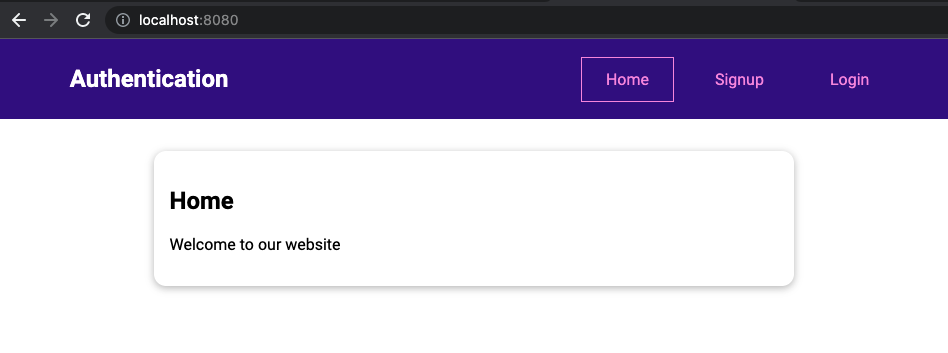
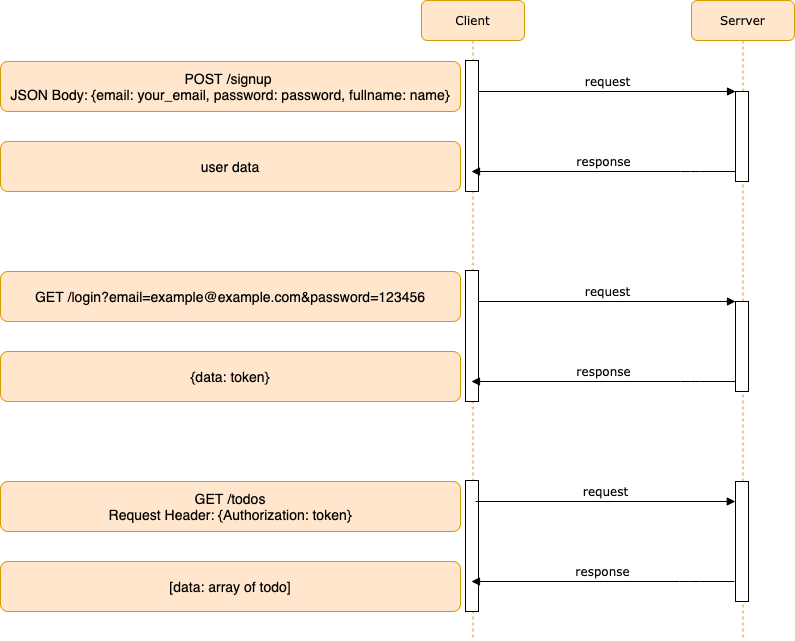
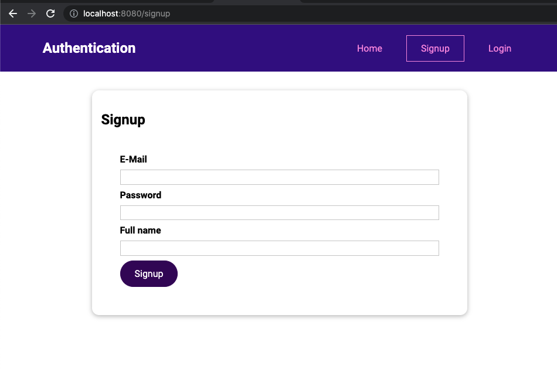
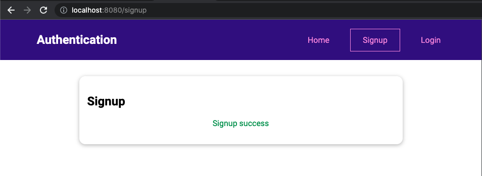
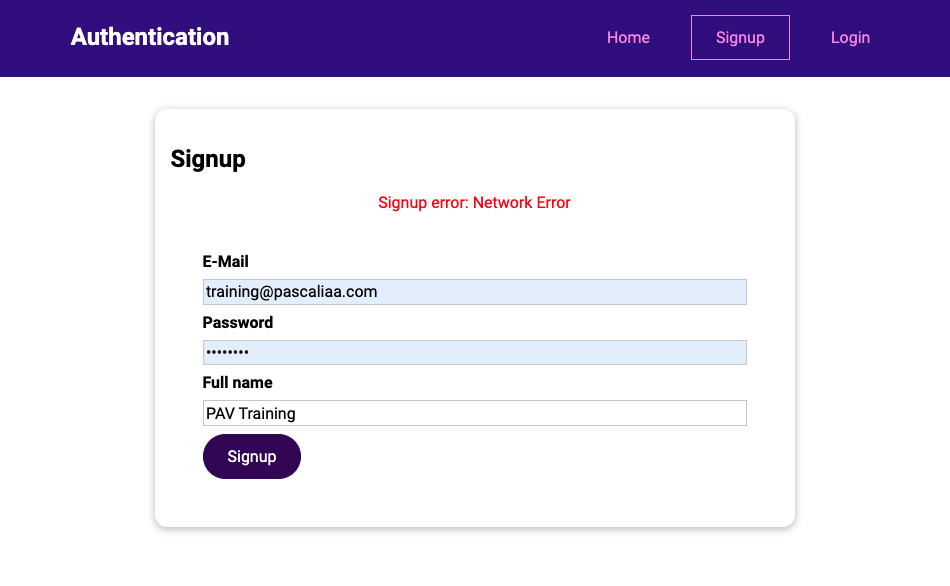
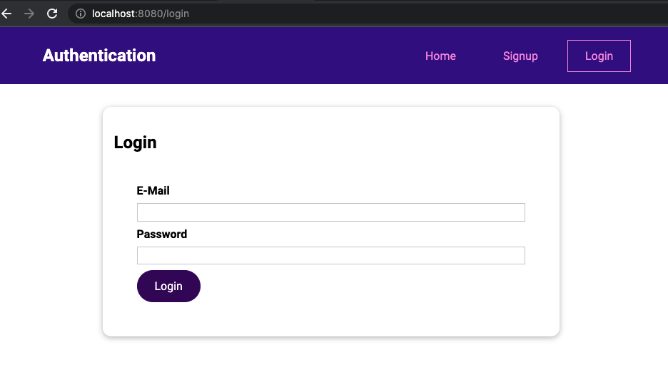
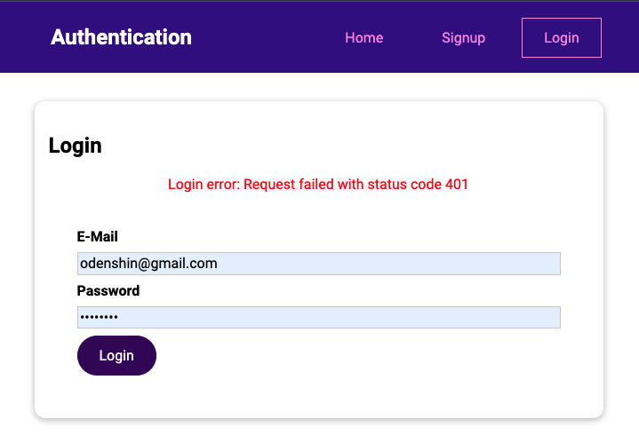
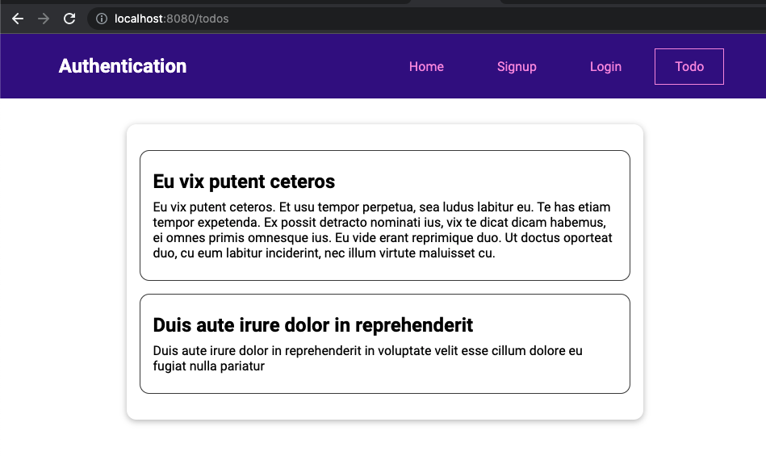
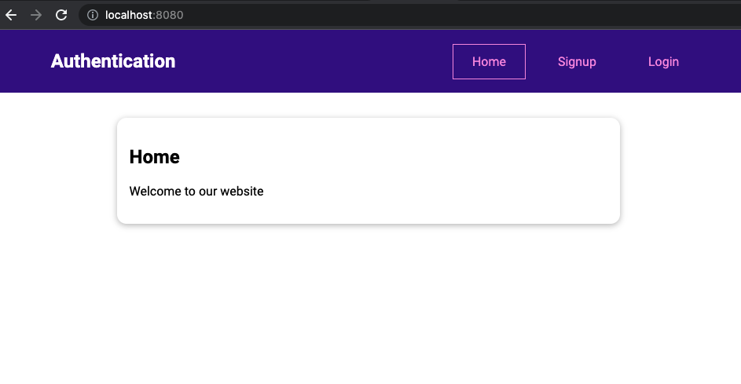
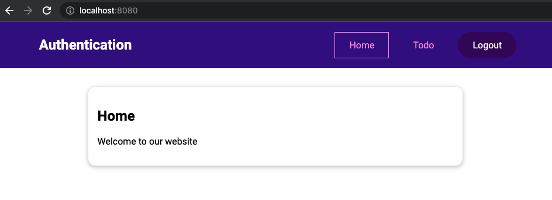

# Authentication in Vue Application

## Preparation

### Download Starting Source Code

Download starting source code at https://gitlab.com/pav-training-program/source-code/vue-starting-source-code/-/tree/main/auth

This project just contains simple pages: Home, Signup Form, Login Form.



### Start API Server

**YOU MUST STOP MySQL on YOUR LOCAL BEFORE STARTING**

[HERE](https://gitlab.com/pav-training-program/source-code/mock-server) is a API Server with some basic APIs for authentication. Download this project and follow the tutorial on README file (Start Server) on the project to start server.

After started server, if you access to http://localhost:5151/login?email=admin@admin.com&password=123456, the repose will be below:

```json
{
  "error": "incorrect user_id/pwd"
}
```

### Authentication Request Sequence



## User Signup Page



We already have form for Signup. Now we will implement signup page: when use fill information into the form and submit, we will call API *http://localhost:5151/signup* to create new user with the submitted information.

## Setup Vuex Store

First, let setup Vuex store for authentication, as we learned in previous chapter, we need to create below files:

```
store/
  |-- auth
    |-- actions.js
    |-- getters.js
    |-- index.js
    |-- mutations.js
```

In Signup page, we don't need any global state here.

> File *auth/src/store/modules/auth/index.js*
```js
import mutations from './mutations.js';
import actions from './actions.js';
import getters from './getters.js';

export default {
  state() {
    return {
    };
  },
  mutations,
  actions,
  getters
};
```

Then now we will implement *mutations*, but because we have no state now, so that we *mutations* is empty.

> File *auth/src/store/modules/auth/mutations.js*
```js
export default {

};
```

And add *getters*, but we and so don't need getter at this moment.

> File *auth/src/store/modules/auth/getters.js*
```js
export default {

};
```

And we also need to call API to create user. Because calling API use async code, we need to put it into *actions* as we learned at [previous chapter](./vuex.md#running-async-code-with-actions).

> File *auth/src/store/modules/auth/actions.js*
```js
import axios from 'axios';

export default {
  async signup(_, payload) {
    await axios.post("http://localhost:5151/signup", payload);
  },
};
```

Now, use *modules* to include the store in root.

> File *auth/src/store/index.js*
```js
import { createStore } from 'vuex';
import auth from './modules/auth/index';

const store = createStore({
  modules: {
    auth: auth,
  }
});

export default store;
```

### Implement Signup Component

After setup the store for signup, let implement Signup Component. The source code just apply what we learned earlier, so that we don't explain detail.

> File *auth/src/pages/auth/Signup.vue*
```vue
<template>
  <base-card>
    <h2>Signup</h2>
    <p class="error" v-if="errorMsg">Signup error: {{ errorMsg }}</p>
    <p class="success" v-if="isSuccess">Signup success</p>
    <form @submit.prevent="submitForm" v-if="!isSuccess">
      <div class="form-control">
        <label for="email">E-Mail</label>
        <input type="email" id="email" v-model.trim="email" />
      </div>
      <div class="form-control">
        <label for="password">Password</label>
        <input type="password" id="password" v-model.trim="password" />
      </div>
      <div class="form-control">
        <label for="fullname">Full name</label>
        <input type="fullname" id="fullname" v-model.trim="fullname" />
      </div>
      <p v-if="!formIsValid">
        Please enter a valid email and password (password must be at least 6
        characters long).
      </p>
      <base-button>Signup</base-button>
    </form>
  </base-card>
</template>

<script>
export default {
  data() {
    return {
      email: "",
      password: "",
      fullname: "",
      formIsValid: true,
      isSuccess: false,
      errorMsg: "",
    };
  },
  methods: {
    async submitForm() {
      this.formIsValid = true;
      if (
        this.email === "" ||
        !this.email.includes("@") ||
        this.password.length < 6
      ) {
        this.formIsValid = false;
        return;
      }

      try {
        await this.$store.dispatch("signup", {
          email: this.email,
          password: this.password,
          fullname: this.fullname,
        });
        this.isSuccess = true;
      } catch (err) {
        this.errorMsg = err.message;
      }
    },
  },
};
</script>

<style scoped>
form {
  margin: 1rem;
  padding: 1rem;
}

.form-control {
  margin: 0.5rem 0;
}

label {
  font-weight: bold;
  margin-bottom: 0.5rem;
  display: block;
}

input,
textarea {
  display: block;
  width: 100%;
  font: inherit;
  border: 1px solid #ccc;
  padding: 0.15rem;
}

input:focus,
textarea:focus {
  border-color: #3d008d;
  background-color: #faf6ff;
  outline: none;
}

.error {
  color: red;
  text-align: center;
}
.success {
  color: rgb(15, 152, 77);
  text-align: center;
}
</style>
```

Open Signup Page, enter valid email, password, fullname and submit form, you can see a screen like below:



In the case of API returns error, you can see the result like this:



## User Login Page

Click on menu *Login*, you can see a login form like this:



We handle user login following below step first, then improve in next steps:

1. Input email and password.
2. Call API Login with request params is username and password
3. If calling API successfully, store response token in a state named *token*. If the token is not empty string, mean that user logged in.
4. If API response error, show error message to UI.

### Setup Vuex store for Login

We will define a state *token* store the token

```js
import mutations from './mutations.js';
import actions from './actions.js';
import getters from './getters.js';

export default {
  state() {
    return {
      token: null,
    };
  },
  mutations,
  actions,
  getters
};
```


And we also need to implement *mutation* named *setLogin* to update the token state.

> File *auth/src/store/modules/auth/mutations.js*
```js
export default {
  setLogin(state, payload) {
    state.token = payload.token;
  }
};
```

We also add getters to get login states.
> File *auth/src/store/modules/auth/getters.js*
```js
export default {
  token(state) {
    return state.token
  },
  isLoggedIn(state) {
    return !!state.token;
  },
};
```

Then add actions to call login API.
> File *auth/src/store/modules/auth/actions.js*
```js
import axios from "axios";

export default {
  signup(context, payload) {
    ....
    // keep signup source code as current
  },

  async login(context, payload) {
    const response = await axios.post("http://localhost:5151/login", payload);
    const token = response.data.data;

    // call mutations to update token
    context.commit("setLogin", {
      token: token,
    });
  },
};

```

### Implement Login Component

Now, we will implement login component. It is almost same with Signup component.

> File *auth/src/pages/auth/Login.vue*
```vue
<template>
  <base-card>
    <h2>Login</h2>
    <p class="error" v-if="loginErrorMsg">Login error: {{ loginErrorMsg }}</p>
    <form @submit.prevent="submitForm">
      <div class="form-control">
        <label for="email">E-Mail</label>
        <input type="email" id="email" v-model.trim="email" />
      </div>
      <div class="form-control">
        <label for="password">Password</label>
        <input type="password" id="password" v-model.trim="password" />
      </div>
      <p
        v-if="!formIsValid"
      >Please enter a valid email and password (password must be at least 6 characters long).</p>
      <base-button>Login</base-button>
    </form>
  </base-card>
</template>

<script>
export default {
  data() {
    return {
      email: '',
      password: '',
      formIsValid: true,
      loginErrorMsg: '',
    };
  },
  methods: {
    async submitForm() {
      this.formIsValid = true;
      if (
        this.email === '' ||
        !this.email.includes('@') ||
        this.password.length < 6
      ) {
        this.formIsValid = false;
        return;
      }

      try {
        await this.$store.dispatch('login', {
          email: this.email,
          password: this.password,
        });
        
        // redirect to homepage after logged in
        this.$router.push({path: '/'});
      } catch (err) {
        this.loginErrorMsg = err.message || 'Something went wrong!';
      }
    }
  }
};
</script>

<style scoped>
form {
  margin: 1rem;
  padding: 1rem;
}

.form-control {
  margin: 0.5rem 0;
}

label {
  font-weight: bold;
  margin-bottom: 0.5rem;
  display: block;
}

input,
textarea {
  display: block;
  width: 100%;
  font: inherit;
  border: 1px solid #ccc;
  padding: 0.15rem;
}

input:focus,
textarea:focus {
  border-color: #3d008d;
  background-color: #faf6ff;
  outline: none;
}

.error {
  color: red;
  text-align: center;
}
</style>
```

Now, let open Login page http://localhost:8080/login, and enter username, password that you created in Signup. You will be navigated home page, and if open console log, you can see the token is shown here.

If you entered invalid username/password, you can see the error:




At this moment, we just save the login token in the *token* state. We will work with this token in next section.

## Authentication and Routing

With current implementation, even Login or not, they can access all pages. We will handle routing: if a logged in user access to Login or Signup page, we will redirect them to home page.

In order to to it, we will use Navigation Guards as below:

> File *auth/src/router.js*
```js
import { createRouter, createWebHistory } from 'vue-router';

import Home from './pages/home/Home.vue';
import Signup from './pages/auth/Signup.vue';
import Login from './pages/auth/Login.vue';
import NotFound from './pages/NotFound.vue';
import store  from './store';

const router = createRouter({
  history: createWebHistory(),
  routes: [
    { path: '/', component: Home },
    { path: '/signup', component: Signup, meta: {requiredUnLoggedIn: true} },
    { path: '/login', component: Login, meta: {requiredUnLoggedIn: true} },
    { path: '/:notFound(.*)', component: NotFound }
  ]
});

router.beforeEach(function(to, _, next) {
  if (to.meta.requiredUnLoggedIn && store.getters.isLoggedIn) {
    next('/');
  } else {
    next();
  }
});

export default router;
```

Let check the result again. Reload page, open login and process to login. After logged in, you will be navigated to home page. And try to click on *Login, Signup*, you can see that you can't access these pages.

## Save the login token 

With current implementation, after logged in, if we reload page, we can see user will be logged out again. That is because of we are storing token in state. When reload page, the state will be lost. We will save it into browser local storage to re-use it after reload page.

> File *auth/src/store/modules/auth/actions.js*
```js
import axios from "axios";

export default {
  async signup(_, payload) {
    await axios.post("http://localhost:5151/signup", payload);
  },

  async login(context, payload) {
    const response = await axios.post("http://localhost:5151/login", payload);
    const token = response.data.data;
    console.log(token);

    // call mutations to update token
    context.commit("setLogin", {
      token: token,
    });

    // save token into local storage
    localStorage.setItem('token', token);
  },
  tryLogin(context) {
    // get saved token from local storage
    const token = localStorage.getItem("token");

    if (token) {
      context.commit("setLogin", {
        token: token,
      });
    }
  },
};

```

Then, in *App.js*, we will dispatch the action (in created) to do auto login by using saved token.

> File *auth/src/App.vue*
```vue
<template>
  <the-header></the-header>
  <router-view></router-view>
</template>

<script>
import TheHeader from './components/layout/TheHeader.vue';

export default {
  components: {
    TheHeader
  },
  created() {
    // dispatch login action to login by saved token
    this.$store.dispatch('tryLogin');
  }
}
</script>

<style>
...
</style>
```

At this moment, if you login and reload page, you see that login status is still kept.

## Using saved token to request Protected Resource.

After login and saved token, we will use this token to request protected resources on API server, such as getting Todo List

### Todo List Page

Now, we will use saved token to request to api to get Todos List. The API Endpoint is http://localhost:5151/todos (Please check more detail for how to using API at https://gitlab.com/pav-training-program/source-code/mock-server)



### Setup store for Todo Pages

As the UI, we can see that we need a state to manage todos list, we will define it as below:

> File *auth/src/store/modules/todo/index.js*
```js
import mutations from './mutations.js';
import actions from './actions.js';
import getters from './getters.js';

export default {
  state() {
    return {
      todos: [],
    };
  },
  mutations,
  actions,
  getters
};
```

And define a getter to get todos

> File *auth/src/store/modules/todo/getters.js*
```js
export default {
  todos(state) {
    return state.todos;
  }
};
```

We also need a mutation to mutate the todos.

> File *auth/src/store/modules/todo/mutations.js*
```js
export default {
  setTodos(state, payload) {
    state.todos = payload.todos;
  }
};
```

Then, we define action to call Todos List API.

> File *auth/src/store/modules/todo/actions.js*
```js
import axios from "axios";

export default {
  async getTodos(context) {
    const token = context.rootGetters.token;
    const response = await axios.get("http://localhost:5151/todos", {
      headers: {
        Authorization: token,
      },
    });

    const todos = response.data.data;
    context.commit("setTodos", {
      todos: todos,
    });
    console.log(todos);
  },
};
```

### Create TodoList Components

We just apply what we learned to create Todo Components, so that we don't need to explain detail. Let check the source code.

> File *auth/src/components/todos/TodoItem.vue*
```vue
<template>
  <li>
    <h3>{{ title }}</h3>
    <div>
      {{ description }}
    </div>
  </li>
</template>

<script>
export default {
  props: ['id', 'title', 'description'],
};
</script>

<style scoped>
li {
  margin: 1rem 0;
  border: 1px solid #424242;
  border-radius: 12px;
  padding: 1rem;
}

h3 {
  font-size: 1.5rem;
}

h3,
h4 {
  margin: 0.5rem 0;
}

div {
  margin: 0.5rem 0;
}

</style>
```

> File *auth/src/pages/todos/TodosList.vue*
```vue
<template>
  <div>
    <section>
      <base-card>
        <div v-if="!!error">{{ error }}</div>
        <div v-else-if="isLoading">
          <base-spinner></base-spinner>
        </div>
        <ul v-else-if="hasTodo">
          <todo-item
            v-for="todo in todos"
            :key="todo.id"
            :id="todo.id"
            :title="todo.title"
            :description="todo.description"
          ></todo-item>
        </ul>
        <h3 v-else>No todo</h3>
      </base-card>
    </section>
  </div>
</template>

<script>
import { mapGetters } from 'vuex';
import TodoItem from '../../components/todos/TodoItem.vue';

export default {
  components: {
    TodoItem,
  },
  data() {
    return {
      isLoading: false,
      error: '',
    };
  },
  computed: {
    hasTodo() {
      return this.todos.length > 0;
    },
    ...mapGetters(['todos']),
  },
  methods: {
    async getTodos() {
      this.isLoading = true;
      try {
        await this.$store.dispatch('getTodos');
      } catch (error) {
        this.error = error.message || 'Something went wrong!';
      }
      this.isLoading = false;
    },
  },
  created() {
    this.getTodos();
  }
};
</script>

<style scoped>
ul {
  list-style: none;
  margin: 0;
  padding: 0;
}
</style>
```

### Create router and protect Todos List Page

After created TodosList component, we will define router to this component and, we also use Navigation Guards to protect the page: only logged in user can access this page

> File *auth/src/router.js*
```js
import { createRouter, createWebHistory } from 'vue-router';

import Home from './pages/home/Home.vue';
import Signup from './pages/auth/Signup.vue';
import Login from './pages/auth/Login.vue';
import TodosList from './pages/todos/TodosList.vue';
import NotFound from './pages/NotFound.vue';
import store  from './store';

const router = createRouter({
  history: createWebHistory(),
  routes: [
    { path: '/', component: Home },
    { path: '/signup', component: Signup, meta: {requiredUnLoggedIn: true} },
    { path: '/login', component: Login, meta: {requiredUnLoggedIn: true} },
    { path: '/todos', component: TodosList, meta: {requiredLogin: true} },
    { path: '/:notFound(.*)', component: NotFound }
  ]
});

router.beforeEach(function(to, from, next) {
  if (to.meta.requiredUnLoggedIn && store.getters.isLoggedIn) {
    next('/');
  } else if (to.meta.requiredLogin && !store.getters.isLoggedIn)  {
    next('/login');
  } else {
    next();
  }
});

export default router;
```

Now, if you logged in and access to todos list http://localhost:8080/todos, the result should be like below.


Note that you need to use Postman to call API https://gitlab.com/pav-training-program/source-code/mock-server#create-todo-api to create Todos.

## Logout user

We can logout user by calling API */logout* to delete token and delete the saved token in local storage. We willl define action *logout* to do it as below

> File *auth/src/store/modules/auth/actions.js*
```js
import axios from "axios";
import router from "../../../router";

export default {
  signup(context, payload) {
    ...
    ...
  },

  login(context, payload) {
    ...
    ...
  },
  tryLogin(context) {
    ...
    ...
  },

  async logout(context) {
    const token = context.rootGetters.token;
    console.log(token);
    await axios.post("http://localhost:5151/logout", {}, {
      headers: {
        Authorization: token,
      },
    });
    localStorage.removeItem('token');
    context.commit("setLogin", {
      token: '',
    });
  },
};
```

In the header (*TheHeader.vue*), we will add a menu to dispatch the *logout* action. We also redirect user to home page when they logged out.

> File

```vue
<template>
  <header>
    <nav>
      <h1>
        <router-link to="/">Authentication</router-link>
      </h1>
      <ul>
        <li>
          <router-link to="/">Home</router-link>
        </li>
        <li>
          <router-link to="/signup">Signup</router-link>
        </li>
        <li>
          <router-link to="/login">Login</router-link>
        </li>
        <li>
          <router-link to="/todos">Todo</router-link>
        </li>
        <li>
          <base-button @click="logout">Logout</base-button>
        </li>
      </ul>
    </nav>
  </header>
</template>

<script>
export default {
  methods: {
    logout() {
      this.$store.dispatch('logout');
      this.$router.replace('/');
    }
  }
}
</script>

<style scoped>
....
....
</style>
```

## Updating the UI Based on Auth State

Now, we will update UI based on auth state:
- *Home* menu is always visible on UI.
- When user is logged in, we hide menus *Signup*, *Login*, and *Todo*, only show *Todo*, and *Logout*
- When user is not logged in, we will show  *Signup*, *Login*, and hide *Todo, Logout*

Remember that we already have a getter *isLoggedIn* (File *auth/src/store/modules/auth/getters.js*). We use it with v-if to show/hide menu as below.

> File *auth/src/components/layout/TheHeader.vue*
```vue
<template>
  <header>
    <nav>
      <h1>
        <router-link to="/">Authentication</router-link>
      </h1>
      <ul>
        <li>
          <router-link to="/">Home</router-link>
        </li>
        <li v-if="!isLoggedIn">
          <router-link to="/signup">Signup</router-link>
        </li>
        <li v-if="!isLoggedIn">
          <router-link to="/login">Login</router-link>
        </li>
        <li v-if="isLoggedIn">
          <router-link to="/todos">Todo</router-link>
        </li>
        <li v-if="isLoggedIn">
          <base-button @click="logout">Logout</base-button>
        </li>
      </ul>
    </nav>
  </header>
</template>

<script>
export default {
  computed: {
    isLoggedIn() {
      return this.$store.getters.isLoggedIn;
    }
  },
  methods: {
    logout() {
      this.$store.dispatch('logout');
      this.$router.replace('/');
    }
  }
}
</script>

<style scoped>
...
...
</style>
```

Now, if you're not logged in, the main menu  should be like below:



But, if you're logged in, the UI should be like below screenshot




Until now, we implemented Signup, Login, Logout, request to protected API with login token. It's important ideas in Vue App Authentication.

## Exercise

Use the source code that you implemented is this chapter to do below exercises.
### Exercise 1

This is API to get logged in user profile https://gitlab.com/pav-training-program/source-code/mock-server#user-profile-api

Use this API to implement *Profile* page to show current user information. This page only accepts logged in users to access.

### Exercise 2

Add a new page to Create Todo. You can check API for creating todos at https://gitlab.com/pav-training-program/source-code/mock-server#create-todo-api

