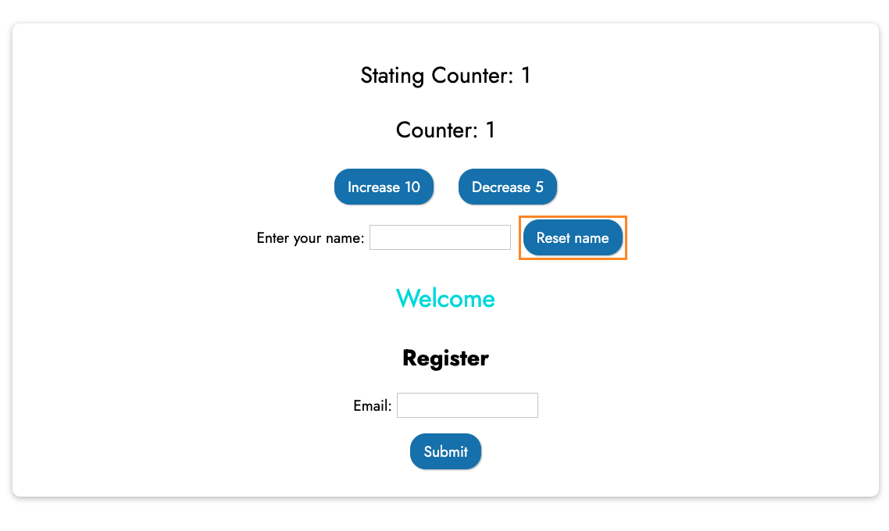
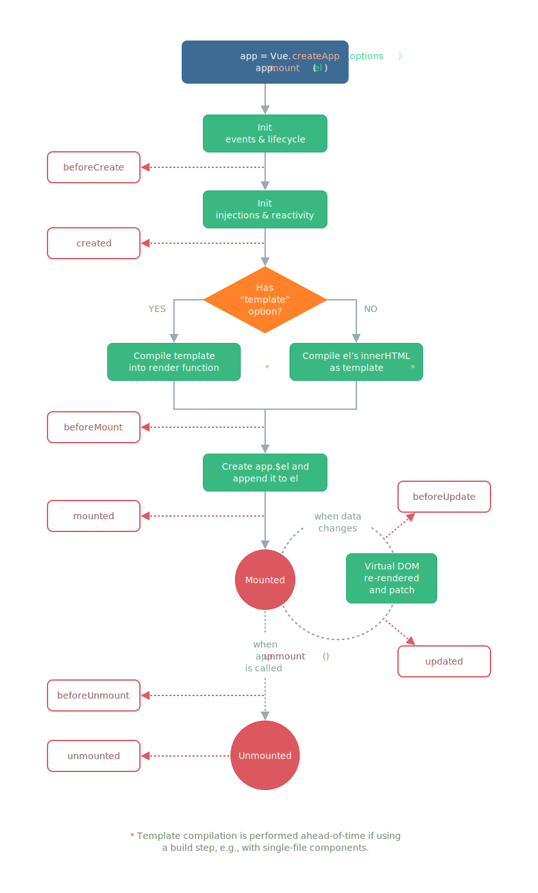

# Basic concepts of Vue

In [previous section](./create-vue-app.md), we learned *binding data* and *text interpolation*, they are basic concepts of Vue, in this section, we will learn more important basic concepts of Vue.

## Using Directives in VueJS

Vue.js Directives are special HTML attributes that allow us to manipulate the HTML DOM. Directives are very powerful and we use them every day. We will learn some important directive in this section.

### Binding Attributes with *v-bind*

Suppose that we want to add a link to website Pascalia Group with below HTML code

```html
<p><a href="http://pascaliaasia.com">Link to Pascalia Group Website</a></p>
```

And you want store the URL string *http://pascaliaasia.com* in *getting-started/vue/app.js* like below:

> File *getting-started/vue/app.js*
```js
const App = Vue.createApp({
  data() {
    return {
      message: "Hello, VueJS!",
      pascaliaWebsite: "http://pascaliaasia.com",
    };
  },
});

App.mount('#content');
```

In previous chapter, we used *Mustaches syntax* for data interpolation (rendering message *"Hello, VueJS~"*), but you CANNOT use this syntax to render data for HTML attributes like below, it doesn't work.

```html
<p><a href="{{pascaliaWebsite}}">Link to Pascalia Group Website</a></p>
```

In order to render value for HTML attributes, we use the *v-bind* Directive with expression:

```html
<div v-bind:attribute_name="dynamicValueFromVueApp"></div>
```
- *div* is HTML tag, it any html tag such as a, span, p...
- *attribute_name* is html attribute like href, id, width, height...
- *dynamicValueFromVueApp*: data returned in the *data()* function.

Example:
```html
<a v-bind:href="pascaliaWebsite">Link to Pascalia Group Website</a>
```
Let update *index.html* to try it.

> File *getting-started/index.html*
```html
<!DOCTYPE html>
<html lang="en">
  <head>
    <meta charset="UTF-8" />
    <meta name="viewport" content="width=device-width, initial-scale=1.0" />
    <title>Getting started with VueJS</title>
    <link
      href="https://fonts.googleapis.com/css2?family=Jost:wght@400;700&display=swap"
      rel="stylesheet"
    />
    <link rel="stylesheet" href="./styles/styles.css" />
    <script src="https://unpkg.com/vue@next" defer></script>
    <script src="./vue/app.js" defer></script>
  </head>
  <body>
    <header>
      <h1>Getting started with VueJS</h1>
    </header>
    <section id="content">
      <div class="message">
        <p>{{ message }}</p>
        <p><a target="_blank" v-bind:href="pascaliaWebsite">Link to Pascalia Group Website</a></p>
      </div>
    </section>
  </body>
</html>
```

When open *index.html*, you can see a screen like below, click on the link *Link to Pascalia Group Website*, it will open the website http://pascaliaasia.com.


Let try to use *v-bind* Directive to render values for other HTML attributes.

You also can use shorthand of *v-bind* with expression *:attribute_name*. Example:

```html
<p><a target="_blank" :href="pascaliaWebsite">Link to Pascalia Group Website</a></p>
```

### Outputting raw HTML with *v-html*

Example, if you want to store all HTML to the link to Pascalia Group Website like below:

> File *getting-started/vue/app.js*
```js
const App = Vue.createApp({
  data() {
    return {
      message: "Hello, VueJS!",
      pascaliaWebsite: '<a target="_blank" href="http://pascaliaasia.com">Link to Pascalia Group Website</a>',
    };
  },
});

App.mount('#content');
```

You also CANNOT use the syntax *{{ pascaliaWebsite }}* to render the link below, it doesn't work.

```html
<!-- this code is incorrect -->
<p>{{ pascaliaWebsite }}</p>
```

If you use above code, the result should be like below:


In order to render raw HTML, you will need to use *v-html* directive.

```html
<p v-html="pascaliaWebsite"></p>
```

> File *getting-started/index.html*
```html
<!DOCTYPE html>
<html lang="en">
  <head>
    <meta charset="UTF-8" />
    <meta name="viewport" content="width=device-width, initial-scale=1.0" />
    <title>Getting started with VueJS</title>
    <link
      href="https://fonts.googleapis.com/css2?family=Jost:wght@400;700&display=swap"
      rel="stylesheet"
    />
    <link rel="stylesheet" href="./styles/styles.css" />
    <script src="https://unpkg.com/vue@next" defer></script>
    <script src="./vue/app.js" defer></script>
  </head>
  <body>
    <header>
      <h1>Getting started with VueJS</h1>
    </header>
    <section id="content">
      <div class="message">
        <p>{{ message }}</p>
        <p v-html="pascaliaWebsite"></p>
      </div>
    </section>
  </body>
</html>
```

Now, you can see the result is correct


### Methods in Vue

To add methods to a Vue instance we use the *methods* option. This should be an object containing the desired methods:

```js
const App = Vue.createApp({
  data() {
    return {
      ....
    };
  },

  // define methods
  methods: {
    method1() {
      // source code for method1
    },

    method2() {
      // source code for method2
    },
    ....
    methodN() {
      // source code for methodN
    }
  }
});

App.mount('#content');
```

Now, we will try to implement a very simple method *randomNumber(), just for returning a random number.

> File *getting-started/vue/app.js*
```js
const App = Vue.createApp({
  data() {
    return {
      message: "Hello, VueJS!",
      pascaliaWebsite: '<a target="_blank" href="http://pascaliaasia.com">Link to Pascalia Group Website</a>',
    };
  },

  methods: {
    randomNumber() {
      const number = Math.random();
      return number;
    }
  }
});

App.mount('#content');
```

Calling the method *randomNumber* in *index.html* file is same with calling a function in vanilla Javascript by using the expression *randomNumber()*.

> File *getting-started/index.html*
```html
<!DOCTYPE html>
<html lang="en">
  <head>
    <meta charset="UTF-8" />
    <meta name="viewport" content="width=device-width, initial-scale=1.0" />
    <title>Getting started with VueJS</title>
    <link
      href="https://fonts.googleapis.com/css2?family=Jost:wght@400;700&display=swap"
      rel="stylesheet"
    />
    <link rel="stylesheet" href="./styles/styles.css" />
    <script src="https://unpkg.com/vue@next" defer></script>
    <script src="./vue/app.js" defer></script>
  </head>
  <body>
    <header>
      <h1>Getting started with VueJS</h1>
    </header>
    <section id="content">
      <div class="message">
        <p>{{ message }}</p>
        <p v-html="pascaliaWebsite"></p>
        <p>Random number: {{ randomNumber() }}</p>
      </div>
    </section>
  </body>
</html>
```

Now, open the *index.html* file, you can see the random number is changed whenever you refresh the page.

You can call methods in text interpolations, directives... In above example, we called the *randomNumber* method in a text interpolation.


## Working with Data inside Vue App

Example, we add 2 *numberA* and *numberB* to data in *app.js*, then we can access to *numberA* and *numberB* from the method *sum* like below.

> File 
```js
const App = Vue.createApp({
  data() {
    return {
      message: "Hello, VueJS!",
      pascaliaWebsite: '<a target="_blank" href="http://pascaliaasia.com">Link to Pascalia Group Website</a>',
      numberA: 1,
      numberB: 2,
    };
  },

  methods: {
    randomNumber() {
      const number = Math.random();
      return number;
    },
    sum() {
      return this.numberA + this.numberB;
    },
  }
});

App.mount('#content');
```

We use *this* to refer to the data. Example, in order to refer to *numberA*, we use *this.numberA*...

Now, let try to call the *sum* method in *index.html*

```html
<p> Sum of {{ numberA }} and {{ numberB }} is {{ sum() }}</p>
```

> File *getting-started/index.html*
```html
<!DOCTYPE html>
<html lang="en">
  <head>
    <meta charset="UTF-8" />
    <meta name="viewport" content="width=device-width, initial-scale=1.0" />
    <title>Getting started with VueJS</title>
    <link
      href="https://fonts.googleapis.com/css2?family=Jost:wght@400;700&display=swap"
      rel="stylesheet"
    />
    <link rel="stylesheet" href="./styles/styles.css" />
    <script src="https://unpkg.com/vue@next" defer></script>
    <script src="./vue/app.js" defer></script>
  </head>
  <body>
    <header>
      <h1>Getting started with VueJS</h1>
    </header>
    <section id="content">
      <div class="message">
        <p>{{ message }}</p>
        <p v-html="pascaliaWebsite"></p>
        <p>Random number: {{ randomNumber() }}</p>
        <p> Sum of {{ numberA }} and {{ numberB }} is {{ sum() }}</p>
      </div>
    </section>
  </body>
</html>
```

Open the *index.html*, the result should be below:


## Events Binding with *v-on*

Before starting, please download starting source code at https://gitlab.com/pav-training-program/source-code/vue-starting-source-code/-/tree/main/basic-concepts and open the folder *basic-concepts* in VS Code. The folder structure will be like this:


The current source code is just simple Vue code to show a number (counter) on screen:


Now, we will try to implement the application with requirement: "When click on button the button *Increase*, increase the counter by one".

### Increasing/Decreasing the counter

In order to listen to an event on Vue, we use *v-on* directive.

Example, to listen to the event *click* when user click on button *Increase*, we use *v-on* as below:

```html
<button v-on:click="counter++">Increase</button>
```

- *v-on:click* is listening to the event *click*. 
- *counter++*: increase the counter by one.

And we can handle button to decrease the counter:
```html
<button v-on:click="counter--">Decrease</button>
```

> File *basic-concepts/index.html*
```html
<!DOCTYPE html>
<html lang="en">
  <head>
    <meta charset="UTF-8" />
    <meta name="viewport" content="width=device-width, initial-scale=1.0" />
    <title>Getting started with VueJS</title>
    <link
      href="https://fonts.googleapis.com/css2?family=Jost:wght@400;700&display=swap"
      rel="stylesheet"
    />
    <link rel="stylesheet" href="./styles/styles.css" />
    <script src="https://unpkg.com/vue@next" defer></script>
    <script src="./vue/app.js" defer></script>
  </head>
  <body>
    <header>
      <h1>Getting started with VueJS</h1>
    </header>
    <section id="content">
      <div class="message">
        <p class="counter">Counter: {{ counter }}</p>
        <p>
          <button v-on:click="counter++">Increase</button>
          <button v-on:click="counter--">Decrease</button>
        </p>
      </div>
    </section>
  </body>
</html>
```

Now, if you click on the button *"Increase"*, the counter will increase by one. If you click on the button *"Decrease"*, the counter will decrease by one.

You also can use shorthand of *v-on:eventName* by expression *@eventName*, example:

```html
<button @click="counter++">Increase</button>
<button @click="counter--">Decrease</button>
```

## Using Events with Methods

In above section, we increased and decreased the counter by using operator *"counter++"*. In this section, we will learn using events binding to call methods.

Example, In *app.js*, we will ad a *increase* and *decrease* methods to increase and decrease the counter by one as below:

> File *basic-concepts/vue/app.js*
```js
const App = Vue.createApp({
  data() {
    return {
      counter: 1,
    }
  },
  methods: {
    increase() {
      this.counter++;
    },
    decrease() {
      this.counter--;
    },
  }
});

App.mount('#content');
```

And we call *increase and decrease* methods when user click on the buttons like bellow:

```html
<button v-on:click="increase()">Increase</button>
<button v-on:click="decrease()">Decrease</button>
```

> File *basic-concepts/index.html*
```html
<!DOCTYPE html>
<html lang="en">
  <head>
    <meta charset="UTF-8" />
    <meta name="viewport" content="width=device-width, initial-scale=1.0" />
    <title>Getting started with VueJS</title>
    <link
      href="https://fonts.googleapis.com/css2?family=Jost:wght@400;700&display=swap"
      rel="stylesheet"
    />
    <link rel="stylesheet" href="./styles/styles.css" />
    <script src="https://unpkg.com/vue@next" defer></script>
    <script src="./vue/app.js" defer></script>
  </head>
  <body>
    <header>
      <h1>Getting started with VueJS</h1>
    </header>
    <section id="content">
      <div class="message">
        <p class="counter">Counter: {{ counter }}</p>
        <p>
          <button v-on:click="increase()">Increase</button>
          <button v-on:click="decrease()">Decrease</button>
        </p>
      </div>
    </section>
  </body>
</html>
```

And now, when you click on buttons *Increase/Decrease*, it will increase/decrease the counter by one. That is how we use events with methods.

## Calling Methods with Arguments

In above example, the methods *increase()/decrease()* have no argument as below:

```js
increase() {
  this.counter++;
}
```

Imagine that you want the methods *increase/decrease* are more flexible, it has a argument to increase or decrease the counter by *x*. *x* can be any number.

First, we add an argument to methods *increase and decrease* as below:

> File `basic-concepts/vue/app.js`
```js
const App = Vue.createApp({
  data() {
    return {
      counter: 1,
    }
  },
  methods: {
    increase(x) {
      this.counter += x;
    },
    decrease(x) {
      this.counter -= x;
    },
  }
});

App.mount('#content');
```

And we will call the methods in events binding as below:

```html
<!-- Increase the counter by 10 -->
<button v-on:click="increase(10)">Increase 10</button>

<!-- Decrease the counter by 5 -->
<button v-on:click="decrease(5)">Decrease 5</button>
```

> File *basic-concepts/index.html*
```html
<!DOCTYPE html>
<html lang="en">
  <head>
    <meta charset="UTF-8" />
    <meta name="viewport" content="width=device-width, initial-scale=1.0" />
    <title>Getting started with VueJS</title>
    <link
      href="https://fonts.googleapis.com/css2?family=Jost:wght@400;700&display=swap"
      rel="stylesheet"
    />
    <link rel="stylesheet" href="./styles/styles.css" />
    <script src="https://unpkg.com/vue@next" defer></script>
    <script src="./vue/app.js" defer></script>
  </head>
  <body>
    <header>
      <h1>Getting started with VueJS</h1>
    </header>
    <section id="content">
      <div class="message">
        <p class="counter">Counter: {{ counter }}</p>
        <p>
          <!-- Increase the counter by 10 -->
          <button v-on:click="increase(10)">Increase 10</button>
          <!-- Decrease the counter by 5 -->
          <button v-on:click="decrease(5)">Decrease 5</button>
        </p>
      </div>
    </section>
  </body>
</html>
```

You can try to add buttons to increase or decrease the counter by 1,2,3...

### Working with Event Objects

We will learn how to work with Event Objects by below example.

Add a text input and a paragraph to show *Welcome* into *index.html* as below:

```html
<p>
  Enter your name: <input type="text" name="name" />
</p>
<p class="welcome">Welcome</p>
```

> File *basic-concepts/index.html*
```html
<!DOCTYPE html>
<html lang="en">
  <head>
    <meta charset="UTF-8" />
    <meta name="viewport" content="width=device-width, initial-scale=1.0" />
    <title>Getting started with VueJS</title>
    <link
      href="https://fonts.googleapis.com/css2?family=Jost:wght@400;700&display=swap"
      rel="stylesheet"
    />
    <link rel="stylesheet" href="./styles/styles.css" />
    <script src="https://unpkg.com/vue@next" defer></script>
    <script src="./vue/app.js" defer></script>
  </head>
  <body>
    <header>
      <h1>Getting started with VueJS</h1>
    </header>
    <section id="content">
      <div class="message">
        <p class="counter">Counter: {{ counter }}</p>
        <p>
          <!-- Increase the counter by 10 -->
          <button v-on:click="increase(10)">Increase 10</button>
          <!-- Decrease the counter by 5 -->
          <button v-on:click="decrease(5)">Decrease 5</button>
        </p>
        <p>
          Enter your name: <input type="text" name="name" />
        </p>
        <p class="welcome">Welcome</p>
      </div>
    </section>
  </body>
</html>
```


Now, we will try to implement the app: If user input a name on the text input, show the message "Welcome Name" below the input.

The idea to do it that we will define a data "name" and a method "*setName"* to update the *name* when user input by using *v-on:input*

> Update file *getting-started/vue/app.js*
```js
const App = Vue.createApp({
  data() {
    return {
      counter: 1,
      name: '',
    }
  },
  methods: {
    increase(x) {
      this.counter += x;
    },
    decrease(x) {
      this.counter -= x;
    },
    setName(event) {
      this.name = event.target.value;
    }
  }
});

App.mount('#content');
```

Explain for the method *setName*:

```js
setName(event) {
  this.name = event.target.value;
}
```
- *event* is the native DOM event object. You can check DOM events list at https://www.w3schools.com/jsref/dom_obj_event.asp
- *event.target.value* refer to the value of the HTML element fired the event.

Now, open *basic-concepts/index.html* and replace below line:

```html
<p class="welcome">Welcome</p>
```

By below code:

```html
<p class="welcome">Welcome {{ name }}</p>
```

After updated *index.html*, open the file and input *your name*, the message *"Welcome your name"* will be shown as below:


Above example is how to work with native event object in VueJS.

Note: Sometimes we also need to access the original DOM event in an inline statement handler. You can pass it into a method using the special *$event* variable. Example, you can replace the source code of input as below:

```html
<input type="text" name="name" v-on:input="setName($event)" />
```

### Working with Event Modifiers

It is a very common need to call *event.preventDefault()* or *event.stopPropagation()*... inside event handlers. Although we can do this easily inside methods, it would be better if the methods can be purely about data logic rather than having to deal with DOM event details.

To address this problem, Vue provides event modifiers for v-on. Recall that modifiers are directive postfixes denoted by a dot. Below list are common Event Modifiers.

- *.stop*: the click event's propagation will be stopped.
- *.prevent*: the submit event will no longer reload the page.
- *.capture*: use capture mode when adding the event listener, 
- *.self*: only trigger handler if *event.target* is the element itself.

Example, we have a form (in the rectangle) like below:


And when user click on the button "Submit", you want to prevent page reload. You can use *.prevent* for *submit event* as below:

```html
<form v-on:submit.prevent="submitRegisterForm">
  <h2>Register</h2>
  <p>Email: <input type="text" name="email" /></p>
  <p><button type="submit">Submit</button></p>
</form>
```

> File *basic-concepts/index.html*
```html
<!DOCTYPE html>
<html lang="en">
  <head>
    <meta charset="UTF-8" />
    <meta name="viewport" content="width=device-width, initial-scale=1.0" />
    <title>Getting started with VueJS</title>
    <link
      href="https://fonts.googleapis.com/css2?family=Jost:wght@400;700&display=swap"
      rel="stylesheet"
    />
    <link rel="stylesheet" href="./styles/styles.css" />
    <script src="https://unpkg.com/vue@next" defer></script>
    <script src="./vue/app.js" defer></script>
  </head>
  <body>
    <header>
      <h1>Getting started with VueJS</h1>
    </header>
    <section id="content">
      <div class="message">
        <p class="counter">Counter: {{ counter }}</p>
        <p>
          <!-- Increase the counter by 10 -->
          <button v-on:click="increase(10)">Increase 10</button>
          <!-- Decrease the counter by 5 -->
          <button v-on:click="decrease(5)">Decrease 5</button>
        </p>
        <p>
          Enter your name: <input type="text" name="name" v-on:input="setName($event)" />
        </p>
        <p class="welcome">Welcome {{ name }}</p>
        <!-- Use .prevent event modifier to prevent page reload -->
        <form v-on:submit.prevent="submitRegisterForm">
          <h2>Register</h2>
          <p>Email: <input type="text" name="email" /></p>
          <p><button type="submit">Submit</button></p>
        </form>
      </div>
    </section>
  </body>
</html>
```

> File *basic-concepts/vue/app.js*
```js
const App = Vue.createApp({
  data() {
    return {
      counter: 1,
      name: '',
    }
  },
  methods: {
    increase(x) {
      this.counter += x;
    },
    decrease(x) {
      this.counter -= x;
    },
    setName(event) {
      this.name = event.target.value;
    },
    // method to handle submit form
    submitRegisterForm(event) {
      alert("Registered successfully");
    }
  }
});

App.mount('#content');
```

By using *.prevent*, if you submit the form, you can see the message *"Registered successfully"* without page reload. If you try to remove *.prevent*, when you submit the form, the page will be reloaded.

### Locking content with *v-once*

If you want to render a content only once, you can use *v-once* to lock the content.

Example, if you add can add below code above the current counter:

```html
<!-- Using v-once to lock the content -->
<p class="counter" v-once>Stating Counter: {{ counter }}</p>
```

Now, If the counter changed, the Starting counter still keep the value "1".


### Two-Way Binding with *v-model*

Example you want to want to add a button to reset input *your name* as below screenshot:



We can use *event binding* and *data binding* that we learned above to implement it like below.

```html
<p>
  Enter your name: <input type="text" v-bind:value="name" name="name" v-on:input="setName($event)" />
  <button v-on:click="resetName">Reset name</button>
</p>
```

We use *v-bind:value="name"* to assign name into the input value

And a method to reset name:

```js
const App = Vue.createApp({
  data() {
    return {
      ...
      name: '',
    }
  },
  methods: {
    ...
    resetName() {
      this.name = "";
    }
  }
});

App.mount('#content');
```

But, Vue provided us a *v-model* directive. You can use the *v-model* directive to create two-way data bindings on form input, textarea, and select elements. It automatically picks the correct way to update the element based on the input type. Although a bit magical, v-model is essentially syntax sugar for updating data on user input events, plus special care for some edge cases.


By using v-model, we don't need to use *v-on:input* and *v-bind:value* anymore. And the input should be:

```html
<input type="text" v-model="name" name="name" />
```

> File *basic-concepts/index.html*
```html
<!DOCTYPE html>
<html lang="en">
  <head>
    <meta charset="UTF-8" />
    <meta name="viewport" content="width=device-width, initial-scale=1.0" />
    <title>Getting started with VueJS</title>
    <link
      href="https://fonts.googleapis.com/css2?family=Jost:wght@400;700&display=swap"
      rel="stylesheet"
    />
    <link rel="stylesheet" href="./styles/styles.css" />
    <script src="https://unpkg.com/vue@next" defer></script>
    <script src="./vue/app.js" defer></script>
  </head>
  <body>
    <header>
      <h1>Getting started with VueJS</h1>
    </header>
    <section id="content">
      <div class="message">
        <p class="counter" v-once>Stating Counter: {{ counter }}</p>
        <p class="counter">Counter: {{ counter }}</p>
        <p>
          <!-- Increase the counter by 10 -->
          <button v-on:click="increase(10)">Increase 10</button>
          <!-- Decrease the counter by 5 -->
          <button v-on:click="decrease(5)">Decrease 5</button>
        </p>
        <p>
          Enter your name: <input type="text" v-model="name" name="name" />
          <button v-on:click="resetName">Reset name</button>
        </p>
        <p class="welcome">Welcome {{ name }}</p>
        <!-- Use .prevent event modifier to prevent page reload -->
        <form v-on:submit.prevent="submitRegisterForm">
          <h2>Register</h2>
          <p>Email: <input type="text" name="email" /></p>
          <p><button type="submit">Submit</button></p>
        </form>
      </div>
    </section>
  </body>
</html>
```

And you also don't need to use the *setName* method anymore.

> File *basic-concepts/vue/app.js*
```js
const App = Vue.createApp({
  data() {
    return {
      counter: 1,
      name: '',
    }
  },
  methods: {
    increase(x) {
      this.counter += x;
    },
    decrease(x) {
      this.counter -= x;
    },
    resetName() {
      this.name = "";
    },
    submitRegisterForm(event) {
      alert("Registered successfully");
    }
  }
});

App.mount('#content');
```

As above implementation, you can see that using two-way binding *(v-model)* is much easier then using *v-bind & v-on*.

### Method used for data binding

In above example, the message "Welcome Your Name* is handled by the code:

```html
<p class="welcome">Welcome {{ name }}</p>
```

Now, we will try to use a method to show the message:

> Update file *basic-concepts/vue/app.js*
```js
const App = Vue.createApp({
  data() {
    return {
      counter: 1,
      name: '',
    }
  },
  methods: {
    increase(x) {
      this.counter += x;
    },
    decrease(x) {
      this.counter -= x;
    },
    resetName() {
      this.name = "";
    },
    welcomeMessage() {
      console.log("Calling method welcomeMessage");
      return "Welcome " + this.name;
    },
    submitRegisterForm(event) {
      alert("Registered successfully");
    }
  }
});

App.mount('#content');
```

And we call *welcomeMessage()* in *index.html* as below:

> File *basic-concepts/index.html*
```html
<!DOCTYPE html>
<html lang="en">
  <head>
    <meta charset="UTF-8" />
    <meta name="viewport" content="width=device-width, initial-scale=1.0" />
    <title>Getting started with VueJS</title>
    <link
      href="https://fonts.googleapis.com/css2?family=Jost:wght@400;700&display=swap"
      rel="stylesheet"
    />
    <link rel="stylesheet" href="./styles/styles.css" />
    <script src="https://unpkg.com/vue@next" defer></script>
    <script src="./vue/app.js" defer></script>
  </head>
  <body>
    <header>
      <h1>Getting started with VueJS</h1>
    </header>
    <section id="content">
      <div class="message">
        <p class="counter" v-once>Stating Counter: {{ counter }}</p>
        <p class="counter">Counter: {{ counter }}</p>
        <p>
          <!-- Increase the counter by 10 -->
          <button v-on:click="increase(10)">Increase 10</button>
          <!-- Decrease the counter by 5 -->
          <button v-on:click="decrease(5)">Decrease 5</button>
        </p>
        <p>
          Enter your name: <input type="text" v-model="name" name="name" />
          <button v-on:click="resetName">Reset name</button>
        </p>
        <p class="welcome">{{ welcomeMessage() }}</p>
        <!-- Use .prevent event modifier to prevent page reload -->
        <form v-on:submit.prevent="submitRegisterForm">
          <h2>Register</h2>
          <p>Email: <input type="text" name="email" /></p>
          <p><button type="submit">Submit</button></p>
        </form>
      </div>
    </section>
  </body>
</html>
```

Now, if you try to click on button "Increase" or "Decrease", although we just increase/decrease the counter, but *welcomeMessage* method also called. You can check it in console, when you click on the buttons, you can see the output log *"Calling method welcomeMessage"*.


That why you shouldn't use method to output some dynamically calculated value like *welcomeMessage()*.

## Working with *computed*

Until now, we used the properties *data* and *methods* in Vue App (app.js). Beside *data* and *methods*, there is a common idea in Vue App, called *computed*. 

We will try to use *computed* to show Welcome Message (Hello your name) instead of *methods* like below:

Let define a *computed* to show Welcome Message 

```js
...
computed: {
  welcomeMessage() {
    console.log("calling welcomeMessage in computed");
    return "Welcome " + this.name; 
  },
},
```

> File *basic-concepts/vue/app.js*
```js
  data() {
    return {
      counter: 1,
      name: '',
    }
  },
  computed: {
    welcomeMessage() {
      console.log("calling welcomeMessage in computed");
      return "Welcome " + this.name; 
    },
  },
  methods: {
    increase(x) {
      this.counter += x;
    },
    decrease(x) {
      this.counter -= x;
    },
    resetName() {
      this.name = "";
    },
    submitRegisterForm(event) {
      alert("Registered successfully");
    }
  }
});

App.mount('#content');
```

Although *welcomeMessage* in computed is a function, but we use it in *index.html* as a property (Only use *welcomeMessage* without parentheses).

```html
<p class="welcome">{{ welcomeMessage }}</p>
```

> File *basic-concepts/index.html*
```html
<!DOCTYPE html>
<html lang="en">
  <head>
    <meta charset="UTF-8" />
    <meta name="viewport" content="width=device-width, initial-scale=1.0" />
    <title>Getting started with VueJS</title>
    <link
      href="https://fonts.googleapis.com/css2?family=Jost:wght@400;700&display=swap"
      rel="stylesheet"
    />
    <link rel="stylesheet" href="./styles/styles.css" />
    <script src="https://unpkg.com/vue@next" defer></script>
    <script src="./vue/app.js" defer></script>
  </head>
  <body>
    <header>
      <h1>Getting started with VueJS</h1>
    </header>
    <section id="content">
      <div class="message">
        <p class="counter" v-once>Stating Counter: {{ counter }}</p>
        <p class="counter">Counter: {{ counter }}</p>
        <p>
          <!-- Increase the counter by 10 -->
          <button v-on:click="increase(10)">Increase 10</button>
          <!-- Decrease the counter by 5 -->
          <button v-on:click="decrease(5)">Decrease 5</button>
        </p>
        <p>
          Enter your name: <input type="text" v-model="name" name="name" />
          <button v-on:click="resetName">Reset name</button>
        </p>
        <!-- Use "computed" to show welcome message -->
        <p class="welcome">{{ welcomeMessage }}</p>
        <!-- Use .prevent event modifier to prevent page reload -->
        <form v-on:submit.prevent="submitRegisterForm">
          <h2>Register</h2>
          <p>Email: <input type="text" name="email" /></p>
          <p><button type="submit">Submit</button></p>
        </form>
      </div>
    </section>
  </body>
</html>
```

Now, you can see that the log message *"calling welcomeMessage in computed"* only show when *name* is changed. When you try to Increase/Decrease the counter, the log message will not be shown. It means that the function *welcomeMessage* in *computed* is only called when the *name* change.

In general, *computed* properties are cached based on their reactive dependencies (In above example, name is a reactive dependency). A *computed* property will only re-evaluate when some of its reactive dependencies have changed.

### Working with *watchers*

Beside *computed* property, Vue also does provide a more generic way to observe and react to data changes on a Vue instance: *watch* properties.
 
Add a watcher *name* into Vue App like below:
```js
watch: {
  name(value) {
    if (value !== '') {
      this.displayName = value;
    } else {
      this.displayName = "No name";
    }
  },
},
```
> File *basic-concepts/vue/app.js*
```js
const App = Vue.createApp({
  data() {
    return {
      counter: 1,
      name: '',
      displayName: '',
    }
  },
  watch: {
    name(value) {
      if (value !== '') {
        this.displayName = value;
      } else {
        this.displayName = "No name";
      }
    },
  },
  computed: {
    welcomeMessage() {
      console.log("calling welcomeMessage in computed");
      return "Welcome " + this.displayName; 
    },
  },
  methods: {
    increase(x) {
      this.counter += x;
    },
    decrease(x) {
      this.counter -= x;
    },
    resetName() {
      this.name = "";
    },
    submitRegisterForm(event) {
      alert("Registered successfully");
    }
  }
});

App.mount('#content');
```

- *name(value)*: watches the data *name*, whenever the *name* changed, this function is will be evaluated automatically. *value* is current value of *name*. It means that the **watcher function name** must be the same with the **data property name** that you want to watch. Example, if you want to watch the data property *counter*, the watcher function name must be *counter*. 

## Comparing *methods*, *computed* and *watch*

- **Methods**: Use with event binding OR data binding
  - Data binding: Method is executed for every “re- render” cycle of the component
  - Use for events or data that really needs to be re- evaluated all the time
- **Computed**: Use with data binding
  - Computed properties are only re-evaluated if one of their “used values” changed
  - Use for data that depends on other data
- **Watch**: Not used directly in template
  - Allows you to run any code in reaction to some changed data (e.g. send Http request etc.)
  - Use for any non-data update you want to make

## Working with *refs*
Vue has a feature that allows you to access to DOM elements when you need them, instead of all the time. And that feature i called *refs*.

Example, if you define ref in template

```html
<input ref="input" />
```

Then you can access to it:

```js
const app = Vue.createApp({})

app.component('base-input', {
  template: `
    <input ref="input" />
    <button @click="logValue">Log Value<button>
  `,
  methods: {
    logValue() {
      const val = this.$refs.input.value;
      console.log(val);
    }
  }
})
```

Example, you can apply *refs* to get email value in our current application.

> Update input email in file *basic-concepts/index.html*
```html
....
...
<p>Email: <input type="text" ref="email" name="email" /></p>
...
```

> Update method *submitRegisterForm* in file *basic-concepts/vue/app.js*
```js
...
...
  methods: {
    ...
    submitRegisterForm(event) {
      const email = this.$refs.email.value;
      alert(email);
    }
  },
...
```

Now, if you click on *Submit* button, you can see inputted email is shown on alert message .

## Lifecycle Diagram

Below is a diagram for the instance lifecycle. You don't need to fully understand everything going on right now, but as you learn and build more, it will be a useful reference.




In this section, just use these hooks such as *beforeCreated, created...* to output log messages in console.

> File *basic-concepts/vue/app.js*
```js
const App = Vue.createApp({
  data() {
    return {
      counter: 1,
      name: '',
      displayName: '',
    }
  },
  watch: {
    name(value) {
      if (value !== '') {
        this.displayName = value;
      } else {
        this.displayName = "No name";
      }
    },
  },
  computed: {
    welcomeMessage() {
      console.log("calling welcomeMessage in computed");
      return "Welcome " + this.displayName; 
    },
  },
  methods: {
    increase(x) {
      this.counter += x;
    },
    decrease(x) {
      this.counter -= x;
    },
    resetName() {
      this.name = "";
    },
    submitRegisterForm(event) {
      alert("Registered successfully");
    }
  },
  // testing lifecycle
  beforeCreate() {
    console.log('beforeCreate()');
  },
  created() {
    console.log('created()');
  },
  beforeMount() {
    console.log('beforeMount()');
  },
  mounted() {
    console.log('mounted()');
  },
  beforeUpdate() {
    console.log('beforeUpdate()');
  },
  updated() {
    console.log('updated()');
  },
});
```

Now, open *index.html*, you can see log messages in console as below screenshot. And if you click on button *Increase/Decrease*, or enter your name, you can see hook *beforeUpdate, updated* is also called.


[Next: Styling in VueJS](./styling.md)