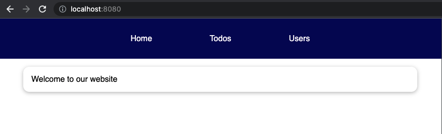
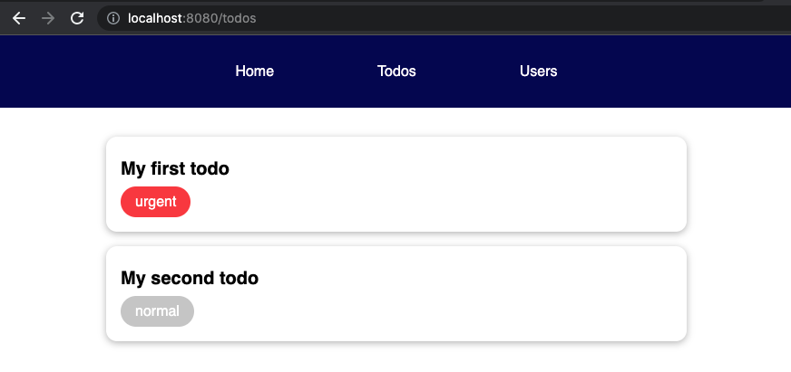
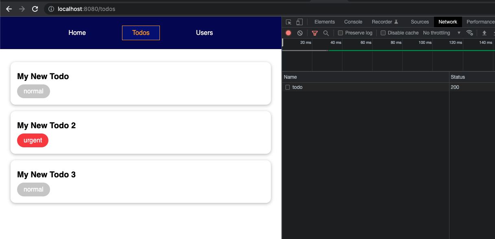
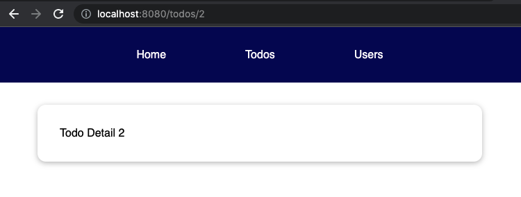
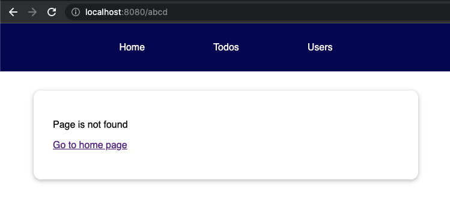
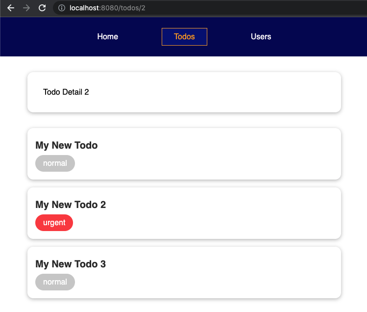
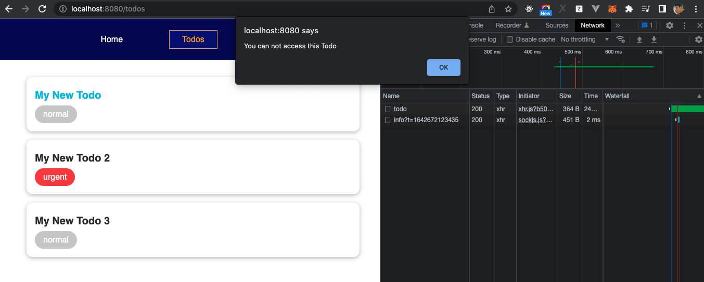
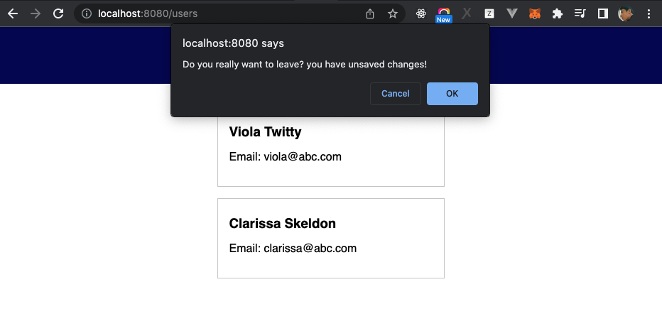
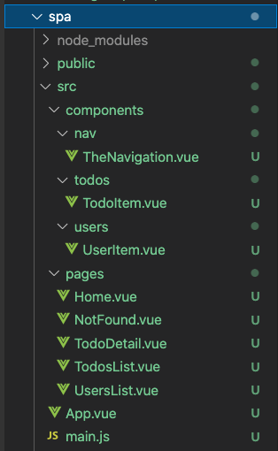

# Build Single Page Application

If you never hear about SPA, you can check it here https://developer.mozilla.org/en-US/docs/Glossary/SPA

## Preparing

Download starting source code at https://gitlab.com/pav-training-program/source-code/vue-starting-source-code/-/tree/main/spa

This project contains some simple components. Start the Vue app by executing below commands:

```sh
npm install
npm run serve
```

If access to the URL http://localhost:8080, you can see a screen with a navigation like below:


Note that the content is still empty.
## Introducing Routing

In this program, until now, all page of our application is only htttp://localhost:8080. Imagine that we want to load other pages by other URLs, example, went we access /welcome, application will show welcome page, and when we access /todos, application will show todos list page without reloading page.

Mapping URLs with Components is called Routing.

## Vue Router

[Vue Router](https://router.vuejs.org/) is the official router for Vue. It deeply integrates with Vue.js core to make building Single Page Applications with Vue.js a breeze. 

Run below command to install Vue Router

```sh
npm install --save vue-router@next
```

## Registering, Rendering and Create Links for Routes

## Registering Routes

First, open *main.js* to register Routes.

> File *spa/src/main.js*
```js

import { createApp } from 'vue';
import { createRouter, createWebHistory } from 'vue-router';

import App from './App.vue';
import Home from './components/home/Home.vue';
import TodosList from './components/todos/TodosList.vue';
import UsersList from './components/users/UsersList.vue';

// Register routes
const router = createRouter({
  history: createWebHistory(),
  routes: [
    { path: '/', component: Home },
    { path: '/todos', component: TodosList },
    { path: '/users', component: UsersList },
  ]
});

const app = createApp(App)

app.use(router);

app.mount('#app');
```

Take a look on the source code to register routers:

```js
const router = createRouter({
  history: createWebHistory(),
  routes: [
    { path: '/', component: Home },
    { path: '/todos', component: TodosList },
    { path: '/users', component: UsersList },
  ]
});
```
- *history: createWebHistory()* tells Vue how to manage history in Vue Application. Example, when you click on router-link to navigate to a page, this page will be added to browser history.
- *routes*: most important. It is an array to define mapping for each *url-component*. Example:
  - *{ path: '/', component: Home }*: when use access to path "/" (http://localhost:8080), the *Home* component will be loading. 
  - *{ path: '/todos', component: TodosList }*: when use access to path "/todos", component "TodosList" will be loaded... And it is the same for other routers.

### Rendering Loaded Component with Router View

In above section, we defined mapping for urls and components. And now, we we use `<router-view></router-view>` to render component.

> File *spa/src/App.vue*
```vue
<template>
  <div>
    <the-navigation></the-navigation>
    <router-view></router-view>
  </div>
</template>

<script>
import TheNavigation from './components/nav/TheNavigation.vue';

export default {
  components: {
    TheNavigation,
  },
};
</script>

<style>
* {
  box-sizing: border-box;
}

html {
  font-family: sans-serif;
}

body {
  margin: 0;
}
</style>
```

`<router-view></router-view>`: you can understand it as a placeholder telling vue router that this is the place where Routed Component should be loaded.

Now, you can access to each path "/", "/todos"/ "users" to check the result. Below is a screenshot when access to the url http://localhost:8080/



### Creating Links For Routers

We registered 3 paths "/", "/todos"/ "users". Now we will use `router-link` to create link to these paths.

> File *spa/src/components/nav/TheNavigation.vue*
```vue
<template>
  <header>
    <nav>
      <ul>
        <li>
          <router-link to="/">Home</router-link>
        </li>
        <li>
          <router-link to="/todos">Todos</router-link>
        </li>
        <li>
          <router-link to="/users">Users</router-link>
        </li>
      </ul>
    </nav>
  </header>
</template>


<style scoped>
header {
  width: 100%;
  height: 5rem;
  background-color: #11005c;
}

nav {
  height: 100%;
}

ul {
  list-style: none;
  margin: 0;
  padding: 0;
  height: 100%;
  display: flex;
  justify-content: center;
  align-items: center;
}

li {
  margin: 0 2rem;
}

a {
  font: inherit;
  background: transparent;
  border: 1px solid transparent;
  cursor: pointer;
  color: white;
  padding: 0.5rem 1.5rem;
  display: inline-block;
  text-decoration: none;
}

a:hover,
a:active,
a.router-link-active {
  color: #f1a80a;
  border-color: #f1a80a;
  background-color: #1a037e;
}
</style>
```

When you access to a path, *router-link* will add class name *router-link-active* automatically into the link corresponding with the path.

Now, let click on menu Home, Todos, Users, you can see the pages are loaded without page reload.



## Adding HTTP Request to Load data from server.

There is a Mock API with GET method to get Todos List from server https://61e4e01a595afe00176e51df.mockapi.io/todo.

We will try to send a http request to this API to get data and show on UI, it's totally same with the section [Sending HTTP Request to get Todo List](.//sending-http-request.md#sending-http-request-to-get-todo-list) that you learned before.

> File *spa/src/components/todos/TodosList.vue*
```vue
<template>
  <ul>
    <li v-if="isLoading">Loading ...</li>
    <todo-item
      v-for="todo in todos"
      :key="todo.id"
      :id="todo.id"
      :name="todo.title"
      :priority="todo.priority"
    ></todo-item>
    <li v-if="error">{{ error }} </li>
  </ul>
</template>

<script>
import axios from "axios";
import TodoItem from './TodoItem.vue';

export default {
  components: {
    TodoItem,
  },
  data() {
    return {
      todos: [],
      isLoading: false,
      error: null
    };
  },
  methods: {
    getTodoList() {
      this.isLoading = true;
      const url = "https://61e4e01a595afe00176e51df.mockapi.io/todo";
      axios
        .get(url)
        .then(response => this.todos = response.data)
        .catch(err => {
          this.error = err.message;
        })
        .then(() => {
          this.isLoading = false;
        });
    },
  },
  created() {
    this.getTodoList();
  }
};
</script>

<style scoped>
ul {
  list-style: none;
  margin: 2rem auto;
  max-width: 40rem;
  padding: 0;
}
</style>
```

Now, if you access to page "Todos", you can see that it call the API, and show response on the UI as below



## Passing Data with Route Params

### Registering dynamic Routes

In real-life project, we need dynamic route for the application. Example, if you have a product detail page, when you access path "/s/1", the UI will show information of the todo with id=1, and when access /todo/2, the UI will show information of the todo with id=2. So that, the router must be set dynamically.

Vue Router provided us a feature to do it, called params, the syntax to use it as below.

```js
routes: [
  ....
  { path: '/todos/:id', component: TodoDetail }
}
```

> File *spa/src/main.js*
```js
import { createApp } from 'vue';
import { createRouter, createWebHistory } from 'vue-router';

import App from './App.vue';
import Home from './components/home/Home.vue';
import TodosList from './components/todos/TodosList.vue';
import TodoDetail from './components/todos/TodoDetail.vue';
import UsersList from './components/users/UsersList.vue';

// Register routes
const router = createRouter({
  history: createWebHistory(),
  routes: [
    { path: '/', component: Home },
    { path: '/todos', component: TodosList },
    { path: '/todos/:id', component: TodoDetail },
    { path: '/users', component: UsersList },
  ]
});

const app = createApp(App)

app.use(router);

app.mount('#app');
```

And we will receive the params value in the component as below. 

> File *spa/src/components/todos/TodoDetail.vue*
```vue
<template>
  <div>
    Todo Detail {{ todoID }}
  </div>
</template>

<script>
export default {
  data() {
    return {
      todoID: 0
    };
  },
  created() {
    // access to param value
    const todoID = this.$route.params.id;
    this.todoID = todoID;
  }
};
</script>

<style scoped>
div {
  margin: 2rem auto;
  max-width: 40rem;
  padding: 2rem;
  box-shadow: 0 2px 8px rgba(0, 0, 0, 0.26);
  border-radius: 12px;
}
</style>
```

As above code. We can get the param value in *created* hook by using *this.$route.param.id*. *id* is param name.

### Link to Dynamic Paths

After created dynamic route, we need to create dynamic links to the route.

Example, when use click on the title of each todo item, they will be navigated to Todo Detail page. We can implement it as below:

> File *spa/src/components/todos/TodoItem.vue*
```vue
<template>
  <li>
    <router-link :to="linkToDetailTodo"><h3>{{ name }}</h3></router-link>
    <span class="badge" :class="classes">{{ priority }}</span>
  </li>
</template>

<script>
export default {
  props: ['id', 'name', 'priority'],
  computed: {
    classes() {
      return {
        'badge--urgent': this.priority === 'urgent',
        'badge--normal': this.priority === 'normal',
      };
    },
    linkToDetailTodo() {
      return `/todos/${this.id}`;
    }
  },
};
</script>

<style scoped>
li {
  margin: 1rem 0;
  box-shadow: 0 2px 8px rgba(0, 0, 0, 0.26);
  border-radius: 12px;
  padding: 1rem;
}

li h3 {
  margin: 0.5rem 0;
  font-size: 1.25rem;
  display: flex;
}

.badge {
  display: inline-block;
  padding: 0.5rem 1rem;
  border-radius: 30px;
  background-color: #ccc;
  color: #2e2e2e;
}

.badge--urgent {
  background-color: #f14545;
  color: white;
}

.badge--normal {
  background-color: #ccc;
  color: white;
}

a {
  text-decoration: none;
  color: #2e2e2e;
}

a:hover {
  color: rgb(29, 188, 228);
}
</style>
```

Now, you can access to Todo List and click on Todos Title, you will be navigated to Todo Detail page like below screenshot.



## Passing params as props

We also can pass route params to component as props. 

In order to pass params as props, when register route, we set *props* to true

```js
{ path: '/todos/:id', component: TodoDetail, props: true }
```
> File *spa/src/main.js*
```js
import { createApp } from 'vue';
import { createRouter, createWebHistory } from 'vue-router';

import App from './App.vue';
import Home from './components/home/Home.vue';
import TodosList from './components/todos/TodosList.vue';
import TodoDetail from './components/todos/TodoDetail.vue';
import UsersList from './components/users/UsersList.vue';

// Register routes
const router = createRouter({
  history: createWebHistory(),
  routes: [
    { path: '/', component: Home },
    { path: '/todos', component: TodosList },
    { path: '/todos/:id', component: TodoDetail, props: true },
    { path: '/users', component: UsersList },
  ]
});

const app = createApp(App)

app.use(router);

app.mount('#app');

```

Now, just access to the param *id* as props in component *TodoDetail*
> File *spa/src/components/todos/TodoDetail.vue*
```vue
<template>
  <div>
    Todo Detail {{ id }}
  </div>
</template>

<script>
export default {
  props: ["id"]
};
</script>

<style scoped>
div {
  margin: 2rem auto;
  max-width: 40rem;
  padding: 2rem;
  box-shadow: 0 2px 8px rgba(0, 0, 0, 0.26);
  border-radius: 12px;
}
</style>
```

## Redirecting 

Example, when use try to access to the path "/home", you want to redirect this user to the path "/", you can define a route as below

```js
{ path: '/home', redirect: '/' }
```

After registered the route in *main.js*, when you try to access to the URL http://localhost:8080/home, you will be redirected to http://localhost:8080/

## Handling Not Found

If user try to access to unregistered routes, we can handle and show a not found page. We can define a route to catch them as below at end of routes.

```js
{path: '/:notFound(.*)', component: NotFound}
```

- *notFound*: you can set any name here.
- *.**: is just a regular expression to match with any path.
- *NotFound*: component that you want show.

> File *spa/src/main.js*
```js
import { createApp } from 'vue';
import { createRouter, createWebHistory } from 'vue-router';

import App from './App.vue';
import Home from './components/home/Home.vue';
import TodosList from './components/todos/TodosList.vue';
import TodoDetail from './components/todos/TodoDetail.vue';
import UsersList from './components/users/UsersList.vue';
import NotFound from './components/nav/NotFound.vue';

// Register routes
const router = createRouter({
  history: createWebHistory(),
  routes: [
    { path: '/', component: Home },
    { path: '/home', redirect: '/' },
    { path: '/todos', component: TodosList },
    { path: '/todos/:id', component: TodoDetail, props: true },
    { path: '/users', component: UsersList },
    { path: '/:notFound(.*)', component: NotFound },
  ]
});

const app = createApp(App)

app.use(router);

app.mount('#app');
```

And create a component for NotFound page

> File *spa/src/components/nav/NotFound.vue*
```vue
<template>
  <div>
    <p>Page is not found</p>
    <p><router-link to="/">Go to home page</router-link></p>
  </div>
</template>

<style scoped>
div {
  margin: 2rem auto;
  max-width: 40rem;
  padding: 2rem;
  box-shadow: 0 2px 8px rgba(0, 0, 0, 0.26);
  border-radius: 12px;
}
</style>
```

Now, if you try to access to unregistered paths such my http://localhost:8080/abcd, http://localhost:8080/def ... you can see not found page as below



## Nested Routes

Now, we implemented Todo Detail in a separated page. But in the case of we want to show Todo Detail Information in the same component with Todo List like below, Nested Route will help us to do it.




### Registering Nested Route

Currently, we registered todo list and todo detail at same level:

```js
{ path: '/todos', component: TodosList },
{ path: '/todos/:id', component: TodoDetail, props: true },
```

We register Nested Route by using *children* like below. Note that *children* is an array, you can register multi nested routes in *children*

```js
{ path: '/todos', component: TodosList, children: [
  { path: ':id', component: TodoDetail, props: true },
] },
```

> File *spa/src/main.js*
```js
import { createApp } from 'vue';
import { createRouter, createWebHistory } from 'vue-router';

import App from './App.vue';
import Home from './components/home/Home.vue';
import TodosList from './components/todos/TodosList.vue';
import TodoDetail from './components/todos/TodoDetail.vue';
import UsersList from './components/users/UsersList.vue';
import NotFound from './components/nav/NotFound.vue';

// Register routes
const router = createRouter({
  history: createWebHistory(),
  routes: [
    { path: '/', component: Home },
    { path: '/home', redirect: '/' },
    { path: '/todos', component: TodosList, children: [
      { path: ':id', name: 'todos' component: TodoDetail, props: true }
    ] },
    { path: '/users', component: UsersList },
    { path: '/:notFound(.*)', component: NotFound },
  ]
});

const app = createApp(App)

app.use(router);

app.mount('#app');
```

And we also need to specify the place to show TodoDetail component inside *TodosList* by using *route-view*

> File *spa/src/components/todos/TodosList.vue*
```vue
<template>
  <ul>
    <li v-if="isLoading">Loading ...</li>
    <router-view></router-view>
    <todo-item
      v-for="todo in todos"
      :key="todo.id"
      :id="todo.id"
      :name="todo.title"
      :priority="todo.priority"
    ></todo-item>
    <li v-if="error">{{ error }} </li>
  </ul>
</template>

<!-- Keep old js and css code here -->
.....
```

Now, you can open Todo List and click on todo item to check the result.

## Named Routes

Alongside the path, you can provide a name to any route. This has the following advantages:

- No hardcoded URLs
- Automatic encoding/decoding of params
- Prevents you from having a typo in the url

Example, we register named route for todo detail:

```js
{ path: ':id',name: 'todo-detail', component: TodoDetail, props: true }
 ```

 > File *spa/src/main.js*
 ```js
 ....
 // Register routes
const router = createRouter({
  history: createWebHistory(),
  routes: [
    { path: '/', component: Home },
    { path: '/home', redirect: '/' },
    { path: '/todos', component: TodosList, children: [
      { path: ':id', name: 'todo-detail', component: TodoDetail, props: true },
    ] },
    { path: '/users', component: UsersList },
    { path: '/:notFound(.*)', component: NotFound },
  ]
});
....
....
```

After defined name for the route, we can build link for the route as below:

```html
<router-link :to="{ name: 'todo-detail', params: { id: '1' }}">
  User
</router-link>
```

Let open TodoItem component to update the method *linkToDetailTodo* to create link to the Todo Detail page.

> File **
```vue
<template>
  <li>
    <router-link :to="linkToDetailTodo"><h3>{{ name }}</h3></router-link>
    <span class="badge" :class="classes">{{ priority }}</span>
  </li>
</template>

<script>
export default {
  props: ['id', 'name', 'priority'],
  computed: {
    classes() {
      return {
        'badge--urgent': this.priority === 'urgent',
        'badge--normal': this.priority === 'normal',
      };
    },
    linkToDetailTodo() {
      return {
        name: 'todo-detail',
        params: {
          id: this.id
        }
      }
    }
  },
};
</script>

<style scoped>
/* Keep old css here */
....
</style>
```

## Navigation Guards

As the name suggests, the navigation guards provided by Vue router are primarily used to guard navigations either by redirecting it or canceling it. There are a number of ways to hook into the route navigation process: globally, per-route, or in-component.

## Global Before Guards

You can register global before guards using *router.beforeEach*

```js
router.beforeEach((to, from) => {
  // ...
  // explicitly return false to cancel the navigation
  return false
})
```

Global before guards are called in creation order, whenever a navigation is triggered. Guards may be resolved asynchronously, and the navigation is considered pending before all hooks have been resolved.

Every guard function receives two arguments:
- *to*: the target route location in a [normalized format](https://next.router.vuejs.org/api/#routelocationnormalized) being navigated to.
- *from*: the current route location in a [normalized format](https://next.router.vuejs.org/api/#routelocationnormalized) being navigated away from.

Example, we will use *beforeEach* to prevent access to the Todo Detail with ID=1 like below

```js
router.beforeEach((to, from) => {
  console.log(to, from);
  if (to.name == 'todo-detail' && to.params.id == 1) {
    alert("You can not access this Todo")
    return false;
  }
})
```

> File *spa/src/main.js*
```js
import { createApp } from 'vue';
import { createRouter, createWebHistory } from 'vue-router';

import App from './App.vue';
import Home from './components/home/Home.vue';
import TodosList from './components/todos/TodosList.vue';
import TodoDetail from './components/todos/TodoDetail.vue';
import UsersList from './components/users/UsersList.vue';
import NotFound from './components/nav/NotFound.vue';

// Register routes
const router = createRouter({
  history: createWebHistory(),
  routes: [
    { path: '/', component: Home },
    { path: '/home', redirect: '/' },
    { path: '/todos', component: TodosList, children: [
      { path: ':id',name: 'todo-detail', component: TodoDetail, props: true },
    ] },
    { path: '/users', component: UsersList },
    { path: '/:notFound(.*)', component: NotFound },
  ]
});

router.beforeEach((to, from) => {
  console.log(to, from);
  if (to.name == 'todo-detail' && to.params.id == 1) {
    alert("You can not access this Todo")
    return false;
  }
})

const app = createApp(App)

app.use(router);

app.mount('#app');
```

Now, if you click on Todo Item with id=1, you can see alert message "You can not access this Todo" and the Todo doesn't show on UI.



## Global After Hooks

You can also register global after hooks.

```js
router.afterEach((to, from) => {
  console.log("send data to Analytics service");
})
```

They are useful for analytics, changing the title of the page, accessibility features like announcing the page and many other things.


## Per-Route Guard

You can define *beforeEnter* guards directly on a route's configuration object.

Example, this code will prevent user to access to "/users" when they are on the path "/".

```js
const routes = [
  ....
  {
    path: '/users',
    component: UsersList,
    beforeEnter: (to, from) => {
      console.log(to, from);
      if (from.path == '/') {
        alert("You can't access to Users List from home page");
        return false;
      }
    },
  },
]
```

> File *spa/src/main.js*
```js
import { createApp } from 'vue';
import { createRouter, createWebHistory } from 'vue-router';

import App from './App.vue';
import Home from './components/home/Home.vue';
import TodosList from './components/todos/TodosList.vue';
import TodoDetail from './components/todos/TodoDetail.vue';
import UsersList from './components/users/UsersList.vue';
import NotFound from './components/nav/NotFound.vue';

// Register routes
const router = createRouter({
  history: createWebHistory(),
  routes: [
    { path: '/', component: Home },
    { path: '/home', redirect: '/' },
    { path: '/todos', component: TodosList, children: [
      { path: ':id',name: 'todo-detail', component: TodoDetail, props: true },
    ] },
    { 
      path: '/users',
      component: UsersList,
      beforeEnter: (to, from) => {
        console.log(to, from);
        if (from.path == '/') {
          alert("You can't access to Users List from home page");
          return false;
        }
      },
    },
    { path: '/:notFound(.*)', component: NotFound },
  ]
});

router.beforeEach((to, from) => {
  console.log(to, from);
  if (to.name == 'todo-detail' && to.params.id == 1) {
    alert("You can not access this Todo")
    return false;
  }
})

const app = createApp(App)

app.use(router);

app.mount('#app');
```

Now, if you open home page, and click on the menu *Users*, you will see the message "You can't access to Users List from home page". But when you are in the *Todo List* page, you can access to *Users* normally.

*beforeEnter* guards only trigger when entering the route, they don't trigger when the params, query or hash change.
## In-Component Guards

Finally, you can directly define route navigation guards inside route components (the ones passed to the router configuration)

You can add the following options to route components:

- *beforeRouteEnter*: called before the route that renders this component is confirmed. Does NOT have access to `this` component instance, because it has not been created yet when this guard is called!
- *beforeRouteUpdate*: called when the route that renders this component has changed, but this component is reused in the new route. For example, given a route with params */todos/:id*, when we navigate between */todos/1* and */todos/2*, the same *TodoDetail* component instance will be reused, and this hook will be called when that happens. Because the component is mounted while this happens, the navigation guard has access to *this* component instance.
- *beforeRouteLeave*: called when the route that renders this component is about to be navigated away from. As with *beforeRouteUpdate*, it has access to *this* component instance.

Example, we can use *beforeRouteLeave* for *Users* component to show confirm that that you user really want to leave the page or not.

> File *spa/src/components/users/UsersList.vue*
```vue
<template>
  <ul>
    <user-item
      v-for="user in users"
      :key="user.id"
      :name="user.name"
      :email="user.email">
    </user-item>
  </ul>
</template>

<script>
import UserItem from './UserItem.vue';

export default {
  components: {
    UserItem,
  },
  data() {
    return {
      users: [
        { id: '1', name: 'Viola Twitty', email: 'viola@abc.com' },
        { id: '2', name: 'Clarissa Skeldon', email: 'clarissa@abc.com' },
      ],
    }
  },
  beforeRouteLeave () {
    const answer = window.confirm('Do you really want to leave? you have unsaved changes!')
    if (!answer) return false
  }
};
</script>

<style scoped>
ul {
  list-style: none;
  margin: 2rem auto;
  max-width: 20rem;
  padding: 0;
}
</style>
```

Now, let access the User List and click on another link such as *Home* or *Todos*, you can see a confirm message *Do you really want to leave? you have unsaved changes!*. If you click on *OK*, you will be navigated to the click link, if you click on *Cancel*, you will stay on the *Users* page.



## Re-structure Our Source Code

Currently, We putted all Components which are used as pages inside folder *src/components/*, but easier to manage, we should create a folder *pages*, and move all the components which is used as pages into this folder. After moved, the folder structure like below:



And we also putted source code for registering routes in *main.js* files, we need to separate it to a file. If there are many routes, *main.js* will get bigger and difficult to manage. Let create a file for routes, it help our source code more clear and readable.

> Create new file *spa/src/router.js*
```js
import { createRouter, createWebHistory } from 'vue-router';

import Home from './pages/Home.vue';
import TodosList from './pages/TodosList.vue';
import TodoDetail from './pages/TodoDetail.vue';
import UsersList from './pages/UsersList.vue';
import NotFound from './pages/NotFound.vue';

// Register routes
const router = createRouter({
  history: createWebHistory(),
  routes: [
    { path: '/', component: Home },
    { path: '/home', redirect: '/' },
    { path: '/todos', component: TodosList, children: [
      { path: ':id',name: 'todo-detail', component: TodoDetail, props: true },
    ] },
    { 
      path: '/users',
      component: UsersList,
      beforeEnter: (to, from) => {
        console.log(to, from);
        if (from.path == '/') {
          alert("You can't access to Users List from home page");
          return false;
        }
      },
    },
    { path: '/:notFound(.*)', component: NotFound },
  ]
});

router.beforeEach((to, from) => {
  console.log(to, from);
  if (to.name == 'todo-detail' && to.params.id == 1) {
    alert("You can not access this Todo")
    return false;
  }
})

export default router;
```

Then import and use router in *main.js*

> File *spa/src/main.js*
```js
import { createApp } from 'vue';

import App from './App.vue';
import router from './router.js';

const app = createApp(App)

app.use(router);

app.mount('#app');
```

## Exercise

1. Create a new page "About Us", write some content to introduce your self in this component. Make a link in main menu to the page.
2. When user access to Todo Detail, Call the api https://61e4e01a595afe00176e51df.mockapi.io/todo/:id (method GET, id is todo ID) to get information of the todo and show on screen.

[Next: Working with Vuex](./vuex.md)
