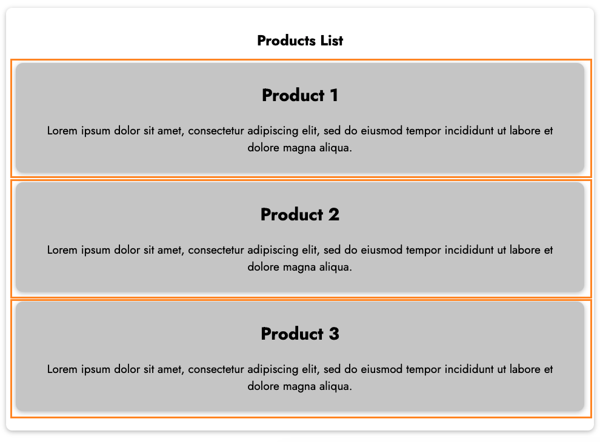
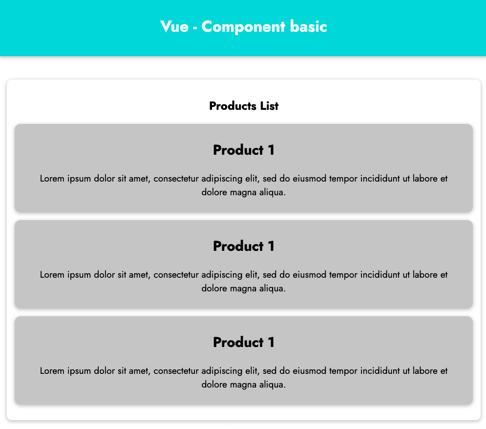
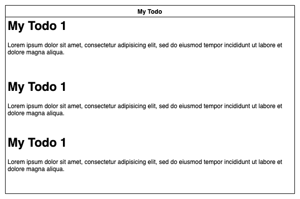

# Vue Component - Basic

## Why we need components

In this chapter, we learn an important idea in Vue. It's component. Components allow you to split up your code into multiple pieces (files). It helps your source code more reuseable.

> Organizing Components: It's common for an app to be organized into a tree of nested components.


## Build your first component

Download starting source code at https://gitlab.com/pav-training-program/source-code/vue-starting-source-code/-/tree/main/component-basic

After open *index.html*, you can see the Products List like below:



### Split Product Items to component

In current source code, we need below code to show a product

```html
<li class="product-item">
    <h2>Product 1</h2>
    <p>Lorem ipsum dolor sit amet, consectetur adipiscing elit, sed do eiusmod tempor incididunt ut labore et dolore magna aliqua. </p>
</li>
```

Now, we will build a component for product item. 

The expression to define a component:

```js
App.component('component-name', options);
```

- *App*: the vue app that you defined by using *Vue.createApp*
- *component*: the function to create a Vue Component.
- *options*: Component options. Since components are reusable Vue instances, they accept the same options as *Vue.createApp*, such as data, computed, watch, methods, and lifecycle hooks.
- *component-name*: the name of the component, we will use this name in template (*index.html*) with expression like html tag `<component-name></component-name>`

Example, we define component for product item as below

> File 
```js
const App = Vue.createApp({
  data() {
    return {
      
    };
  },

  methods: {
   
  }
});

// Define component: product-item
App.component('product-item', {
  template: `
    <li class="product-item">
      <h2>{{ product.name }}</h2>
      <p>{{ product.description }}</p>
    </li>
  `,
  data() {
    return {
      product: {
        id: '1',
        name: 'Product 1',
        description: "Lorem ipsum dolor sit amet, consectetur adipiscing elit, sed do eiusmod tempor incididunt ut labore et dolore magna aliqua."
      },
    };
  }
});

App.mount('#content');
```


And we use *product-item* component in *index.html*
> File *component-basic/index.html*
```html
<!DOCTYPE html>
<html lang="en">
  <head>
    <meta charset="UTF-8" />
    <meta name="viewport" content="width=device-width, initial-scale=1.0" />
    <title>Rendering List & Conditional Contents</title>
    <link
      href="https://fonts.googleapis.com/css2?family=Jost:wght@400;700&display=swap"
      rel="stylesheet"
    />
    <link rel="stylesheet" href="./styles/styles.css" />
    <script src="https://unpkg.com/vue@next" defer></script>
    <script src="./vue/app.js" defer></script>
  </head>
  <body>
    <header>
      <h1>Vue - Component basic</h1>
    </header>
    <section id="content">
      <h2>Products List</h2>
      <ul>
        <product-item></product-item>
        <product-item></product-item>
        <product-item></product-item>
      </ul>
    </section>
  </body>
</html>
```

Now, open *index.html* file, the UI should be like below:



Now, there is a problem that all product items have the same information. We will learn how to pass data into components later. We will learn how to setup a better Development Environment first.

## Exercise



Build component for todo item and use the component to build a Todo list as above mockup.

[Next: Setup Development Environment Like a Real Project](./setup-real-dev-env.md)
