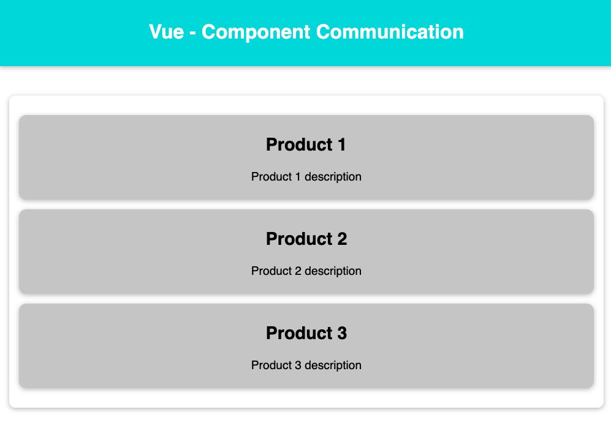
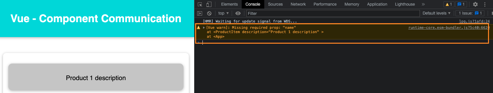
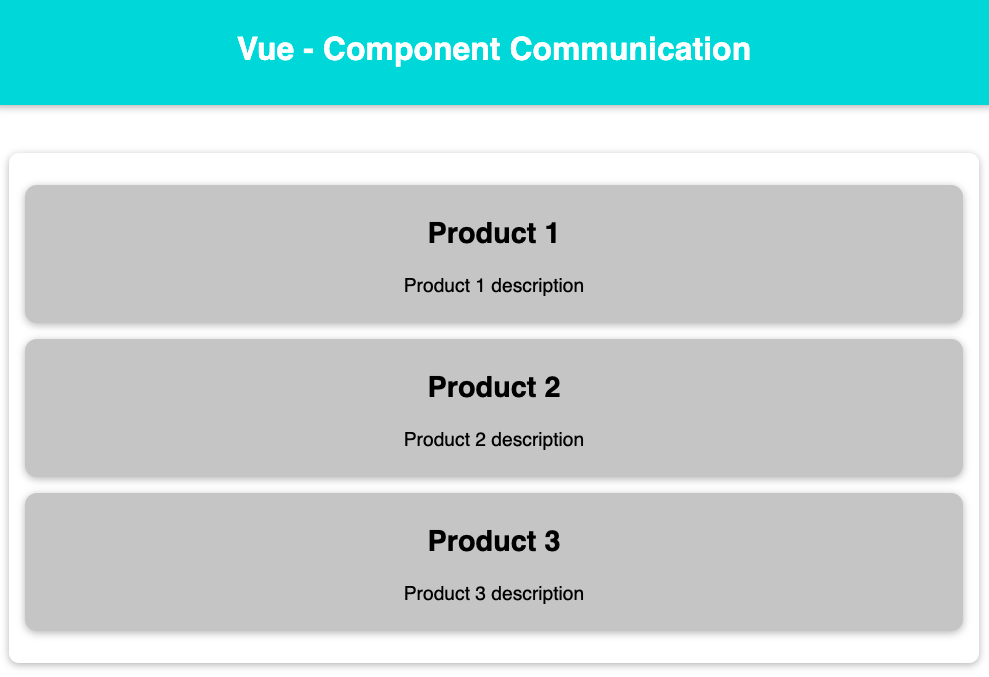
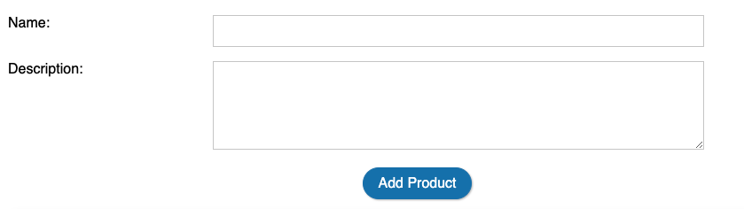
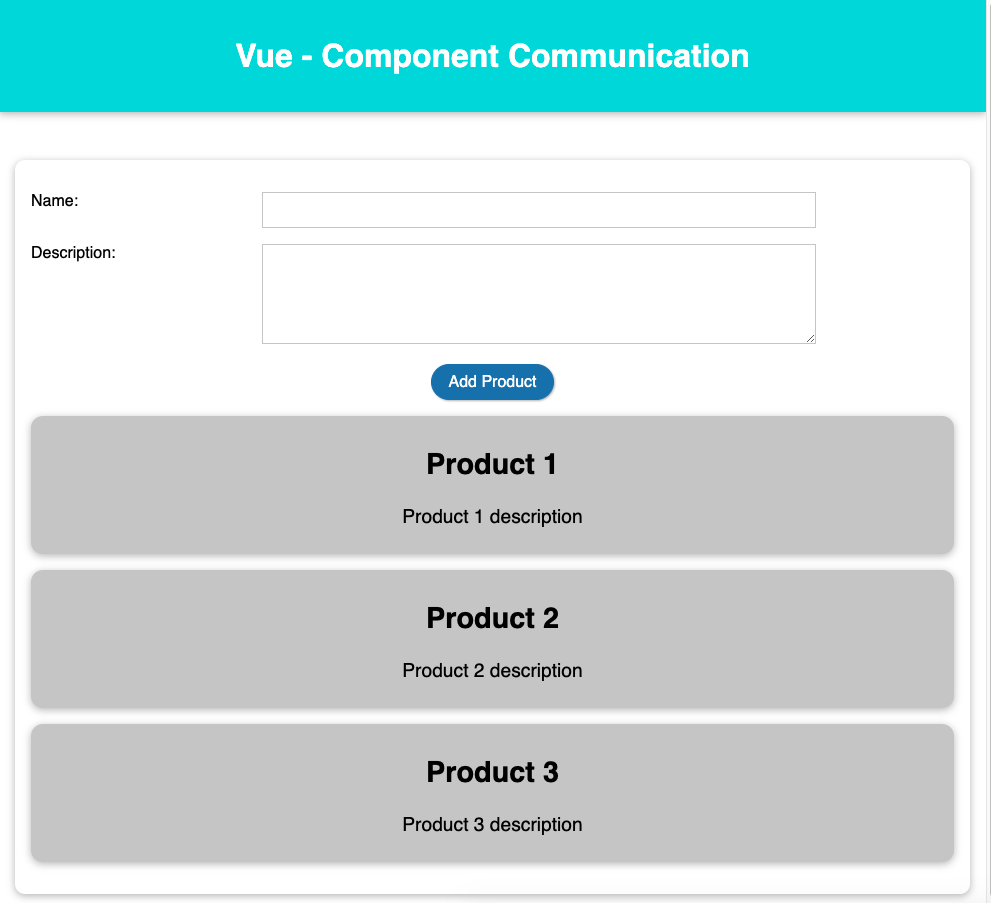
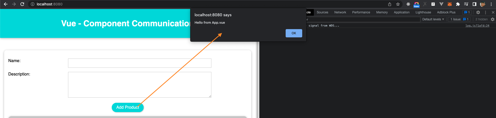
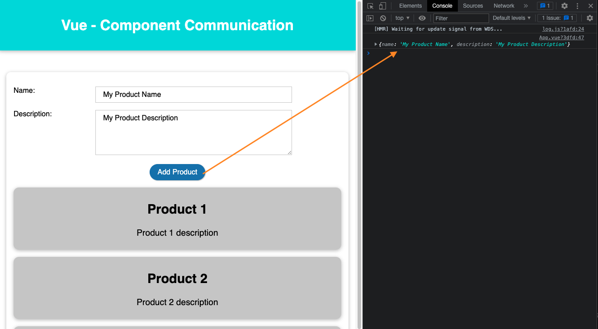
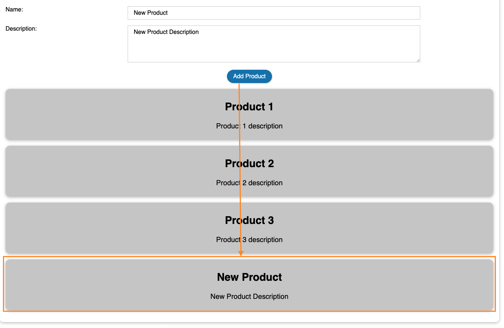

# Component Communication

In previous section, in application *vue-first-app*, we created *ProductItem.vue* component. But it is not really reusable, all information of a product is the same such as product name, product description). We will learn how to make really really reusable Components in this chapter.

## Understanding Parent and Child Component

If a component *A* is used in another component *B*,  *A* is called child component, and *B* is called parent component.

Example, the the application *vue-first-app*. Because *ProductItem* is used in *App* component, so that *ProductItem* is called child component, and *App* is called parent component.

## Passing data from Parent to Child Component by using *props*

You can pass data from parent to child component by using *props*. *props* are just like html attributes. Example:

```html
<ProductItem name="Product 1" description="Description for product 1">
```

*name and description* are called props.

Let update *Vue.app* component to pass data (name and description) to *ProductItem* component.
> File *vue-first-app/src/App.vue*
```vue
<template>
  <div class="app">
    <header>
      <h1>Vue - Component Communication</h1>
    </header>
    <div class="content">
      <ProductItem name="Product 1" description="Product 1 description" />
      <ProductItem name="Product 2" description="Product 2 description" />
      <ProductItem name="Product 3" description="Product 3 description" />
    </div>
  </div>
</template>

<script>
import ProductItem from './components/ProductItem.vue'

export default {
  name: 'App',
  components: {
    ProductItem
  }
}
</script>

<style>
* {
  box-sizing: border-box;
}

html {
  font-family: 'Jost', sans-serif;
}

body {
  margin: 0;
}
.content {
  box-shadow: 0 2px 8px rgba(0, 0, 0, 0.26);
  margin: 3rem 1rem;
  border-radius: 10px;
  padding: 1rem;
  text-align: center;
}
header {
  box-shadow: 0 2px 8px rgba(0, 0, 0, 0.26);
  padding: 1rem;
  background-color: #00dbde;
  color: white;
  text-align: center;
}
</style>
```

### Receiving data from Parent Component

We passed data such as name and description of product in above section. Now, we will learn how to receive the data in *ProductItem* component.

In order to receive the data passed, we need to define *props* properties in child component (ProductItem) like below:

```vue
<script>
export default {
  props: ['name', 'description'],
}
</script>
```

And use can use these *props* in *template*:

```vue
<template>
  <li class="product-item">
    <h2>{{ name }}</h2>
    <p>{{ description }}</p>
  </li>
</template>
```

> File *vue-first-app/src/components/ProductItem.vue*
```vue
<template>
  <li class="product-item">
    <h2>{{ name }}</h2>
    <p>{{ description }}</p>
  </li>
</template>

<script>
export default {
  props: ['name', 'description'],
}
</script>

<!-- Add "scoped" attribute to limit CSS to this component only -->
<style scoped>
.product-item {
  list-style: none;
  align-items: center;
  box-shadow: 0 2px 8px rgba(0, 0, 0, 0.25);
  padding: 0.5rem 2rem;
  margin: 1rem 0;
  border-radius: 12px;
  background-color: #ccc;
  font-size: 1.2rem;
}
</style>
```

Now, open http://localhost:8080/, you can see the data (name, description) that you passed in *App.vue* will be shown:



### Props Casing

HTML attribute names are case-insensitive, so browsers will interpret any uppercase characters as lowercase. That means when you’re using in-DOM templates, camelCased prop names need to use their kebab-cased (hyphen-delimited) equivalents:

Example, if you define props in ProductItem:

```js
{
  ...
  props: ['productName', 'productDescription']
}
```

In parent component, you have to pass value to props like below:

```html
<Product product-name="Product 1" product-description="Product 1 description " />
```

### Prop Validation

To specify prop validations, you can provide an object with validation requirements to the value of props, instead of an array of strings. For example:

```js
export default {
  props: {
    // Basic type check (`null` and `undefined` values will pass any type validation)
    propA: Number,
    // Multiple possible types
    propB: [String, Number],
    // Required string
    propC: {
      type: String,
      required: true
    },
    // Number with a default value
    propD: {
      type: Number,
      default: 100
    },
    // Object with a default value
    propE: {
      type: Object,
      // Object or array defaults must be returned from
      // a factory function
      default: function () {
        return { message: 'hello' }
      }
    },
    // Custom validator function
    propF: {
      validator: function (value) {
        // The value must match one of these strings
        return ['success', 'warning', 'danger'].indexOf(value) !== -1
      }
    }
  }
  name: 'MyComponent'
}
```

Example, if we want to add validation for *name and description* props in ProductItem component as below:
- *name*: type must be String and Required.
- *description: type must be String and optional.

The props validation should be:

```js
props: {
  name: {
    type: String,
    required: true
  },
  description: String
}
```

> File *vue-first-app/src/components/ProductItem.vue*
```vue
<template>
  <li class="product-item">
    <h2>{{ name }}</h2>
    <p>{{ description }}</p>
  </li>
</template>

<script>
export default {
  props: {
    name: {
      type: String,
      required: true
    },
    description: String
  },
}
</script>

<!-- Add "scoped" attribute to limit CSS to this component only -->
<style scoped>
.product-item {
  list-style: none;
  align-items: center;
  box-shadow: 0 2px 8px rgba(0, 0, 0, 0.25);
  padding: 0.5rem 2rem;
  margin: 1rem 0;
  border-radius: 12px;
  background-color: #ccc;
  font-size: 1.2rem;
}
</style>
```

In *App.vue*, if you use *ProductItem* component without passing *name*
```html
<ProductItem description="Product 1 description" />
```
You will get a warning message like below:




### Passing Dynamic Data to Child Component

In above section, we just passed static data in *App.vue* to child component *ProductItem.vue* like

```html
<ProductItem name="Product 1" description="...">
```

But we also pass dynamic data to child component by using *v-bind*.

Example, you have products list in *App.vue* like below:

```js
...
data() {
  return {
    products: [
      {
        name: "Product 1",
        description: "Product 1 description"
      },
      {
        name: "Product 2",
        description: "Product 2 description"
      },
      {
        name: "Product 3",
        description: "Product 3 description"
      }
    ]
  }
}
```

You can use *v-for* and *v-bind* to pass data to *ProductItem* like below:

```html
<ProductItem
  v-for="(product,index) in products"
  :key="index"
  :name="product.name"
  :description="product.description" />
```

> File *vue-first-app/src/App.vue*
```vue
<template>
  <div class="app">
    <header>
      <h1>Vue - Component Communication</h1>
    </header>
    <div class="content">
      <ProductItem
      v-for="(product,index) in products"
      :key="index"
      :name="product.name"
      :description="product.description" />
    </div>
  </div>
</template>

<script>
import ProductItem from "./components/ProductItem.vue";

export default {
  name: "App",
  components: {
    ProductItem,
  },
  data() {
    return {
      products: [
        {
          name: "Product 1",
          description: "Product 1 description",
        },
        {
          name: "Product 2",
          description: "Product 2 description",
        },
        {
          name: "Product 3",
          description: "Product 3 description",
        },
      ],
    };
  }
};
</script>

<style>
* {
  box-sizing: border-box;
}

html {
  font-family: "Jost", sans-serif;
}

body {
  margin: 0;
}
.content {
  box-shadow: 0 2px 8px rgba(0, 0, 0, 0.26);
  margin: 3rem 1rem;
  border-radius: 10px;
  padding: 1rem;
  text-align: center;
}
header {
  box-shadow: 0 2px 8px rgba(0, 0, 0, 0.26);
  padding: 1rem;
  background-color: #00dbde;
  color: white;
  text-align: center;
}
</style>
```

You can see the products list will be shown like below.



### Emitting Custom Events 

Example, we will add a form to add products list as below.



Let's create *NewProduct.vue* component

> File *vue-first-app/src/components/NewProduct.vue*
```vue
<template>
  <div>
    <p><label>Name:</label><input ref="name" type="text"></p>
    <p><label>Description:</label><textarea ref="description"></textarea></p>
    <p><button>Add Product</button></p>
  </div>
</template>

<script>
export default {

}
</script>

<!-- Add "scoped" attribute to limit CSS to this component only -->
<style scoped>
label{
  width: 10%;
  display: flex;
  float: left;
}
input, textarea {
  font: inherit;
  border: 1px solid #ccc;
  padding: 0.5rem 1rem;
  width: 60%;
}

textarea {
  height: 100px;
}

input:focus {
  outline: none;
  border-color: #00dbde;
  background-color: #d7fdeb;
}

button {
  font: inherit;
  cursor: pointer;
  border: 1px solid #337ab7;
  background-color: #337ab7;
  color: white;
  padding: 0.5rem 1rem;
  box-shadow: 1px 1px 2px rgba(0, 0, 0, 0.26);
  border-radius: 20px;
  margin: 0 1rem;
}

button:hover,
button:active {
  background-color: #00dbde;
  border-color: #00dbde;
  box-shadow: 1px 1px 4px rgba(0, 0, 0, 0.26);
}
</style>
```

After created *AddProduct* component, use this component in *App* component. We also add a new method named *addProduct* to *App* component like below. The *addProduct* just alert a message *"Hello from App.vue"*.

> File *vue-first-app/src/App.vue*
```vue
<template>
  <div class="app">
    <header>
      <h1>Vue - Component Communication</h1>
    </header>
    <div class="content">
      <NewProduct />
      <ProductItem
      v-for="(product,index) in products"
      :key="index"
      :name="product.name"
      :description="product.description" />
    </div>
  </div>
</template>

<script>
import ProductItem from "./components/ProductItem.vue";
import NewProduct from "./components/NewProduct.vue";

export default {
  name: "App",
  components: {
    ProductItem,
    NewProduct
  },
  data() {
    return {
      products: [
        {
          name: "Product 1",
          description: "Product 1 description",
        },
        {
          name: "Product 2",
          description: "Product 2 description",
        },
        {
          name: "Product 3",
          description: "Product 3 description",
        },
      ],
    };
  },
  methods: {
    addProduct() {
      alert("Hello from App.vue")
    }
  }
};
</script>

<style>
* {
  box-sizing: border-box;
}

html {
  font-family: "Jost", sans-serif;
}

body {
  margin: 0;
}
.content {
  box-shadow: 0 2px 8px rgba(0, 0, 0, 0.26);
  margin: 3rem 1rem;
  border-radius: 10px;
  padding: 1rem;
  text-align: center;
}
header {
  box-shadow: 0 2px 8px rgba(0, 0, 0, 0.26);
  padding: 1rem;
  background-color: #00dbde;
  color: white;
  text-align: center;
}
</style>
```

Now, if open http://localhost:8080/, the result should be.




**Now, if you want to call the methods *addProduct* from the *NewProduct.vue* component when use click the button *Add Product*, you can do it by following below steps.**

First, In *App.vue*, when use the component *NewProduct*,  we also declare a custom event like below:

```html
<NewProduct @add-product="addProduct" />
```

> File *vue-first-app/src/App.vue*
```vue
<template>
  <div class="app">
    <header>
      <h1>Vue - Component Communication</h1>
    </header>
    <div class="content">
      <NewProduct @add-product="addProduct" />
      <ProductItem
      v-for="(product,index) in products"
      :key="index"
      :name="product.name"
      :description="product.description" />
    </div>
  </div>
</template>

<script>
import ProductItem from "./components/ProductItem.vue";
import NewProduct from "./components/NewProduct.vue";

export default {
  name: "App",
  components: {
    ProductItem,
    NewProduct
  },
  data() {
    return {
      products: [
        {
          name: "Product 1",
          description: "Product 1 description",
        },
        {
          name: "Product 2",
          description: "Product 2 description",
        },
        {
          name: "Product 3",
          description: "Product 3 description",
        },
      ],
    };
  },
  methods: {
    addProduct() {
      alert("Hello from App.vue")
    }
  }
};
</script>

<style>
* {
  box-sizing: border-box;
}

html {
  font-family: "Jost", sans-serif;
}

body {
  margin: 0;
}
.content {
  box-shadow: 0 2px 8px rgba(0, 0, 0, 0.26);
  margin: 3rem 1rem;
  border-radius: 10px;
  padding: 1rem;
  text-align: center;
}
header {
  box-shadow: 0 2px 8px rgba(0, 0, 0, 0.26);
  padding: 1rem;
  background-color: #00dbde;
  color: white;
  text-align: center;
}
</style>
```


Now, in *NewProduct.vue* component. You can use *this.$emit* to emit an event. You can update button "Add Product* as below:

```html
<p><button @click="this.$emit('add-product');">Add Product</button></p>
```

*@click="this.$emit('add-product')"*: when you click on this button, it will trigger to custom event *add-product* on *Vue.app*, and call the method *addProduct*. Try to click on button *Add Product*, you can see the result:



You also call *this.$emit('add-product');"* in methods like below:

> File *vue-first-app/src/components/NewProduct.vue*
```vue
<template>
  <div>
    <p><label>Name:</label><input ref="name" type="text"></p>
    <p><label>Description:</label><textarea ref="description"></textarea></p>
    <p><button @click="addNewProduct">Add Product</button></p>
  </div>
</template>

<script>
export default {

  methods: {
    addNewProduct() {
      this.$emit('add-product');
    }
  }
}
</script>

<!-- Add "scoped" attribute to limit CSS to this component only -->
<style scoped>
.......
/* Keep CSS as current */
</style>
```

You also can emit event with data. Example, you can pass the data like product name, product description when emitting event. :

```js
this.$emit('add-product', data);
```

> You can update the method *addNewProduct* in file *vue-first-app/src/components/NewProduct.vue* as below

```js
addNewProduct() {
  const product = {
    name: this.$refs.name.value,
    description: this.$refs.description.value
  }
  this.$emit('add-product', product);
}
```

And you also need to update the method *addProduct* in file *vue-first-app/src/App.vue* to get emitted event data.

> Method *addProduct* in file *vue-first-app/src/App.vue*
```js
addProduct(product) {
  console.log(product);
}
```

Now, if you  click you enter product name and product description and click *Add Product*, you can see the this data is passed to the parent component *App.vue*



If you add product data to products list.

```js
addProduct(product) {
  this.products.push(product);
}
```

> File *vue-first-app/src/App.vue*
```vue
<template>
  <div class="app">
    <header>
      <h1>Vue - Component Communication</h1>
    </header>
    <div class="content">
      <NewProduct @add-product="addProduct" />
      <ProductItem
      v-for="(product,index) in products"
      :key="index"
      :name="product.name"
      :description="product.description" />
    </div>
  </div>
</template>

<script>
import ProductItem from "./components/ProductItem.vue";
import NewProduct from "./components/NewProduct.vue";

export default {
  name: "App",
  components: {
    ProductItem,
    NewProduct
  },
  data() {
    return {
      products: [
        {
          name: "Product 1",
          description: "Product 1 description",
        },
        {
          name: "Product 2",
          description: "Product 2 description",
        },
        {
          name: "Product 3",
          description: "Product 3 description",
        },
      ],
    };
  },
  methods: {
    addProduct(product) {
      this.products.push(product);
    }
  }
};
</script>

<style>
...
/* Keep current style */
</style>
```

Now, if you try to add new product, it will show on the UI.



## Provide / Inject
Usually, when we need to pass data from the parent to child component, we use *props*. Imagine the structure where you have some deeply nested components and you only need something from the parent component in the deep nested child. In this case, you still need to pass the prop down the whole component chain which might be annoying.

For such cases, we can use the provide and inject pair. Parent components can serve as dependency provider for all its children, regardless how deep the component hierarchy is. This feature works on two parts: parent component has a provide option to provide data and child component has an inject option to start using this data.


Now, we will use provide to in *App.vue* as below. Note that we don't pass any *props* to *ProductItem* component.
> File **
```vue
<template>
  <div class="app">
    <header>
      <h1>Vue - Component Communication</h1>
    </header>
    <div class="content">
      <NewProduct @add-product="addProduct" />
      <ProductItem />
    </div>
  </div>
</template>

<script>
import ProductItem from "./components/ProductItem.vue";
import NewProduct from "./components/NewProduct.vue";

export default {
  name: "App",
  components: {
    ProductItem,
    NewProduct,
  },
  data() {
    return {
      products: [
        {
          name: "Product 1",
          description: "Product 1 description",
        },
        {
          name: "Product 2",
          description: "Product 2 description",
        },
        {
          name: "Product 3",
          description: "Product 3 description",
        },
      ],
    };
  },
  // Using provide
  provide() {
    return {
      products: this.products,
    }
  },
  methods: {
    addProduct(product) {
      this.products.push(product);
    },
  },
};
</script>

<style>
...
</style>

````

After define *products* in *provide*, we can use *inject* to inject it into *ProductItem* component instead of using *props*.

File *vue-first-app/src/components/ProductItem.vue*
```
<template>
  <ul>
    <li v-for="(product, index) in products" class="product-item" :key="index">
      <h2>{{ product.name }}</h2>
      <p>{{ product.description }}</p>
    </li>
  </ul>
</template>

<script>
export default {
  // props: {
  //   name: {
  //     type: String,
  //     required: true
  //   },
  //   description: String
  // },
  inject: ["products"],
};
</script>

<!-- Add "scoped" attribute to limit CSS to this component only -->
<style scoped>
...
</style>
```

**Small Note: The file name *vue-first-app/src/components/ProductItem.vue* is not correct in this context, because it show products list, so that the file name should be *ProductList.vue* :)**

## Exercise

### Exercise 1

- In component *NewProduct*, after added new product, we should reset the form. Try to reset the form after added new product.

### Exercise 2

Implement feature to delete product, when user click on product item, delete the product. (Tip for freshers: you can use *array.splice* to delete an element from an array).

[Next: Diving into Components](./diving-into-component.md)
