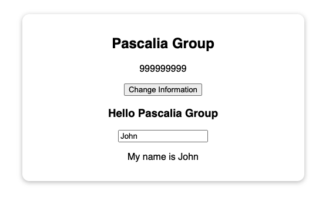
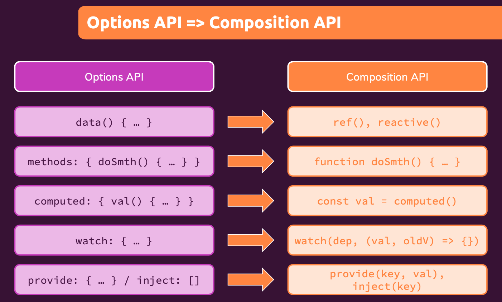

# Composition API

## Introduction

There is a very good introduction about Composition API on the official homepage https://v3.vuejs.org/guide/composition-api-introduction.html#why-composition-api. Please read and understand why we need composition API, then we will go to next section to learn how to use it.

## Download starting source code

Please download starting source code at https://gitlab.com/pav-training-program/source-code/vue-starting-source-code/-/tree/main/composition-api

## Replace *data* with *refs*

Now, let open *App.vue* and update it with below code.

> File *composition-api/src/App.vue*
```vue
<template>
  <section class="container">
    <h2>{{ name }}</h2>
  </section>
</template>

<script>
import { ref } from 'vue';
export default {
  setup() {
    const companyName = ref('Pascalia Group');
    return {name: companyName}
  },
}
</script>


<style>
......
....
</style>
```

The new *setup* component option is executed before the component is created, once the props are resolved, and serves as the entry point for composition APIs.

The *setup* option should be a function that accepts *props* and *context* which we will talk about later. 

*ref* function allows us to create reactive variable anywhere as above. *ref* takes the argument and returns it wrapped within an object with a *value* property, which can then be used to access or mutate the value of the reactive variable.

> File *composition-api/src/App.vue*
```vue
...
<script>
import { ref } from 'vue';
export default {
  setup() {
    const companyName = ref('Pascalia Group');

    setTimeout(() => {
      companyName.value = "Pascalia Asia";
    }, 1000);

    return {name: companyName}
  },
}
</script>
...
```

In above example, we use setTimeoutFunction to change value of reactive variable created by using *ref*. Reload the page, we can see that message "Pascalia Group" in beginning, but one second later, it changed to "Pascalia Asia". That is the same with we using *data*, when a data changes, it is reflected on the UI.

## Creating Reactive Object with *reactive*

In above example, we have only one variable *companyName*, imagine in the case there is more information such as *phone*, and you want you use a object instead of defining more *reactive* variables, the *reactive* will help you to do it as below

> File *composition-api/src/App.vue*
```vue
<template>
  <section class="container">
    <h2>{{ company.name }}</h2>
    <p>{{ company.phone }}</p>
  </section>
</template>

<script>
import { reactive } from 'vue';
export default {
  setup() {
    const companyInfo = reactive({
      name: "Pascalia Group",
      phone: 999999999,
    });

    setTimeout(() => {
      companyInfo.name = "Pascalia Asia";
      companyInfo.phone = 666666666;
    }, 1000);

    return {company: companyInfo}
  },
}
</script>

<style>
...
...
</style>
```

You can check more about *reactive* at https://v3.vuejs.org/api/basic-reactivity.html#reactive

## Replacing "methods" with Regular Functions

In composition API, we can replace methods by creating Regular Functions, and include the function is *return object*. Easier to understand, in template, we can access to any property in *return object*.

Example, we can define a function to update company information as below:

```vue
<template>
  <section class="container">
    <h2>{{ company.name }}</h2>
    <p>{{ company.phone }}</p>
    <p><button @click="updateFunc">Change Information</button></p>
  </section>
</template>

<script>
import { reactive } from "vue";
export default {
  setup() {
    const companyInfo = reactive({
      name: "Pascalia Group",
      phone: 999999999,
    });

    function changeInfo() {
      companyInfo.name = "Pascalia Asia";
      companyInfo.phone = 666666666;
    }

    return { company: companyInfo, updateFunc: changeInfo };
  },
};
</script>
<style>
.....
</style>
```

Try to click on button *Change Information*, you can see the information is changed.


## Replacing computed property by Computed Function

Example, if you want to use *computed* to return a message like *Hello Company Name* based on *companyInfo.name*. You can *computed* property to do it in Options API, but in Composition API, we can use *computed* function as below:

```vue
<template>
  <section class="container">
    <h2>{{ company.name }}</h2>
    <p>{{ company.phone }}</p>
    <p><button @click="updateFunc">Change Information</button></p>
    <h3>{{ message }}</h3>
    <p>
      <input type=te>
    </p>
  </section>
</template>

<script>
import { computed, reactive } from "vue";
export default {
  setup() {
    const companyInfo = reactive({
      name: "Pascalia Group",
      phone: 999999999,
    });

    const welcomeMsg = computed(function () {
      return "Hello " + companyInfo.name;
    });

    function changeInfo() {
      companyInfo.name = "Pascalia Asia";
      companyInfo.phone = 666666666;
    }

    return {
      company: companyInfo,
      message: welcomeMsg,
      updateFunc: changeInfo,
    };
  },
};
</script>

<style>
....
....
</style>
```

Here, the *computed* function returns a read-only Reactive Reference to the output of the getter like callback passed as the first argument to *computed*. 


## Using two-way binding in Composition API

Example, you have a input username, and you can use two-way binding by following below steps:
1. Define a reactive variable by using ref `const userName = ref('')`
2. Expose the variable in return object `return {userName: userName, ... }`
3. Using v-model as we learned before `<input v-model="userName">`

> File *composition-api/src/App.vue*
```vue
<template>
  <section class="container">
    <h2>{{ company.name }}</h2>
    <p>{{ company.phone }}</p>
    <p><button @click="updateFunc">Change Information</button></p>
    <h3>{{ message }}</h3>
    <p>
      <input type="text" v-model="userName" />
    </p>
    <p>My name is {{ userName }}</p>
  </section>
</template>

<script>
import { computed, reactive, ref } from "vue";
export default {
  setup() {
    const userName = ref('');
    const companyInfo = reactive({
      name: "Pascalia Group",
      phone: 999999999,
    });

    const welcomeMsg = computed(function () {
      return "Hello " + companyInfo.name;
    });

    function changeInfo() {
      companyInfo.name = "Pascalia Asia";
      companyInfo.phone = 666666666;
    }

    return {
      company: companyInfo,
      message: welcomeMsg,
      updateFunc: changeInfo,
      userName: userName,
    };
  },
};
</script>

<style>
.....
.....
</style>
```

The result should be



## Reacting to Changes with *watch*

Just like how we set up a *watcher* on the a property inside our component using the *watch* option, we can do the same using the *watch* function imported from Vue. It accepts 3 arguments:

- A Reactive Reference or getter function that we want to watch
- A callback
- Optional configuration options

> Example for *watch* to react to *userName* change
```js
watch([userName], function(oldValue, newValue) {
  console.log("Reacting to userName change");
  console.log("Old value: ", oldValue);
  console.log("New value: ", newValue);
})
```

> File *composition-api/src/App.vue*
```vue
<template>
  <section class="container">
    <h2>{{ company.name }}</h2>
    <p>{{ company.phone }}</p>
    <p><button @click="updateFunc">Change Information</button></p>
    <h3>{{ message }}</h3>
    <p>
      <input type="text" v-model="userName" />
    </p>
    <p>My name is {{ userName }}</p>
    <p>{{ memberWelcome }}</p>
  </section>
</template>

<script>
import { computed, reactive, ref, watch } from "vue";
export default {
  setup() {
    const userName = ref('')
    const memberWelcome = ref('');
    const companyInfo = reactive({
      name: "Pascalia Group",
      phone: 999999999,
    });

    const welcomeMsg = computed(function () {
      return "Hello " + companyInfo.name;
    });

    function changeInfo() {
      companyInfo.name = "Pascalia Asia";
      companyInfo.phone = 666666666;
    }

    watch([userName], function(oldValue, newValue) {
      console.log("Reacting to userName change");
      console.log("Old value: ", oldValue);
      console.log("New value: ", newValue);
    })

    return {
      company: companyInfo,
      message: welcomeMsg,
      updateFunc: changeInfo,
      userName: userName,
      memberWelcome: memberWelcome,
    };
  },
};
</script>

<style>
....
</style>
```

## Using *props*

Now, we will split Company Information into a component, and learn how to pass data into child component via *props*

Let create a component *CompanyInfo* first, then explain about it later.

> File *composition-api/src/components/CompanyInfo.vue*
```vue
<template>
  <div>
    <h2>{{ name }}</h2>
    <p>{{ phone }}</p>
    <p><button>Change Information</button></p>
    <h3>{{ message }}</h3>
  </div>
</template>

<script>
import { computed } from "vue";
export default {
  props: ["name", "phone"],
  setup(props) {
    const welcomeMsg = computed(function () {
      return "Hello " + props.name;
    });

    return {
      message: welcomeMsg,
    };
  },
};
</script>
````

- *setup(props)*: The first argument in the *setup* function is the *props* argument. Just as you would expect in a standard component, *props* inside of a *setup* function are reactive and will be updated when new props are passed in.


Now, in *App.vue* you can register *CompanyInfo*, and use it in the same way with Options API.

> File **
```vue
<template>
  <section class="container">
    <company-info
      :name="company.name"
      :phone="company.phone"
    ></company-info>
    <p>
      <input type="text" v-model="userName" />
    </p>
    <p>My name is {{ userName }}</p>
    <p>{{ memberWelcome }}</p>
  </section>
</template>

<script>
import { reactive, ref, watch } from "vue";
import CompanyInfo from "./components/CompanyInfo.vue";

export default {
  components: {
    CompanyInfo,
  },
  setup() {
    const userName = ref("");
    const memberWelcome = ref("");
    const companyInfo = reactive({
      name: "Pascalia Group",
      phone: 999999999,
    });

    function changeInfo() {
      companyInfo.name = "Pascalia Asia";
      companyInfo.phone = 666666666;
    }

    watch([userName], function (oldValue, newValue) {
      console.log("Reacting to userName change");
      console.log("Old value: ", oldValue);
      console.log("New value: ", newValue);
    });

    return {
      company: companyInfo,
      updateFunc: changeInfo,
      userName: userName,
      memberWelcome: memberWelcome,
    };
  },
};
</script>

<style>
....
</style>
```

## Working with *context*

The second argument passed to the *setup* function is the *context*. The *context* is a normal JavaScript object that exposes other values that may be useful inside setup:

```js
export default {
  setup(props, context) {
    // Attributes (Non-reactive object, equivalent to $attrs)
    console.log(context.attrs)

    // Slots (Non-reactive object, equivalent to $slots)
    console.log(context.slots)

    // Emit events (Function, equivalent to $emit)
    console.log(context.emit)

    // Expose public properties (Function)
    console.log(context.expose)
  }
}
```

**Now, we will try to use *context.emit* to emit custom event to change company information.**

In *App.vue*, we will pass *update-info* custom event as below.
> File *composition-api/src/App.vue*
```vue
<template>
  ...
    <company-info
      :name="company.name"
      :phone="company.phone"
      @update-info="updateFunc"
    ></company-info>
  ...
</template>
...
```

Then in *CompanyInfo* component, we will use *context.emit* to emit the custom event

> File *composition-api/src/components/CompanyInfo.vue*
```vue
<template>
  <div>
    <h2>{{ name }}</h2>
    <p>{{ phone }}</p>
    <p><button @click="updateInfo">Change Information</button></p>
    <h3>{{ message }}</h3>
  </div>
</template>

<script>
import { computed } from "vue";
export default {
  props: ["name", "phone"],
  setup(props, context) {
    const welcomeMsg = computed(function () {
      return "Hello " + props.name;
    });

    function updateInfo() {
      // emit custom event `update-info`
      context.emit('update-info');
    }

    return {
      message: welcomeMsg,
      updateInfo: updateInfo,
    };
  },
};
</script>
```

## Using Provide/Inject

We can use *provide/inject* with the Composition API as well. Both can only be called during *setup()* with a current active instance.

### Using Provide

When using provide in *setup()*, we start by explicitly importing the method from vue. This allows us to define each property with its own invocation of provide.

The *provide* function allows you to define the property through two parameters:

1. The property's name (string type)
2. The property's value

Example:

```js
setup() {
  provide('userName', 'John')
  provide('userInfo', {
    email: 'email@example.com',
    age: 21,
  })
}
```

We will apply *provide* to pass data into *CompanyInfo* as below
```js
provide("companyInfo", companyInfo);
```


> File *composition-api/src/components/CompanyInfo.vue*
```vue
<template>
  <section class="container">
    <company-info
      @update-info="updateFunc"
    ></company-info>
    <p>
      <input type="text" v-model="userName" />
    </p>
    <p>My name is {{ userName }}</p>
    <p>{{ memberWelcome }}</p>
  </section>
</template>

<script>
import { provide, reactive, ref, watch } from "vue";
import CompanyInfo from "./components/CompanyInfo.vue";

export default {
  components: {
    CompanyInfo,
  },
  setup() {
    const userName = ref("");
    const memberWelcome = ref("");
    const companyInfo = reactive({
      name: "Pascalia Group",
      phone: 999999999,
    });

    // Using provide function to provide data
    provide("companyInfo", companyInfo);

    function changeInfo() {
      companyInfo.name = "Pascalia Asia";
      companyInfo.phone = 666666666;
    }

    watch([userName], function (oldValue, newValue) {
      console.log("Reacting to userName change");
      console.log("Old value: ", oldValue);
      console.log("New value: ", newValue);
    });

    return {
      company: companyInfo,
      updateFunc: changeInfo,
      userName: userName,
      memberWelcome: memberWelcome,
    };
  },
};
</script>

<style>
......
</style>
```

### Using *inject*

When using *inject* in *setup()*, we also need to explicitly import it from vue. Once we do so, this allows us to invoke it to define how we want to expose it to our component.

The inject function takes two parameters:
1. The name of the property to inject
2. A default value (Optional)

Example, we use *inject* in *CompanyInfo* component with below code. Note that we have to import *inject* from vue before using it.
```js
const companyInfo = inject('companyInfo')
```

> File *composition-api/src/components/CompanyInfo.vue*
```vue
<template>
  <div>
    <h2>{{ companyInfo.name }}</h2>
    <p>{{ companyInfo.phone }}</p>
    <p><button @click="updateInfo">Change Information</button></p>
    <h3>{{ message }}</h3>
  </div>
</template>

<script>
import { computed, inject } from "vue";
export default {
  setup(_, context) {
    const companyInfo = inject('companyInfo')

    const welcomeMsg = computed(function () {
      return "Hello " + companyInfo.name;
    });

    function updateInfo() {
      // emit custom event `update-info`
      context.emit('update-info');
    }

    return {
      message: welcomeMsg,
      companyInfo: companyInfo,
      updateInfo: updateInfo,
    };
  },
};
</script>
```

Note that in order to use it in template, you must expose it in return object `return {companyInfo: companyInfo,...}`.

Until now, we learned how to apply ideas in Option API into Composition API. Below diagram helps you easier to remember it.



## Lifecycle Hooks in Composition API

You can access a component's lifecycle hook by prefixing the lifecycle hook with "on". You also need to import it implicitly from vue.

he following table contains how the lifecycle hooks are invoked inside of *setup()*:

|Options API|Hook inside setup|
| ----------- | ----------- |
|beforeCreate|Not needed*|
|created|Not needed*|
|beforeMount|onBeforeMount|
|mounted|onMounted|
|beforeUpdate|onBeforeUpdate|
|updated|onUpdated|
|beforeUnmount|onBeforeUnmount|
|unmounted|onUnmounted|
|errorCaptured|onErrorCaptured|
|renderTracked|onRenderTracked|
|renderTriggered|onRenderTriggered|
|activated|onActivated|
|deactivated|onDeactivated|

You can can try to use some of *Lifecycle Hooks*

> File *composition-api/src/components/CompanyInfo.vue*
```vue
<template>
  <div>
    <h2>{{ companyInfo.name }}</h2>
    <p>{{ companyInfo.phone }}</p>
    <p><button @click="updateInfo">Change Information</button></p>
    <h3>{{ message }}</h3>
  </div>
</template>

<script>
import { computed, inject, onBeforeMount, onBeforeUpdate, onMounted, onUpdated } from "vue";
export default {
  setup(_, context) {
    const companyInfo = inject('companyInfo')

    const welcomeMsg = computed(function () {
      return "Hello " + companyInfo.name;
    });

    function updateInfo() {
      // emit custom event `update-info`
      context.emit('update-info');
    }

    // try to use some hooks
    onBeforeMount(function() {
      console.log("onBeforeMount hook");
    })

    onMounted(function() {
      console.log("onMounted hook");
    })

    onBeforeUpdate(function() {
      console.log("onBeforeUpdate hook");
    })

    onUpdated(function() {
      console.log("onUpdated hook");
    })

    return {
      message: welcomeMsg,
      companyInfo: companyInfo,
      updateInfo: updateInfo,
    };
  },
};
</script>
```

At here, we learned all ideas to replace Option API by Composition API. There are two more things that are *router* and *vuex store*, you can check how to use them with Composition API at:
- Vuex with Composition API: https://next.vuex.vuejs.org/guide/composition-api.html#accessing-state-and-getters
- Vue Router with Composition API: https://next.router.vuejs.org/guide/advanced/composition-api.html#accessing-the-router-and-current-route-inside-setup

## Exercise

Copy the project *auth* that you created in the chapter *"[Authentication in Vue App](./authentication.md)"* to a new folder *auth-composition*, then migrate all components to use Composition API.

*This is sample to migrate *Login.vue* to Composition API. You can check this example and apply to other Component.*
> File *auth-composition/src/pages/auth/Login.vue*
```vue
<template>
  <base-card>
    <h2>Login</h2>
    <p class="error" v-if="loginErrorMsg">Login error: {{ loginErrorMsg }}</p>
    <form @submit.prevent="submitForm">
      <div class="form-control">
        <label for="email">E-Mail</label>
        <input type="email" id="email" v-model.trim="email" />
      </div>
      <div class="form-control">
        <label for="password">Password</label>
        <input type="password" id="password" v-model.trim="password" />
      </div>
      <p v-if="!formIsValid">
        Please enter a valid email and password (password must be at least 6
        characters long).
      </p>
      <base-button>Login</base-button>
    </form>
  </base-card>
</template>

<script>
import { ref } from "vue";
import { useStore } from "vuex";
import { useRouter } from "vue-router";

export default {
  setup() {
    const router = useRouter();
    const store = useStore();
    const email = ref("");
    const password = ref("");
    const formIsValid = ref(true);

    const loginErrorMsg = ref("");

    async function submitForm() {
      formIsValid.value = true;
      if (
        email.value === "" ||
        !email.value.includes("@") ||
        password.value.length < 6
      ) {
        formIsValid.value = false;
        return;
      }

      try {
        // dispatch store action
        await store.dispatch("login", {
          email: email.value,
          password: password.value,
        });

        // redirect to homepage after logged in
        router.push({ path: "/" });
      } catch (err) {
        loginErrorMsg.value = err.message || "Something went wrong!";
      }
    }

    return {
      email,
      password,
      formIsValid,
      loginErrorMsg,
      submitForm,
    };
  },
};
</script>

<style scoped>
...
</style>
```
