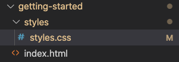
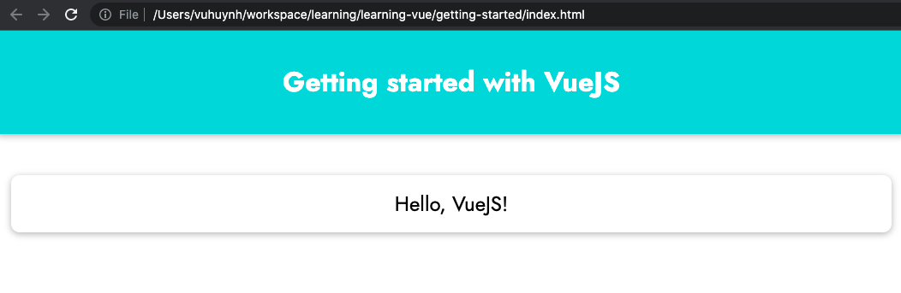
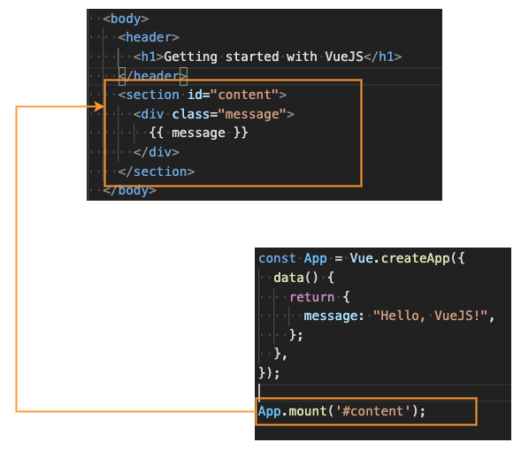
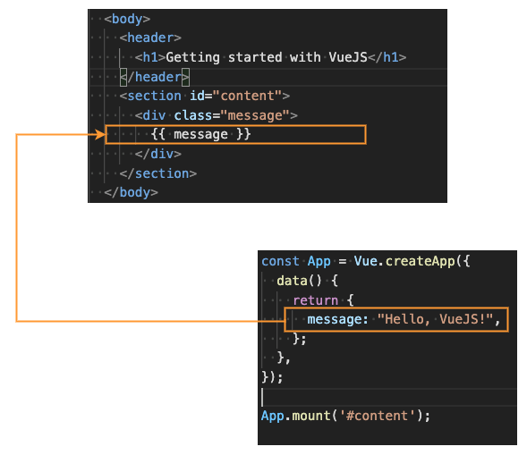

# Create first Vue App

In this chapter, we will learn simple way to create a Vue App.

## Preparing source code

Before starting, please download source code at https://gitlab.com/pav-training-program/source-code/vue-starting-source-code/-/tree/main/getting-started

When you open the folder *getting-started* in VS Code, the source code structure should be like below screenshot:



It's just HTML-CSS page, there is still no VueJS code. When you open *index.html* file, you can see a screen like below:



## Creating Vue Application

Base on source code downloaded above,  in this section, we will create a very simple VueJS to show "Hello, VueJS".

### Step 1: Include VueJS library into *index.html*

There is a latest version of VueJS at *https://unpkg.com/vue@next*, we just include it into *index.html* by using *script* tag:

```html
<script src="https://unpkg.com/vue@next" defer></script>
```

> Update file *getting-started/index.html* with below code
```html
<!DOCTYPE html>
<html lang="en">
  <head>
    <meta charset="UTF-8" />
    <meta name="viewport" content="width=device-width, initial-scale=1.0" />
    <title>Getting started with VueJS</title>
    <link
      href="https://fonts.googleapis.com/css2?family=Jost:wght@400;700&display=swap"
      rel="stylesheet"
    />
    <link rel="stylesheet" href="./styles/styles.css" />
    <script src="https://unpkg.com/vue@next" defer></script>
  </head>
  <body>
    <header>
      <h1>Getting started with VueJS</h1>
    </header>
    <section id="content">
      <div class="message">
        Hello, VueJS!
      </div>
    </section>
  </body>
</html>
```

### Step 2: Create VueJS file

First, let create new folder *vue* under the folder *getting-started*, and create a file *app.js* under the folder *vue*

> File *getting-started/vue/app.js*
```js
const App = Vue.createApp({
  data() {
    return {
      message: "Hello, VueJS!",
    };
  }
});

App.mount('#content');
```

Explain for above source code:

- *const App = Vue.createApp({...})*: the expression to create a VueJS app.
- *{...}*: The *options* to initial the VueJS app, there are many things in the *options*, we will learn it from now until end of this program. Now, we can see one option appeared here that is *data*
- *data()*: is a function. It's name must be *data*, and it MUST return an *Object*, note that it always return an *Object*, NOT numbers, NOT arrays... In above example, the *data* function returns object *{message: "Hello, VueJS!"}*
- *App.mount('#content')*: connect Vue App to HTML element with id is *content*. The elements inside *#content* will be handled by VueJS



### Step 3: Include Vue App *app.js* to HTML file

After created *app.js* file as above, we need to include it into *index.html* file by using *script* tag

```html
<script src="./vue/app.js" defer></script>
```

### Step 4: Binding data from Vue to HTML

After that included *app.js* into *index.html* file, we can use data from VueJS *app.js*. In the *index.html* file, replace the text *"Hello, VueJS!"* by expression *{{ message }}*

> File *getting-started/index.html*
```html
<!DOCTYPE html>
<html lang="en">
  <head>
    <meta charset="UTF-8" />
    <meta name="viewport" content="width=device-width, initial-scale=1.0" />
    <title>Getting started with VueJS</title>
    <link
      href="https://fonts.googleapis.com/css2?family=Jost:wght@400;700&display=swap"
      rel="stylesheet"
    />
    <link rel="stylesheet" href="./styles/styles.css" />
    <script src="https://unpkg.com/vue@next" defer></script>
    <script src="./vue/app.js" defer></script>
  </head>
  <body>
    <header>
      <h1>Getting started with VueJS</h1>
    </header>
    <section id="content">
      <div class="message">
        {{ message }}
      </div>
    </section>
  </body>
</html>
```

- *{{ message }}*: *message* is a *key* of the return object in *data* function. This expression will be replaced by the value of the key *message*. Check below image for easier to understand:



Now, we have created a very simple Vue Application. Open *index.html* file, you can see the result like below. The UI is same with the UI from beginning. The different thing that the message *Hello, VueJS!* is handled by Vue.


If you open file *getting-started/vue/app.js* and change the message to *your name*, you can see that *"Hello, your name!"* appears on the UI.

- Using *returned data* of *app.js* in *index.html* is called *data binding*.
- The expression *{{ message }}* to show the message from returned data is *text interpolation*. The syntax *{{ variable }}* is called *Mustaches syntax*

[Next: Basic Concepts](./basic-concept.md)
