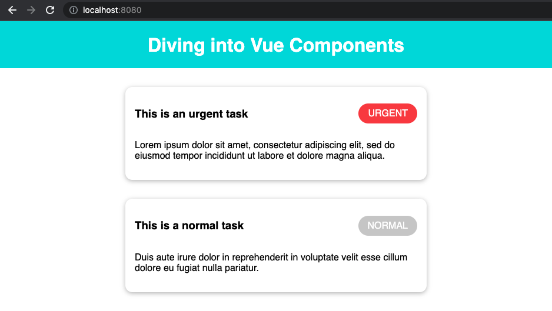
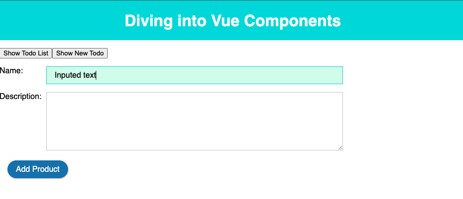
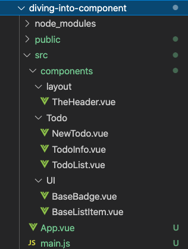

# Diving into Component

## Preparing

Download starting source code at https://gitlab.com/pav-training-program/source-code/vue-starting-source-code/-/tree/main/diving-into-component

Start project:

```
npm install
npm run serve
```

This project is just simple Vue components so show Todo List as below:



##  Understanding Scoped Style

When a `<style>` tag has the scoped attribute, its CSS will apply to elements of the current component only. This is similar to the style encapsulation found in Shadow DOM. It comes with some caveats, but doesn't require any polyfills.

Example, when you open file *diving-into-component/src/components/TodoInfo.vue*, you can see the CSS Style

```html
<style scoped>
section {
  margin: 2rem auto;
  max-width: 30rem;
  border-radius: 12px;
  box-shadow: 0 2px 8px rgba(0, 0, 0, 0.26);
  padding: 1rem;
}

section header {
  display: flex;
  justify-content: space-between;
  align-items: center;
}
</style>
```

By using attribute *scoped*, this css is only apply for this component. It called Scoped Style

We use Scoped Style to avoid conflict when components have the same CSS class name (or selector).

## Understanding Global vs Local Components

### Global Components

Open file *diving-into-component/src/main.js*, you can see its code:

```js
import { createApp } from 'vue';

import App from './App.vue';
import BaseBadge from './components/BaseBadge.vue';

const app = createApp(App);

app.component('base-badge', BaseBadge);

app.mount('#app');
```

By using *app.component('base-badge', BaseBadge)*, the component *base-badge* is registered globally. If you registered a component globally like this, this component can be used anywhere in the application.

If you open the component *diving-into-component/src/components/TodoInfo.vue*, you can see *TodoInfo* uses the component *base-badge* without registering.

### Local Component

Open file *diving-into-component/src/App.vue*, you can see the code like below:

```js
import TheHeader from './components/TheHeader.vue';
import TodoInfo from './components/TodoInfo.vue';

export default {
  components: {
    TheHeader,
    TodoInfo
  }
  ...
```

After imported component *TheHeader, TodoInfo*, you use the property *component* to register these components. By using this way, the components (TheHeader, TodoInfo) are registered locally. Local Components only can be used current component.

## Using Slots

Slots allows you to compose components like this:

```html
<todo-button>
  Add todo
</todo-button>
```

Then in the template for <todo-button>, you might have:

```html
<!-- todo-button component template -->
<button class="btn-primary">
  <slot></slot>
</button>
```


When the component renders, <slot></slot> will be replaced by "Add todo".

```html
<!-- rendered HTML -->
<button class="btn-primary">
  Add todo
</button>
```

### Example for using slot

First, let create a Component *BaseListItem* with slot.

> File *diving-into-component/src/components/BaseListItem.vue*
```vue
<template>
  <section>
    <slot></slot>
  </section>
</template>

<style scoped>
section {
  margin: 2rem auto;
  max-width: 30rem;
  border-radius: 12px;
  box-shadow: 0 2px 8px rgba(0, 0, 0, 0.26);
  padding: 1rem;
}
</style>
```

Then we can modify the component *TodoInfo* to use *BaseListItem*.

> File *diving-into-component/src/components/TodoInfo.vue*
```vue
<template>
  <base-list-item>
    <header>
      <h3>{{ title }}</h3>
      <base-badge :type="priority" :caption="priority.toUpperCase()"></base-badge>
    </header>
    <p>{{ description }}</p>
  </base-list-item>
</template>

<script>
import BaseListItem from './BaseListItem.vue';

export default {
  props: ['title', 'description', 'priority'],
  components: {
    BaseListItem
  }
};
</script>

<style scoped>
header {
  display: flex;
  justify-content: space-between;
  align-items: center;
}
</style>
```

Now, you can see the result is the same with before modifying.

### Named Slot

If you have multiple slots, you can set name for them:

```html
<div class="container">
  <header>
    <slot name="header"></slot>
  </header>
  <main>
    <slot></slot>
  </main>
  <footer>
    <slot name="footer"></slot>
  </footer>
</div>
```

In template, you might have:

```html
<base-layout>
  <template v-slot:header>
    <h1>Here might be a page title</h1>
  </template>

  <p>A paragraph for the main content.</p>
  <p>And another one.</p>

  <template v-slot:footer>
    <p>Here's some contact info</p>
  </template>
</base-layout>
```

Now everything inside the `<template>` elements will be passed to the corresponding slots. Example, elements in `<template v-slot:header>` is be passed to `<slot name="header"></slot>`. Any content not wrapped in a `<template>` using v-slot is assumed to be for the default slot.

Either way, the rendered HTML will be:

```html
<div class="container">
  <header>
    <h1>Here might be a page title</h1>
  </header>
  <main>
    <p>A paragraph for the main content.</p>
    <p>And another one.</p>
  </main>
  <footer>
    <p>Here's some contact info</p>
  </footer>
</div>
```


Example, you can apply multiple slots for *BaseListItem* like below.

> File *diving-into-component/src/components/BaseListItem.vue*
```vue
<template>
  <section>
    <header>
      <slot name="header"></slot>
    </header>
    <slot></slot>
  </section>
</template>

<style scoped>
header {
  display: flex;
  justify-content: space-between;
  align-items: center;
}
section {
  margin: 2rem auto;
  max-width: 30rem;
  border-radius: 12px;
  box-shadow: 0 2px 8px rgba(0, 0, 0, 0.26);
  padding: 1rem;
}
</style>
```

> File *diving-into-component/src/components/TodoInfo.vue*
```vue
<template>
  <base-list-item>
    <template v-slot:header>
      <h3>{{ title }}</h3>
      <base-badge :type="priority" :caption="priority.toUpperCase()"></base-badge>
    </template>
    <p>{{ description }}</p>
  </base-list-item>
</template>

<script>
import BaseListItem from './BaseListItem.vue';

export default {
  props: ['title', 'description', 'priority'],
  components: {
    BaseListItem
  }
};
</script>
```

## Refactoring Component

Now, We defined and show Todo List in *App.vue* directly. We will create a component to show Todo List

> File *diving-into-component/src/components/TodoList.vue*
```vue
<template>
  <div>
    <todo-info v-for="(todo, index) in todos"
      :key="index"
      :title="todo.title"
      :description="todo.description"
      :priority="todo.priority"
    ></todo-info>
  </div>
</template>

<script>
import TodoInfo from './TodoInfo.vue';

export default {
  components: {
    TodoInfo
  },
  data() {
    return {
      todos: [{
        title: 'This is an urgent task',
        description: 'Lorem ipsum dolor sit amet, consectetur adipiscing elit, sed do eiusmod tempor incididunt ut labore et dolore magna aliqua.',
        priority: 'urgent',
      },
      {
        title: 'This is a normal task',
        description: 'Duis aute irure dolor in reprehenderit in voluptate velit esse cillum dolore eu fugiat nulla pariatur.',
        priority: 'normal',
      }]
    };
  }
};
</script>
```

And update *App.vue* to use *TodoList* component.
> File **
```vue
<template>
  <div>
    <the-header></the-header>
    <todo-list></todo-list>
  </div>
</template>

<script>
import TheHeader from './components/TheHeader.vue';
import TodoList from './components/TodoList.vue';

export default {
  components: {
    TheHeader,
    TodoList
  }
};
</script>

<style>
html {
  font-family: sans-serif;
}

body {
  margin: 0;
}

button {
  font: inherit;
  cursor: pointer;
  border: 1px solid #337ab7;
  background-color: #337ab7;
  color: white;
  padding: 0.5rem 1rem;
  box-shadow: 1px 1px 2px rgba(0, 0, 0, 0.26);
  border-radius: 20px;
  margin: 0 1rem;
}
</style>
```

## Dynamic Component

### Using Dynamic Component

Vue provides a feature to load components dynamically by using expression:

```html
<component :is="dynamicComponentName"></component>
```

*dynamicComponentName* is a dynamic component name. It can be changed.

Example, Create new component *NewTodo.vue*
```vue
<template>
  <div>
    <p><label>Name:</label><input ref="name" type="text"></p>
    <p><label>Description:</label><textarea ref="description"></textarea></p>
    <p><button @click="addNewProduct">Add Todo</button></p>
  </div>
</template>

<script>
export default {

}
</script>

<style scoped>
label{
  width: 10%;
  display: flex;
  float: left;
}
input, textarea {
  font: inherit;
  border: 1px solid #ccc;
  padding: 0.5rem 1rem;
  width: 60%;
}

textarea {
  height: 100px;
}

input:focus {
  outline: none;
  border-color: #00dbde;
  background-color: #d7fdeb;
}

</style>
```

And we can apply Dynamic Component: when user click on button "Show Todo List" - we will load the component "TodoList", and when user click on button "Show New Todo" - we will load the component *NewTodo*

> File *diving-into-component/src/App.vue*
```vue
<template>
  <div>
    <the-header></the-header>
    <p>
      <button @click="setDisplayComponent('TodoList')">Show Todo List</button>
      <button @click="setDisplayComponent('NewTodo')">Show New Todo</button>
    </p>
    <component :is="displayComponent"></component>
  </div>
</template>

<script>
import TheHeader from './components/TheHeader.vue';
import TodoList from './components/TodoList.vue';
import NewTodo from './components/NewTodo.vue';

export default {
  components: {
    TheHeader,
    TodoList,
    NewTodo
  },
  data(){
    return {
      displayComponent: "TodoList"
    };
  },
  methods: {
    setDisplayComponent(componentName) {
      this.displayComponent = componentName;
    }
  }

};
</script>

<style>
html {
  font-family: sans-serif;
}

body {
  margin: 0;
}

</style>
```

### Keep Dynamic Component Alive

Now, if you enter some text to the form *Add Todo*, and click buttons *Show Todo List/Show New Todo* to switch between Todo List and New Todo, you can see that entered text is lost. The form will be reset. To keep current component status, we can use *keep-alive*

```html
<keep-alive>
  <component :is="currentComponent"></component>
</keep-alive>
```

> File *diving-into-component/src/App.vue*
```vue
<template>
  <div>
    <the-header></the-header>
    <p>
      <button @click="setDisplayComponent('TodoList')">Show Todo List</button>
      <button @click="setDisplayComponent('NewTodo')">Show New Todo</button>
    </p>
    <keep-alive>
      <component :is="displayComponent"></component>
    </keep-alive>
  </div>
</template>

<script>
import TheHeader from './components/TheHeader.vue';
import TodoList from './components/TodoList.vue';
import NewTodo from './components/NewTodo.vue';

export default {
  components: {
    TheHeader,
    TodoList,
    NewTodo
  },
  data(){
    return {
      displayComponent: "TodoList"
    };
  },
  methods: {
    setDisplayComponent(componentName) {
      this.displayComponent = componentName;
    }
  }

};
</script>

<style>
html {
  font-family: sans-serif;
}

body {
  margin: 0;
}

</style>
```

Now, if you try to enter some text on the form and switch between Todo List/New Todo, entered text still keep in the form.



## Make better folder structure

In current folder structure, we put all components inside the folder *src/components*. Imagine that if we have more many components, this folder will contain many files, it becomes difficult to manage the files. So that we should create sub folders and move components to these folder as below:



- *src/components/layout*: contains the components for master layout like the Header, Footer, Sidebar of the application.
- *src/components/UI*: contains common UI component like button, input, badges...
- *src/components/Todo*: contains all components related to Todo feature. If you have another feature such as Product, you should create new folder *src/components/Product/* and put all components related to Product in this folder.

## Exercise

1. Use slot to make *BaseBadge* component *(diving-into-component/src/components/UI/BaseBadge.vue)*
2. Create a component to show List of Products. The product information include *name, description, price*
3. Add button to switch the UI to show *Todo List - New Todo - Product List*

[Next: Working with Form](./working-with-form.md)

