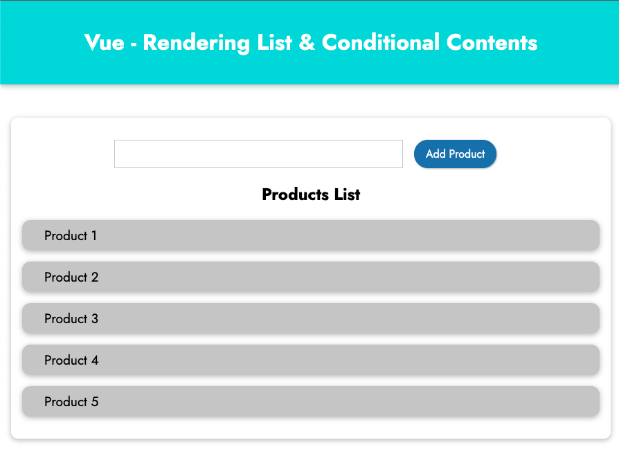
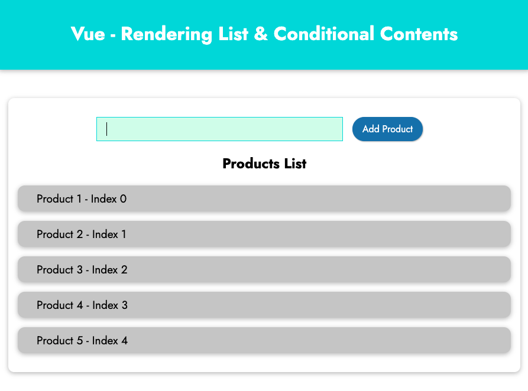
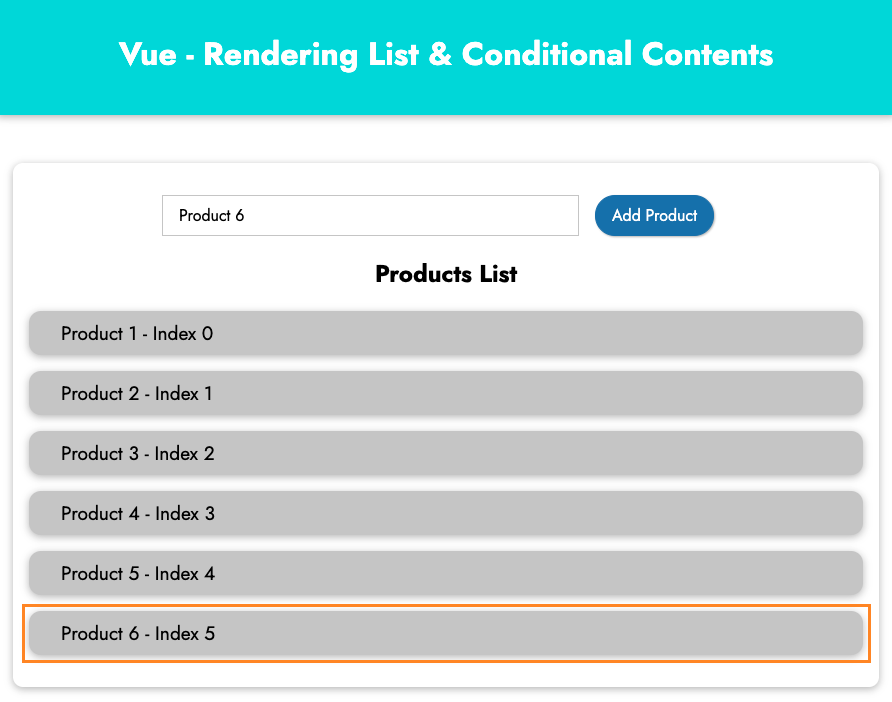
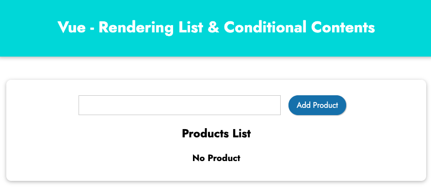
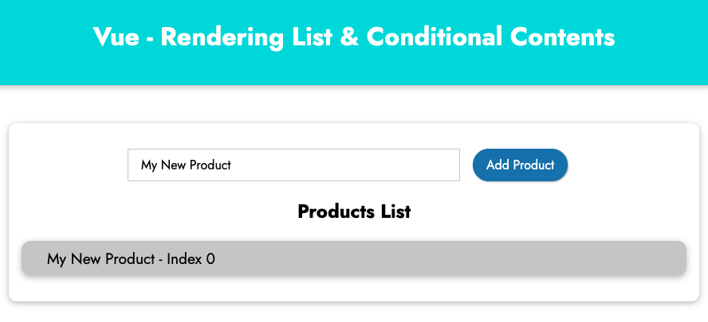
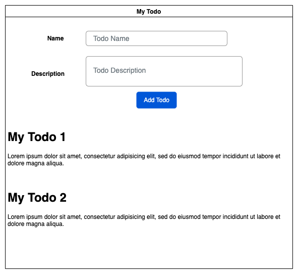

# Rendering List and Conditional Contents.

## Preparing

Download starting source code for this chapter at https://gitlab.com/pav-training-program/source-code/vue-starting-source-code/-/tree/main/list-conditional-rendering and open the folder *list-conditional-rendering* in your VS Code.

The source code is just for create a HTML/CSS page with the UI like below:



## Rendering List in Vue with *v-for*

Example you have array of products *["Product 1", "Product 2", "Product 3", "Product 4", "Product 5"]* storing in *app.js* like below:

> File *list-conditional-rendering/vue/app.js*
```js
const App = Vue.createApp({
  data() {
    return {
      products: ["Product 1", "Product 2", "Product 3", "Product 4", "Product 5"],
    };
  },

  methods: {
   
  }
});

App.mount('#content');
```

And we will use *v-for* with below expression to render the array to list:

```html
<!-- array is data stored in vue app  -->
<!-- li can be any HTML tag -->
<li v-for="item in arrays" :key="item">
    {{ item }}
</li>
```

Example, in order to render products list above, we use below code:

```html
<li class="product-item" v-for="product in products" :key="product">
  {{ product }}
</li>
```

We also can access to the index of current item in array, and use the *index* as below:

```html
<li class="product-item" v-for="(product, index) in products" :key="index">
  {{ product }} - Index {{ index }}
</li>
```

> Update file *list-conditional-rendering/index.html*
```html
<!DOCTYPE html>
<html lang="en">
  <head>
    <meta charset="UTF-8" />
    <meta name="viewport" content="width=device-width, initial-scale=1.0" />
    <title>Rendering List & Conditional Contents</title>
    <link
      href="https://fonts.googleapis.com/css2?family=Jost:wght@400;700&display=swap"
      rel="stylesheet"
    />
    <link rel="stylesheet" href="./styles/styles.css" />
    <script src="https://unpkg.com/vue@next" defer></script>
    <script src="./vue/app.js" defer></script>
  </head>
  <body>
    <header>
      <h1>Vue - Rendering List & Conditional Contents </h1>
    </header>
    
    <section id="content">
      <p><input type="text"><button>Add Product</button></p>
      <h2>Products List</h2>
      <ul>
        <li class="product-item" v-for="(product, index) in products" :key="index">
          {{ product }} - Index {{ index }}
        </li>
      </ul>
    </section>
  </body>
</html>
```

The result should be like below:



### Understanding about keys in list

Take a look on below code:

```html
<li class="product-item" v-for="(product, index) in products" :key="index">
```

You can see there is an attribute *:key* (or *v-bind:key*). 

The *key* special attribute is used as a hint for Vue's virtual DOM algorithm to keep track of a node's identity. That way, Vue knows when it can reuse and patch existing nodes and when it needs to reorder or recreate them. 


When Vue is updating a list of elements rendered with *v-for*, by default it uses an “in-place patch” strategy. If the order of the data items has changed, instead of moving the DOM elements to match the order of the items, Vue will patch each element in-place and make sure it reflects what should be rendered at that particular index.

This default mode is efficient, but only suitable when your list render output does not rely on child component state or temporary DOM state (e.g. form input values).

To give Vue a hint so that it can track each node’s identity, and thus reuse and reorder existing elements, you need to provide a unique key attribute for each item:

```html
<li class="product-item" v-for="(product, index) in products" :key="index">
```
It is recommended to provide a key attribute with *v-for* whenever possible, unless the iterated DOM content is simple, or you are intentionally relying on the default behavior for performance gains.

> As vue document, DO NOT use non-primitive values like objects and arrays as v-for keys. Use string or numeric values instead.

### Add items to the list


On the UI, we already prepared a input and a button to add new product. Now, we will handle them to add new products to the list.

Define a method *addProduct* to add product to the list as below:

> Fille *list-conditional-rendering/vue/app.js*
```js
const App = Vue.createApp({
  data() {
    return {
      enteredProduct: "",
      products: ["Product 1", "Product 2", "Product 3", "Product 4", "Product 5"],
    };
  },

  methods: {
   addProduct() {
    if (this.enteredProduct === '') {
      alert("Please enter product name");
      return;
    }
    // Add new product to products list
    this.products.push(this.enteredProduct);
   }
  }
});

App.mount('#content');
```

Update input and button for adding new product:
```html
<p><input type="text" v-model="enteredProduct"><button @click="addProduct">Add Product</button></p>
```

> File *list-conditional-rendering/index.html*
```html
<!DOCTYPE html>
<html lang="en">
  <head>
    <meta charset="UTF-8" />
    <meta name="viewport" content="width=device-width, initial-scale=1.0" />
    <title>Rendering List & Conditional Contents</title>
    <link
      href="https://fonts.googleapis.com/css2?family=Jost:wght@400;700&display=swap"
      rel="stylesheet"
    />
    <link rel="stylesheet" href="./styles/styles.css" />
    <script src="https://unpkg.com/vue@next" defer></script>
    <script src="./vue/app.js" defer></script>
  </head>
  <body>
    <header>
      <h1>Vue - Rendering List & Conditional Contents </h1>
    </header>
    
    <section id="content">
      <p><input type="text" v-model="enteredProduct"><button @click="addProduct">Add Product</button></p>
      <h2>Products List</h2>
      <ul>
        <li class="product-item" v-for="(product, index) in products" :key="index">
          {{ product }} - Index {{ index }}
        </li>
      </ul>
    </section>
  </body>
</html>
```

Now, if you enter a product name to the input and click the button *Add Product*, new product will be added to the list.



## Rendering Conditional Contents

Vue does provide *v-if, v-else-if and v-else* to render conditional content depending on data.

### Using *v-if*

Example, in the case of products list is empty, you want to render a message *"No product"* on UI like below



In order to show the message, you can use *v-if* with below expression:
```html
<h3 v-if="products.length === 0">No Product</h3>
```

*products.length === 0* is just a vanilla javascript expression to check the array *products* is empty or not.

> File *list-conditional-rendering/index.html*
```html
<!DOCTYPE html>
<html lang="en">
  <head>
    <meta charset="UTF-8" />
    <meta name="viewport" content="width=device-width, initial-scale=1.0" />
    <title>Rendering List & Conditional Contents</title>
    <link
      href="https://fonts.googleapis.com/css2?family=Jost:wght@400;700&display=swap"
      rel="stylesheet"
    />
    <link rel="stylesheet" href="./styles/styles.css" />
    <script src="https://unpkg.com/vue@next" defer></script>
    <script src="./vue/app.js" defer></script>
  </head>
  <body>
    <header>
      <h1>Vue - Rendering List & Conditional Contents </h1>
    </header>
    
    <section id="content">
      <p><input type="text" v-model="enteredProduct"><button @click="addProduct">Add Product</button></p>
      <h2>Products List</h2>
      <h3 v-if="products.length === 0">No Product</h3>
      <ul>
        <li class="product-item" v-for="(product, index) in products" :key="index">
          {{ product }} - Index {{ index }}
        </li>
      </ul>
    </section>
  </body>
</html>
```

Now, let update products array to empty to check the result:

> File *list-conditional-rendering/vue/app.js*
```js
const App = Vue.createApp({
  data() {
    return {
      enteredProduct: "",
      products: [],
    };
  },

  methods: {
   addProduct() {
    if (this.enteredProduct === '') {
      alert("Please enter product name");
      return;
    }
    this.products.push(this.enteredProduct);
   }
  }
});

App.mount('#content');
```

Now, if you open *index.html*, because products list is empty, so that you can see the message *"No Product"* on screen.


If you try to add a product, the message *"No Product"* will be hidden.




### Using *v-show* instead of *v-if*

In the case that you have only *v-if* like above, you also can use *v-show* instead.

```html
<h3 v-show="products.length === 0">No Product</h3>
```

With this code, the message only shows when the products list is empty.

### Using *v-else*

Example, if you also hide the Heading *"Products List"* when products list is empty, you can use *v-else*:

```html
  <h3 v-if="products.length === 0">No Product</h3>
  <h2 v-else>Products List</h2>
```

> File *list-conditional-rendering/index.html*
```html
<!DOCTYPE html>
<html lang="en">
  <head>
    <meta charset="UTF-8" />
    <meta name="viewport" content="width=device-width, initial-scale=1.0" />
    <title>Rendering List & Conditional Contents</title>
    <link
      href="https://fonts.googleapis.com/css2?family=Jost:wght@400;700&display=swap"
      rel="stylesheet"
    />
    <link rel="stylesheet" href="./styles/styles.css" />
    <script src="https://unpkg.com/vue@next" defer></script>
    <script src="./vue/app.js" defer></script>
  </head>
  <body>
    <header>
      <h1>Vue - Rendering List & Conditional Contents </h1>
    </header>
    
    <section id="content">
      <p><input type="text" v-model="enteredProduct"><button @click="addProduct">Add Product</button></p>
      <h3 v-if="products.length === 0">No Product</h3>
      <h2 v-else>Products List</h2>
      <ul>
        <li class="product-item" v-for="(product, index) in products" :key="index">
          {{ product }} - Index {{ index }}
        </li>
      </ul>
    </section>
  </body>
</html>
```

## Exercise

Using Vue to create TODO app following below UI:



**Requirement:**

1. Allow user to create new Todos. When Todo is created, it added to Todos List as the UI.
2. If Todos list is empty, show message *"No todo"*.
3. When user click on a TODO, remove the Todo from the List.

[Next: Vue Component (basic)](./component-basic.md)
