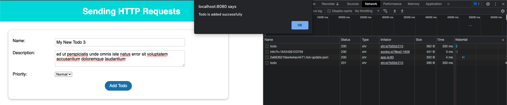

# Sending HTTP Requests

## Preparing

Download starting source code at https://gitlab.com/pav-training-program/source-code/vue-starting-source-code/-/tree/main/sending-http-request

This Vue project is just to show Todo List (hard code) and a form to add new todo. We will use this project to learn how to send HTTP requests.

Start the project:

```sh
cd sending-http-request
npm install
npm run serve
```


## Preparing API

We prepared APIs for get and add Todo:

### Get Todo List API

- Endpoint: https://61e4e01a595afe00176e51df.mockapi.io/todo
- Method: GET

> Example Response
```json
[
    {
        "createdAt": "2022-01-16T20:26:53.001Z",
        "title": "Customer Usability Strategist",
        "description": "Error impedit quod dolor fuga aut repudiandae deserunt qui. Est iure non quam aspernatur neque molestias blanditiis eaque enim. Quia voluptatibus in.",
        "priority": "normal",
        "id": "1"
    },
    {
        "createdAt": "2022-01-16T08:03:37.102Z",
        "title": "Lead Directives Officer",
        "description": "Consectetur quo est voluptas dolor rerum minus commodi quae et. Impedit molestiae suscipit voluptates molestiae commodi aperiam non ut. Praesentium animi eligendi dolorem quia dolorem. Dolores ab voluptatibus a et harum et error id facere. Dolor ea cumque.",
        "priority": "urgent",
        "id": "2"
    }
]
```

### Add Todo List API

- Endpoint: https://61e4e01a595afe00176e51df.mockapi.io/todo
- Method: POST
- Request body: JSON
```json
{
    "title": "Your Todo title",
    "description": "Your Todo Description",
    "priority": "normal",
}
```

Example response:
```json
{
    "createdAt": "2022-01-17T00:10:20.033Z",
    "title": "My New Todo",
    "description": "Error impedit quod dolor fuga aut repudiandae deserunt qui.",
    "priority": "normal",
    "id": "3"
}
```

You must use Postman to create few todos before go to next section.

## Introducing Axios

Axios is Promise based HTTP client for the browser and node.js. If you never used it, please read it at https://github.com/axios/axios

Install axios:

```sh
npm install axios --save
```

If there is any error when running app, run below command, if not, skip it.

```sh
npm install
```

## Sending HTTP Request to get Todo List

Now, Todo list is still hardcode, it is defined by an array. Now, we will call API https://61e4e01a595afe00176e51df.mockapi.io/todo to Todo List from server and show on UI.

The idea that we implement a method *getTodoList* to call the API, and append response Todo List into the the data to show on UI. When use click on button *Fetch Todo List*, call this method

> File *sending-http-request/src/components/Todo/TodoList.vue*
```vue
<template>
  <base-section>
    <h2>Todo List</h2>
    <p><base-button @click="getTodoList">Fetch Todo List</base-button></p>
    <todo-info
      v-for="(todo, index) in todos"
      :key="index"
      :title="todo.title"
      :description="todo.description"
      :priority="todo.priority"
    ></todo-info>
  </base-section>
</template>

<script>
import axios from "axios";
import BaseSection from "../UI/BaseSection.vue";
import BaseButton from "../UI/BaseButton.vue";
import TodoInfo from "./TodoInfo.vue";

export default {
  components: {
    BaseSection,
    BaseButton,
    TodoInfo,
  },
  data() {
    return {
      todos: [],
    };
  },
  methods: {
    getTodoList() {
      const url = "https://61e4e01a595afe00176e51df.mockapi.io/todo";
      axios
        .get(url)
        .then(response => (this.todos = response.data));
    },
  },
};
</script>

<style scoped>
h2,
p {
  text-align: center;
}
</style>
```

Now, if you click on the button *Fetch Todo List*, data will be fetched from server and show on UI.


If you use tool like Postman to add more todo, then click on button *Fetch Todo List*, you can see added items will be shown on the list.

## Fetch Todo List with *mounted* 

Now, we have to click on the button "Fetch Todo List* to load the list. But if you want to load Todo List when page is loaded, we can use hook *mounted* to do it like below.

> File *sending-http-request/src/components/Todo/TodoList.vue*
```vue
<template>
  <base-section>
    <h2>Todo List</h2>
    <todo-info
      v-for="(todo, index) in todos"
      :key="index"
      :title="todo.title"
      :description="todo.description"
      :priority="todo.priority"
    ></todo-info>
  </base-section>
</template>

<script>
import axios from "axios";
import BaseSection from "../UI/BaseSection.vue";
import TodoInfo from "./TodoInfo.vue";

export default {
  components: {
    BaseSection,
    TodoInfo,
  },
  data() {
    return {
      todos: [],
    };
  },
  methods: {
    getTodoList() {
      const url = "https://61e4e01a595afe00176e51df.mockapi.io/todo";
      axios
        .get(url)
        .then(response => this.todos = response.data);
    },
  },
  mounted() {
    this.getTodoList();
  }
};
</script>

<style scoped>
h2,
p {
  text-align: center;
}
</style>
```

Now, just reload page, and we will see that Todo List shown on screen.


## Handling loading and error

As normal, we should show loading icon, or message when waiting response from server.

In order to handle loading, we define a property *isLoading* in data. When start calling API, set *isLoading* to true, and when calling API completed, we will set it to *false*.

For handling error, we also define a property *error* in data, if calling API returns error, we will assign error message to property *error*. Then we check if *error* is not null, we will show error message on screen.

> File *sending-http-request/src/components/Todo/TodoList.vue*
```vue
<template>
  <base-section>
    <h2>Todo List</h2>
    <p v-if="isLoading">Loading...</p>
    <p v-if="error">{{ error }}</p>
    <todo-info
      v-for="(todo, index) in todos"
      :key="index"
      :title="todo.title"
      :description="todo.description"
      :priority="todo.priority"
    ></todo-info>
  </base-section>
</template>

<script>
import axios from "axios";
import BaseSection from "../UI/BaseSection.vue";
import TodoInfo from "./TodoInfo.vue";

export default {
  components: {
    BaseSection,
    TodoInfo,
  },
  data() {
    return {
      todos: [],
      isLoading: false,
      error: null
    };
  },
  methods: {
    getTodoList() {
      this.isLoading = true;
      const url = "https://61e4e01a595afe00176e51df.mockapi.io/todo";
      axios
        .get(url)
        .then(response => this.todos = response.data)
        .catch(err => {
          // handling error here
          this.error = err.message;
        })
        .then(() => {
          this.isLoading = false;
        });
    },
  },
  mounted() {
    this.getTodoList();
  }
};
</script>

<style scoped>
h2,
p {
  text-align: center;
}
</style>
```

Now, when reload page, you can see the message *Loading...* when waiting response from API. And if you try to change API endpoint to a a wrong URL like https://61e4e01a595afe00176e51df.mockapi.io/todo1, you can see the error message shown on UI when API returns error.


## Send HTTP Request To add New Todo

In order to add New Todo, we also do almost same with above. But instead of call API *GET https://61e4e01a595afe00176e51df.mockapi.io/todo* to get Todo List, we will send with method POST to create new Todo.

> File **
```vue
<template>
  <base-section>
    <form @submit.prevent="addNewTodo">
      <p v-if="error">{{ error }}</p>
      <p><label>Name:</label><input ref="title" type="text" /></p>
      <p><label>Description:</label><textarea ref="description"></textarea></p>
      <p>
        <label>Priority:</label>
        <select ref="priority">
          <option value="normal">Normal</option>
          <option value="urgent">Urgent</option>
        </select>
      </p>
      <p class="center">
        <base-button>Add Todo</base-button>
      </p>
    </form>
  </base-section>
</template>

<script>
import axios from 'axios';
import BaseButton from "../UI/BaseButton.vue";
import BaseSection from "../UI/BaseSection.vue";
export default {
  components: {
    BaseButton,
    BaseSection,
  },
  data() {
    return {
      error: null
    }
  },
  methods: {
    addNewTodo() {
      const url = 'https://61e4e01a595afe00176e51df.mockapi.io/todo';
      axios
        .post(url, {
          title: this.$refs.title.value,
          description: this.$refs.description.value,
          priority: this.$refs.priority.value
        })
        .then((response) => {
          console.log(response.data);
          alert("Todo is added successfully");
        })
        .catch((err) => {
          console.log(err);
          this.error = err.message;
        });
    },
  },
};
</script>

<!-- Add "scoped" attribute to limit CSS to this component only -->
<style scoped>
/* Keep old style */
......
</style>
```

Try to enter todo information and submit form.



Because we still didn't handle reload Todo List after add new, so that we need to reload page to see new Todo on UI.

## Exercise

1. Validate form add todo, title and description are required.
2. Add delete button on each item on todo list. When user click on the button, call API https://61e4e01a595afe00176e51df.mockapi.io/todo/:id with method DELETE to delete the todo.

[Next: Build Single Page Application](./build_single_page_application.md)
