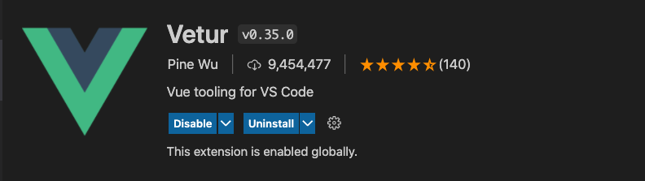

# Setup Environment

## Setup NodeJS and npm

- In order to work with VueJS, we need to install NodeJS and npm. You can install both of them by download and install at https://nodejs.org/en/


After install NodeJs, you can check it by open terminal and run commands:

```sh
node -v
# output will be like v14.7.x
npm -v
# output will be like v6.10.x
```

NodeJS and `npm` are installed, we will learn how to use it later.

## Setup VSCode

We recommend to use VSCode for coding with React. If you not installed VSCode, you can download and install it here https://code.visualstudio.com/

After installed VSCode, you can install useful extension `Pettier - Code Formater`, it help to format code automatically


You also need to install Vetur extension for coding Vue Applications.





Setup environment is done.

[Next: Create first Vue App (Basic - using cdn)](./create-vue-app.md)
