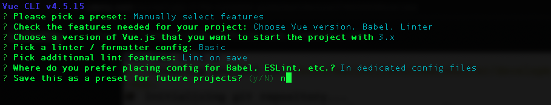

# Setup Development Environment Like a Real Project


## Install Vue CLI

Vue CLI is a tool for Vue Development. You can check more at https://cli.vuejs.org/

Run below command to install Vue CLI

```sh
npm install -g @vue/cli

# OR, if you're using mac or ubuntu, run below command
sudo npm install -g @vue/cli
```

## Create First App with Vue CLI

After installed Vue CLI, create first application with below command:

```sh
vue create vue-first-app
```

A screen like below will be shown


Select *Manually select feature* and press Enter, then you will see a screen like below:


Let everything as default. Select *Choose Vue version* and press Enter. A screen like below will shown


Select *3.x* and press Enter, and a screen will shown like below:


Select *ESLint with error prevention only* and press Enter.


Select *Lint on save* and press Enter, a screen will be show as below.


Select *In dedicated config files* and press Enter. A screen like below will shown



You type *n* and press Enter, if there is any more screen, let press enter. Wait for a minute, you will be an application was created under the folder *vue-first-app*

Go to the folder *vue-first-app* and run below command to start the app:

```sh
npm run serve
```

After the app started, access to the URL http://localhost:8080/, you can see the UI as below:


## Inspecting Created App

Now, let open the folder in VS Code. The folder structure is as below screenshot.


There are many files here, but we mainly work with the folder *src*. 

First, let open the file *main.js*

```js
import { createApp } from 'vue'
import App from './App.vue'

createApp(App).mount('#app')
```

We can see that this file is just import *App.vue* component, and use the function *createApp* to initialize a Vue App.

Next, let check what included in *App.vue*
```vue
<template>
  
  <HelloWorld msg="Welcome to Your Vue.js App"/>
</template>

<script>
import HelloWorld from './components/HelloWorld.vue'

export default {
  name: 'App',
  components: {
    HelloWorld
  }
}
</script>

<style>
#app {
  font-family: Avenir, Helvetica, Arial, sans-serif;
  -webkit-font-smoothing: antialiased;
  -moz-osx-font-smoothing: grayscale;
  text-align: center;
  color: #2c3e50;
  margin-top: 60px;
}
</style>
```

This is a Vue Component. In this file, we can see there are main parts:

- *template*: Contain the HTML template. Its syntax is the same with the *index.html* files that you learned in previous sections.
- *script*: contain javascript code for Vue Options that you leaned in previous sections: [component basic](./component-basic.md). We will learn more detail in next chapter.
- *style*: CSS code for styling the component.

For the source code in script tag:

```js
import HelloWorld from './components/HelloWorld.vue'

export default {
  name: 'App',
  components: {
    HelloWorld
  }
}
```

- *import HelloWorld from './components/HelloWorld.vue'* for importing the *HelloWorld* component.
- *name: 'App'*: allow the component to recursively invoke itself in its template.
- *components*: is a object to register components which are used in this component.

## Re-Create Products List Page with New Environment

Now, we will use created app *vue-first-app* to build a products list


### Step 1: Add a component for Product Item.

Because we don't use the component *vue-first-app/src/components/HelloWorld.vue*, therefore let delete this file and create new file for Product Item

> File *vue-first-app/src/components/ProductItem.vue*
```js
<template>
  <li class="product-item">
    <h2>{{ product.name }}</h2>
    <p>{{ product.description }}</p>
  </li>
</template>

<script>
export default {
  // property is to define component name
  name: 'ProductItem',
  data() {
    return {
      product: {
        id: '1',
        name: 'Product 1',
        description: "Lorem ipsum dolor sit amet, consectetur adipiscing elit, sed do eiusmod tempor incididunt ut labore et dolore magna aliqua."
      },
    };
  }
}
</script>

<!-- Add "scoped" attribute to limit CSS to this component only -->
<style scoped>
.product-item {
  list-style: none;
  align-items: center;
  box-shadow: 0 2px 8px rgba(0, 0, 0, 0.25);
  padding: 0.5rem 2rem;
  margin: 1rem 0;
  border-radius: 12px;
  background-color: #ccc;
  font-size: 1.2rem;
}
</style>
```

### Step 2: Update component *App.vue*

In *vue-first-app/src/App.vue* file, we import *ProductItem* component and use it.

> File *vue-first-app/src/App.vue*
```vue
<template>
  <div class="app">
    <header>
      <h1>Vue - Component basic</h1>
    </header>
    <div class="content">
      <ProductItem />
      <ProductItem />
      <ProductItem />
    </div>
  </div>
</template>

<script>
import ProductItem from './components/ProductItem.vue'

export default {
  name: 'App',
  components: {
    ProductItem
  }
}
</script>

<style>
* {
  box-sizing: border-box;
}

html {
  font-family: 'Jost', sans-serif;
}

body {
  margin: 0;
}
.content {
  box-shadow: 0 2px 8px rgba(0, 0, 0, 0.26);
  margin: 3rem 1rem;
  border-radius: 10px;
  padding: 1rem;
  text-align: center;
}
header {
  box-shadow: 0 2px 8px rgba(0, 0, 0, 0.26);
  padding: 1rem;
  background-color: #00dbde;
  color: white;
  text-align: center;
}
</style>
```

Now, access to http://localhost:8080/, you will see screen same with before.


## Exercise

Split Page Header to a Vue Component (*Header.vue*), and use it in *App.vue*


[Next: Component Communication](./component-communication.md)