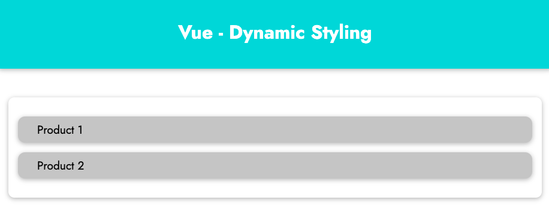

# Dynamic Styling in Vue

## Preparing

Before starting this chapter, please download the source code at https://gitlab.com/pav-training-program/source-code/vue-starting-source-code/-/tree/main/styling-vue 

The folder *styling-vue* contain HTML to show list product as below:



## Inline CSS Dynamic Styling

Example, if user click on products, you want to change the background of these product. How we do it in Vue?

The idea that we will define the data such as *isProduct1Selected, isProduct2Selected* to check if these product is selected (clicked), and use *even binding, methods* to handle the data. And use *:style* to set inline css for the background.

> File *styling-vue/vue/app.js*
```js
const App = Vue.createApp({
  data() {
    return {
      isProduct1Selected: false,
      isProduct2Selected: false,
    };
  },

  methods: {
    setSelectedProduct(productID) {
      console.log(productID);
      if (productID === 1) {
        this.isProduct1Selected = true;
      } else if (productID === 2) {
        this.isProduct2Selected = true;
      }
    }
  }
});

App.mount('#content');
```

> File **
```html
<!DOCTYPE html>
<html lang="en">
  <head>
    <meta charset="UTF-8" />
    <meta name="viewport" content="width=device-width, initial-scale=1.0" />
    <title>Getting started with VueJS</title>
    <link
      href="https://fonts.googleapis.com/css2?family=Jost:wght@400;700&display=swap"
      rel="stylesheet"
    />
    <link rel="stylesheet" href="./styles/styles.css" />
    <script src="https://unpkg.com/vue@next" defer></script>
    <script src="./vue/app.js" defer></script>
  </head>
  <body>
    <header>
      <h1>Vue - Dynamic Styling</h1>
    </header>
    <section id="content">
      <div
        class="product-item"
        @click="setSelectedProduct(1)"
        :style="{backgroundColor: isProduct1Selected ? '#00dbde' : '#ccc'}"
      >
        Product 1
      </div>
      <div
        class="product-item"
        @click="setSelectedProduct(2)"
        :style="{backgroundColor: isProduct2Selected ? '#00dbde' : '#ccc'}"
      >
        Product 2
      </div>
    </section>
  </body>
</html>
```

Explain for the code:

```html
<div
  ...
  :style="{backgroundColor: isProduct1Selected ? '#00dbde' : '#ccc'}"
>
```
- Above code is *attribute binding (v-bind)* for the HTML attribute *style*, the value is an object. The key of the object is CSS property, but this CSS property is transformed from dash to camelCase (Example, *background-color* is transformed to *backgroundColor*, *font-size* is transformed to *fontSize*). The value of the object is set dynamically depending on the data.

Now, if you click on a product, you can see its background is changed from *gray* to *turquoise*


Above example is how we use inline dynamic CSS styling in Vue.

## Using CSS Classes Dynamically

In above section, we used Inline CSS to set background for the items dynamically, but using inline style is not a good idea, because the source code is complex, not readable. In this section, we will use CSS Classes dynamically, a better way to dynamically styling in Vue.

First, open the file *styling-vue/styles/styles.css* and add a class *product-item__active* at bottom of the file.

> File *styling-vue/styles/styles.css*
```css
...
...
.product-item__active {
  background-color: #00dbde;
}
```

And replace *:style="{backgroundColor: isProduct1Selected ? '#00dbde' : '#ccc'}"* by *:class="{'product-item__active': isProduct1Selected}"*

> File *styling-vue/index.html*
```html
<!DOCTYPE html>
<html lang="en">
  <head>
    <meta charset="UTF-8" />
    <meta name="viewport" content="width=device-width, initial-scale=1.0" />
    <title>Getting started with VueJS</title>
    <link
      href="https://fonts.googleapis.com/css2?family=Jost:wght@400;700&display=swap"
      rel="stylesheet"
    />
    <link rel="stylesheet" href="./styles/styles.css" />
    <script src="https://unpkg.com/vue@next" defer></script>
    <script src="./vue/app.js" defer></script>
  </head>
  <body>
    <header>
      <h1>Vue - Dynamic Styling</h1>
    </header>
    <section id="content">
      <div
        class="product-item"
        :class="{'product-item__active': isProduct1Selected}"
        @click="setSelectedProduct(1)"
      >
        Product 1
      </div>
      <div
        class="product-item"
        :class="{'product-item__active': isProduct2Selected}"
        @click="setSelectedProduct(2)"
      >
        Product 2
      </div>
    </section>
  </body>
</html>
```

*{'product-item__active': isProduct1Selected}"* is an object. The key is class name, the value is a boolean type. If it is true, class will be added automatically to the element, if it is false, the class will be remove from the element. You can use multiple keys to bind multiple classes.

We have another way to add CSS classes into an elements, that is array syntax. Take a look at current source code:

```html
<div
  class="product-item"
  :class="{'product-item__active': isProduct1Selected}"
  @click="setSelectedProduct(1)"
>
  Product 1
</div>
```

We can replace above code by using array syntax like below:

```html
<div
  :class="['product-item', {'product-item__active': isProduct1Selected}]"
  @click="setSelectedProduct(1)"
>
  Product 1
</div>
```

By using the array syntax *['product-item', {'product-item__active': isProduct1Selected}]*, the class *product-item* is always added to the element, and the class *product-item__active* is only added into the element when *isProduct1Selected* is *true*.

## Dynamic styling with *computed* property

You also can use *computed* to return the object for CSS classes.

> File *styling-vue/vue/app.js*
```js
const App = Vue.createApp({
  data() {
    return {
      isProduct1Selected: false,
      isProduct2Selected: false,
    };
  },

  computed: {
    product1Classes() {
      return {
        'product-item__active': this.isProduct1Selected,
      }
    },
    product2Classes() {
      return {
        'product-item__active': this.isProduct2Selected,
      }
    }
  },

  methods: {
    setSelectedProduct(productID) {
      console.log(productID);
      if (productID === 1) {
        this.isProduct1Selected = true;
      } else if (productID === 2) {
        this.isProduct2Selected = true;
      }
    }
  }
});

App.mount('#content');
```

Now, you can use *computed* properties in *index.html*
> File *styling-vue/index.html*
```html
<!DOCTYPE html>
<html lang="en">
  <head>
    <meta charset="UTF-8" />
    <meta name="viewport" content="width=device-width, initial-scale=1.0" />
    <title>Getting started with VueJS</title>
    <link
      href="https://fonts.googleapis.com/css2?family=Jost:wght@400;700&display=swap"
      rel="stylesheet"
    />
    <link rel="stylesheet" href="./styles/styles.css" />
    <script src="https://unpkg.com/vue@next" defer></script>
    <script src="./vue/app.js" defer></script>
  </head>
  <body>
    <header>
      <h1>Vue - Dynamic Styling</h1>
    </header>
    <section id="content">
      <div
        :class="['product-item', product1Classes]"
        @click="setSelectedProduct(1)"
      >
        Product 1
      </div>
      <div
        :class="['product-item', product2Classes]"
        @click="setSelectedProduct(2)"
      >
        Product 2
      </div>
    </section>
  </body>
</html>
```

Moving logic to Vue code helps your source code in *index.html*  readable.

[Next: List & Conditional rendering in VueJS](./rendering-list-and-conditional.md)
