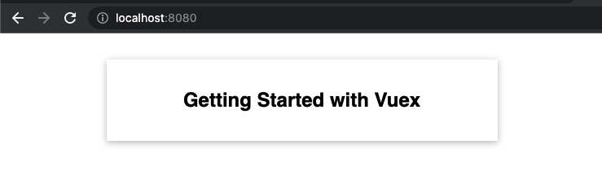
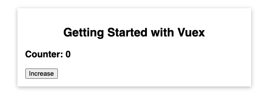
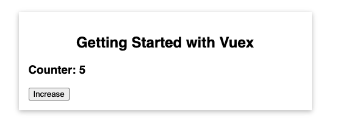
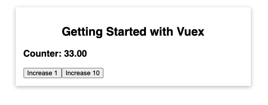
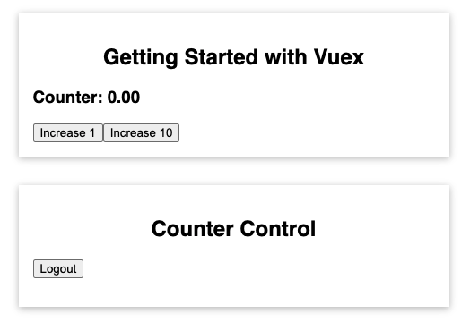

# Vuex

## What is Vuex?

Vuex is a state management pattern + library for Vue.js applications. It serves as a centralized store for all the components in an application, with rules ensuring that the state can only be mutated in a predictable fashion.

You can check more about Introduction for VueX Concept at https://vuex.vuejs.org/#what-is-a-state-management-pattern. 

In this chapter, we will mainly focus on how to apply VueX in your application.

## Download Starting Source Code

Download starting source code for this chapter at https://gitlab.com/pav-training-program/source-code/vue-starting-source-code/-/tree/main/vuex

Start the application:

```sh
npm run install
npm run serve
```

This project is a very simple Vue App to show a message on screen.



## Creating and Using Store

First, let install Vuex by executing below command:

```sh
npm install --save vuex@next

# OR
# yarn add vuex@next --save
```


Imagine that you want to implement a *counter*, when user click on button *Increase*, we increase the counter by one.



As we learned at basic concept chapter, we can use *data* and *methods* to implement it. But now, we will use Vuex to manage the counter state.

### Creating a Store

We can create a store like below code.

> File *vuex/src/main.js*
```js
import { createApp } from 'vue';
import { createStore } from 'vuex';

import App from './App.vue';

// Create a new store.
const store = createStore({
  state: {
    counter: 0
  }
})

const app = createApp(App);

// Use the the store for vue app
app.use(store);
app.mount('#app');
```


## Connecting Component to State

Now, in any component, you can access to the counter value. Let create new *TheCounter* component to use this state as below:

> Create file *vuex/src/components/TheCounter.vue*
```vue
<template>
  <h3>Counter: {{ counter }} </h3>
</template>

<script>
export default {
  computed: {
    counter() {
      return this.$store.state.counter
    }
  }
}
</script>
```

In above code, we use *this.$store.state* to access to the state object directly.


## Changing the State

Now, let import the component *TheCounter* in *App.vue* and implement a method *increase* to update the counter value. 

> File **
```vue
<template>
  <base-container title="Getting Started with Vuex">
    <the-counter></the-counter>
    <button @click="increase">Increase</button>
  </base-container>
</template>

<script>
import BaseContainer from './components/BaseContainer.vue';
import TheCounter from './components/TheCounter.vue';

export default {
  components: {
    BaseContainer,
    TheCounter,
  },
  methods: {
    increase() {
      return this.$store.state.counter++;
    }
  }
};
</script>

<style>
* {
  box-sizing: border-box;
}

html {
  font-family: sans-serif;
}

body {
  margin: 0;
}
</style>
```

Now, if you click on *Increase* button, the counter will be increased by one. 



Above way is just a way to change counter state. We will learn a better way to do it in next section.

## Using Mutations for Changing Data

A right way to way to change state in a Vuex store is using *mutations*. Vuex *mutations* are very similar to *events*: each mutation has a string **type** and a **handler**. The handler function is where we perform actual state modifications, and it will receive the state as the first argument. 


Example:

```js
const store = createStore({
  state: {
    count: 0
  },
  mutations: {
    increment (state) {
      // mutate state
      state.count++
    }
  }
})
```

You cannot directly call a mutation handler. Think of it more like event registration: "When a mutation with type increment is triggered, call this handler." To invoke a mutation handler, you need to call store.commit with its type:

```js
store.commit('increment')
```

Now, let apply it into the counter in our application.

> File *vuex/src/main.js*
```js
import { createApp } from "vue";
import { createStore } from "vuex";

import App from "./App.vue";

const store = createStore({
  state: {
    counter: 0
  },
  mutations: {
    increment(state) {
      state.counter++;
    }
  }
});

const app = createApp(App);

app.use(store);
app.mount("#app");
```

And commit the *mutation* by using *store.commit*

> File *vuex/src/App.vue*
```vue
<template>
  <base-container title="Getting Started with Vuex">
    <the-counter></the-counter>
    <button @click="increase">Increase</button>
  </base-container>
</template>

<script>
import BaseContainer from './components/BaseContainer.vue';
import TheCounter from './components/TheCounter.vue';

export default {
  components: {
    BaseContainer,
    TheCounter,
  },
  methods: {
    increase() {
      this.$store.commit('increment');
    }
  }
};
</script>

<style>
* {
  box-sizing: border-box;
}

html {
  font-family: sans-serif;
}

body {
  margin: 0;
}
</style>
```

## Passing data to Mutations with Payload

We also can pass payload to mutation as below

```js
const store = createStore({
  state: {
    counter: 0
  },
  mutations: {
    increment(state, payload) {
      state.counter = state.counter + payload.value;
    }
  }
});
```

Then we will pass payload to mutation:

```js
this.$store.commit({
  type: 'increment',
  value: 10
});
```

Let update store and component to try it.

> File *vuex/src/main.js*
```js
import { createApp } from "vue";
import { createStore } from "vuex";

import App from "./App.vue";

const store = createStore({
  state: {
    counter: 0
  },
  mutations: {
    increment(state, payload) {
      state.counter = state.counter + payload.value;
    }
  }
});

const app = createApp(App);

app.use(store);
app.mount("#app");
```

> File *vuex/src/App.vue*
```vue
<template>
  <base-container title="Getting Started with Vuex">
    <the-counter></the-counter>
    <button @click="increase(1)">Increase 1</button>
    <button @click="increase(10)">Increase 10</button>
  </base-container>
</template>

<script>
import BaseContainer from './components/BaseContainer.vue';
import TheCounter from './components/TheCounter.vue';

export default {
  components: {
    BaseContainer,
    TheCounter,
  },
  methods: {
    increase(value) {
      this.$store.commit({
        type: 'increment',
        value: value
      });
    }
  }
};
</script>

<style>
* {
  box-sizing: border-box;
}

html {
  font-family: sans-serif;
}

body {
  margin: 0;
}
</style>
```

## Getting data with Getters

Sometimes we may need to compute derived state based on store state, for example formatting a number:

```js
computed: {
  counter () {
    return this.$store.state.counter.toFixed(2);
  }
}
```

**If more than one component needs to make use of this**, we have to either duplicate the function, or extract it into a shared helper and import it in multiple places - both are less than ideal.

Vuex allows us to define "getters" in the store. You can think of them as computed properties for stores.

Getters will receive the state as their first argument:
```js
const store = createStore({
  state: {
    counter: 0
  },
  mutations: {
    increment(state, payload) {
      state.counter = state.counter + payload.value;
    }
  },
  getters: {
    formattedCounter(state) {
      return state.counter.toFixed(2);
    }
  }
});
```

The getters will be exposed on the *store.getters* object, and you access values as properties:

```js
this.$store.getters.formattedCounter
```

Try in by updating our source code.

> File *vuex/src/main.js*
```js
import { createApp } from "vue";
import { createStore } from "vuex";

import App from "./App.vue";

const store = createStore({
  state: {
    counter: 0
  },
  mutations: {
    increment(state, payload) {
      state.counter = state.counter + payload.value;
    }
  },
  getters: {
    formattedCounter(state) {
      return state.counter.toFixed(2);
    }
  }
});

const app = createApp(App);

app.use(store);
app.mount("#app");
```

> File *vuex/src/components/TheCounter.vue*
```vue
<template>
  <h3>Counter: {{ counter }} </h3>
</template>

<script>
export default {
  computed: {
    counter() {
      return this.$store.getters.formattedCounter;
    }
  }
}
</script>
```

Now, the result should be like below screenshot.



## Running async code with Actions

Actions are similar to mutations, the differences being that:

- Instead of mutating the state, actions commit mutations.
- Actions can contain arbitrary asynchronous operations.

```js
const store = new Vuex.Store({
  state: {
    counter: 0
  },
  mutations: {
    increment (state) {
      state.counter++
    }
  },
  actions: {
    increment (context) {
      context.commit('increment')
    }
  }
})

```

Action handlers receive a context object which exposes the same set of methods/properties on the store instance, so you can call context.commit to commit a mutation, or access the state and getters via *context.state* and context.getters. We can even call other actions with *context.dispatch*. We will see why this context object is not the store instance itself when we introduce Modules later.


Actions are triggered with the *store.dispatch* method:

```js
store.dispatch('increment')
```

This may look silly at first sight: if we want to increment the count, why don't we just call *store.commit('increment')* directly? Remember that mutations **have to be synchronous.** Actions don't. We can perform asynchronous operations inside an action:

```js
actions: {
  incrementAsync ({ commit }) {
    setTimeout(() => {
      commit('increment')
    }, 1000)
  }
}
```

Let's apply *actions* for our counter app.

> File *vuex/src/main.js*
```js
import { createApp } from "vue";
import { createStore } from "vuex";

import App from "./App.vue";

const store = createStore({
  state: {
    counter: 0
  },
  mutations: {
    increment(state, payload) {
      state.counter = state.counter + payload.value;
    }
  },
  getters: {
    formattedCounter(state) {
      return state.counter.toFixed(2);
    }
  },
  actions: {
    incrementAsync (context, payload) {
      setTimeout(() => {
        context.commit('increment', payload);
      }, 200)
    }
  }
});

const app = createApp(App);

app.use(store);
app.mount("#app");

```

Note that methods in *actions* can have 2nd params, that is payload. 

Then now, we will update Component to *dispatch* the action instead of commit to the mutation.

> File *vuex/src/App.vue*
```vue
<template>
  <base-container title="Getting Started with Vuex">
    <the-counter></the-counter>
    <button @click="increase(1)">Increase 1</button>
    <button @click="increase(10)">Increase 10</button>
  </base-container>
</template>

<script>
import BaseContainer from './components/BaseContainer.vue';
import TheCounter from './components/TheCounter.vue';

export default {
  components: {
    BaseContainer,
    TheCounter,
  },
  methods: {
    increase(value) {
      this.$store.dispatch({
        type: 'incrementAsync',
        value: value
      });
    }
  }
};
</script>

<style>
* {
  box-sizing: border-box;
}

html {
  font-family: sans-serif;
}

body {
  margin: 0;
}
</style>
```

## Using Mapper Helpers

### Using *mapGetters* Helper

In the *TheCounter* Component, use below code is just access to *formattedCounter*.

```js
counter() {
  return this.$store.getters.formattedCounter;
}
```

Instead of defining a computed property on your own, you can call *mapGetters* here.

```js
...
computed: {
  ...mapGetters(['formattedCounter'])
}
```

> File *vuex/src/components/TheCounter.vue*
```vue
<template>
  <h3>Counter: {{ formattedCounter }} </h3>
</template>

<script>
import { mapGetters } from 'vuex';

export default {
  computed: {
    ...mapGetters(['formattedCounter'])
  }
}
</script>
```

*mapGetters* will return an object which you can then spread with the three spread operator. So *mapGetters* gives you an object, which we now merge into the computed properties object.

*mapGetters* takes an argument which is an array.  You can list all *getter names* as strings, which you want to have as computed properties in this component.

### Using *mapActions* Helper

Same with above, in *App.vue*, we use below code to dispatch action:

```js
increase(value) {
  this.$store.dispatch({
    type: 'incrementAsync',
    value: value
  });
}
```

And same with *mapGetters*, we can so can use *mapActions* 

> File *vuex/src/App.vue*
```vue
<template>
  <base-container title="Getting Started with Vuex">
    <the-counter></the-counter>
    <button @click="incrementAsync({value: 10})">Increase 1</button>
    <button @click="incrementAsync({value: 10})">Increase 10</button>
  </base-container>
</template>

<script>
import { mapActions } from 'vuex';
import BaseContainer from './components/BaseContainer.vue';
import TheCounter from './components/TheCounter.vue';

export default {
  components: {
    BaseContainer,
    TheCounter,
  },
  methods: {
    ...mapActions(["incrementAsync"])
  }
};
</script>

<style>
* {
  box-sizing: border-box;
}

html {
  font-family: sans-serif;
}

body {
  margin: 0;
}
</style>
```

Almost same with *mapGetters*, *mapActions* also takes an argument which is an array. And now here we define all the action names, which we wanna have as methods in this component. Note that we use *mapActions* in *methods*, NOT *computed* property.

## Adding more state

Now, our app has only one state (counter). So that we will try to add more state into the store. Example, we will add a state to handle user authentication state. If user is authenticated, we will show the counter, otherwise hide the counter.



We just apply what we have learned for below code, so that I don't explain more here.

> File **
```js
import { createApp } from "vue";
import { createStore } from "vuex";

import App from "./App.vue";

const store = createStore({
  state: {
    counter: 0,
    isLoggedIn: true
  },
  mutations: {
    increment(state, payload) {
      state.counter = state.counter + payload.value;
    },
    setAuth(state, payload) {
      state.isLoggedIn = payload.isLoggedIn;
    }
  },
  getters: {
    formattedCounter(state) {
      return state.counter.toFixed(2)
    },
    isUserIsAuthenticated(state) {
      return state.isLoggedIn;
    }
  },
  actions: {
    incrementAsync (context, payload) {
      setTimeout(() => {
        context.commit('increment', payload);
      }, 200)
    },
    login(context) {
      context.commit('setAuth', { isLoggedIn: true });
    },
    logout(context) {
      context.commit('setAuth', { isLoggedIn: false });
    }
  }
});

const app = createApp(App);

app.use(store);
app.mount("#app");

```

> New file *vuex/src/components/CounterControl.vue*
```vue
<template>
  <p>
    <button @click="login" v-if="!isUserIsAuthenticated">Login</button>
    <button @click="logout" v-if="isUserIsAuthenticated">Logout</button>
  </p>
</template>

<script>
import { mapGetters, mapActions } from "vuex";
export default {
  methods: {
    ...mapActions(["login", "logout"]),
  },
  computed: {
    ...mapGetters(["isUserIsAuthenticated"]),
  },
};
</script>
```

> File *vuex/src/App.vue*
```vue
<template>
  <base-container title="Getting Started with Vuex" v-if="isUserIsAuthenticated">
    <the-counter></the-counter>
    <button @click="incrementAsync({value: 1})">Increase 1</button>
    <button @click="incrementAsync({value: 10})">Increase 10</button>
  </base-container>
  <base-container title="Counter Control">
    <user-auth></user-auth>
  </base-container>
</template>

<script>
import { mapGetters, mapActions } from 'vuex';
import BaseContainer from './components/BaseContainer.vue';
import TheCounter from './components/TheCounter.vue';
import UserAuth from './components/UserAuth.vue';

export default {
  components: {
    BaseContainer,
    TheCounter,
    UserAuth
  },
  computed: {
    ...mapGetters(['isUserIsAuthenticated'])
  },
  methods: {
    ...mapActions(["incrementAsync"])
  }
};
</script>

<style>
* {
  box-sizing: border-box;
}

html {
  font-family: sans-serif;
}

body {
  margin: 0;
}
</style>
```


Now, you can click on button to Login/Logout, then you can see the counter is visible/invisible.

## Using Modules

Due to using a single state tree, all states of our application are contained inside one big object. However, as our application grows in scale, the store can get really bloated.

To help with that, Vuex allows us to divide our store into modules. Each module can contain its own state, mutations, actions, getters, and even nested modules - it's fractal all the way down:

```js
const moduleA = {
  state: () => ({ ... }),
  mutations: { ... },
  actions: { ... },
  getters: { ... }
}

const moduleB = {
  state: () => ({ ... }),
  mutations: { ... },
  actions: { ... }
}

const store = createStore({
  modules: {
    a: moduleA,
    b: moduleB
  }
})
```

We use apply modules to separate counter to a module as below.

> File *vuex/src/main.js*
```js
import { createApp } from "vue";
import { createStore } from "vuex";

import App from "./App.vue";

const counterStore = {
  namespaced: true,
  state: {
    counter: 0
  },
  mutations: {
    increment(state, payload) {
      state.counter = state.counter + payload.value;
    }
  },
  getters: {
    formattedCounter(state) {
      return state.counter.toFixed(2)
    }
  },
  actions: {
    incrementAsync (context, payload) {
      setTimeout(() => {
        context.commit('increment', payload);
      }, 200)
    }
  }
};

const store = createStore({
  modules: {
    counter: counterStore
  },
  state: {
    isLoggedIn: true
  },
  mutations: {
    setAuth(state, payload) {
      state.isLoggedIn = payload.isLoggedIn;
    }
  },
  getters: {
    isUserIsAuthenticated(state) {
      return state.isLoggedIn;
    }
  },
  actions: {
    login(context) {
      context.commit('setAuth', { isLoggedIn: true });
    },
    logout(context) {
      context.commit('setAuth', { isLoggedIn: false });
    }
  }
});

const app = createApp(App);

app.use(store);
app.mount("#app");
```

### Understanding about Module's Local State

Note that inside a module's mutations and getters, the first argument received will be the module's local state.

```js
const moduleA = {
  state: () => ({
    count: 0
  }),
  mutations: {
    increment (state) {
      // `state` is the local module state
      state.count++
    }
  },
  getters: {
    doubleCount (state) {
      return state.count * 2
    }
  }
}
```

Similarly, inside module actions, *context.state* will expose the local state, and root state will be exposed as *context.rootState*:

```js
const moduleA = {
  // ...
  actions: {
    incrementIfOddOnRootSum ({ state, commit, rootState }) {
      if ((state.count + rootState.count) % 2 === 1) {
        commit('increment')
      }
    }
  }
}
```

Also, inside module getters, the root state will be exposed as their 3rd argument:

```js
const moduleA = {
  // ...
  getters: {
    sumWithRootCount (state, getters, rootState) {
      return state.count + rootState.count
    }
  }
}
```

### Namespacing Modules

By default, actions and mutations are still registered under the global namespace - this allows multiple modules to react to the same action/mutation type. Getters are also registered in the global namespace by default. However, this currently has no functional purpose (it's as is to avoid breaking changes). You must be careful not to define two getters with the same name in different, non-namespaced modules, resulting in an error.

If you want your modules to be more self-contained or reusable, you can mark it as namespaced with *namespaced: true*. When the module is registered, all of its getters, actions and mutations will be automatically namespaced based on the path the module is registered at. For example, we mark *counterStore* as namespaced:

> File *vuex/src/main.js*
```js
....
const counterStore = {
  namespaced: true,
  state: {
    counter: 0
  },
  mutations: {
    increment(state, payload) {
      state.counter = state.counter + payload.value;
    }
  },
  getters: {
    formattedCounter(state) {
      return state.counter.toFixed(2)
    }
  },
  actions: {
    incrementAsync (context, payload) {
      setTimeout(() => {
        context.commit('increment', payload);
      }, 200)
    }
  }
};
....
....
```

Note that what you set *namespaced: true* for *counterStore*, when you create store, the *key* of object *modules* is name of namespace.

```js
const store = createStore({
  modules: {
    counter: counterStore, //counter is name of namespace.
  }, 
  ...
});
```

An we can use *mapGetters* to access to namespace *counter*
> File *vuex/src/components/TheCounter.vue*
```js
...
computed: {
  ...mapGetters('counter', ['formattedCounter'])
}
...
```

> File *vuex/src/App.vue*
```js
...
methods: {
  ...mapActions('counter', ["incrementAsync"])
}
...
```

## Structuring Vuex Code

With that, we are almost done with the basics, but there is one,maybe obvious problem, the *main.js* file is huge. It has the entire store and even an extra module in there, and it might work for this app, but even here, it's a lot of code.

In bigger apps, we should move the store to a folder structure like below:

```
├── index.html
├── main.js
├── App.js
├── components
│   ├── TheCounter.vue
│   └── ...
└── store
    ├── actions.js        # root actions
    ├── getters.js        # root getters
    ├── index.js          # where we assemble modules and export 
    ├── mutations.js      # root mutations
    └── modules
        ├── counter               # counter module
            ├── actions.js        # counter actions
            ├── getters.js        # counter getters
            ├── index.js          
            ├── mutations.js      # counter mutations
```

You can download all files for store here https://gitlab.com/pav-training-program/source-code/vue-starting-source-code/-/tree/main/vuex_store_structure

And update *main.js* to use the files

> File *vuex/src/main.js*
```js
import { createApp } from "vue";
import store from './store/index.js';
import App from "./App.vue";

const app = createApp(App);

app.use(store);
app.mount("#app");

```

## Exercise

Apply *vuex* for source code that you completed in the chapter [Component Communication](./component-communication.md)

[Next: Authentication in Vue App](./authentication.md)
