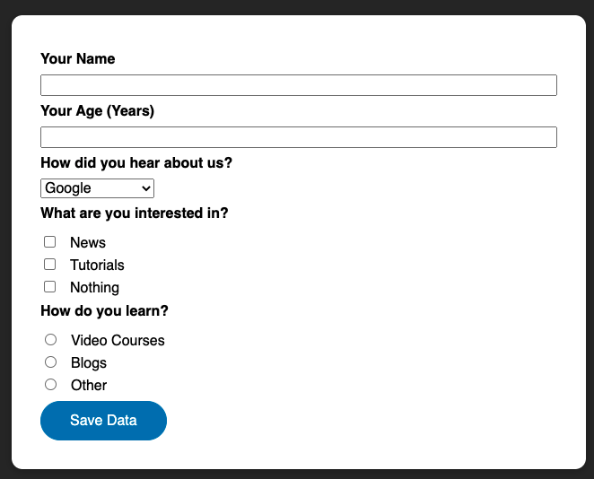
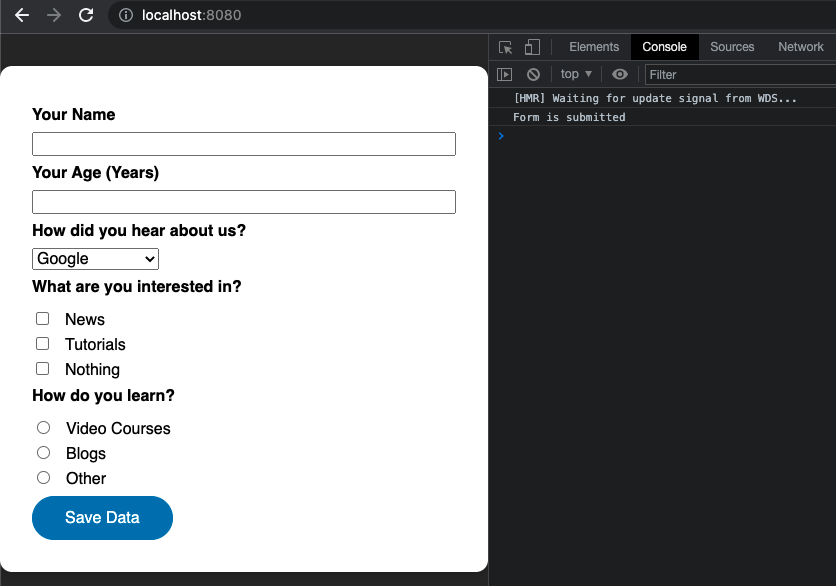
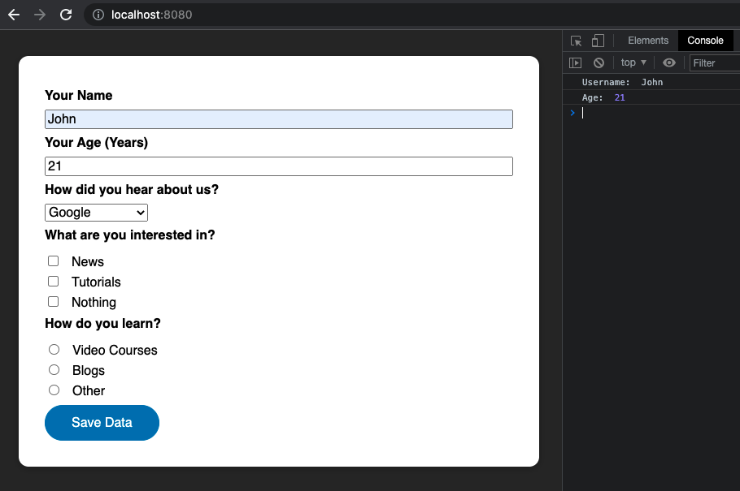
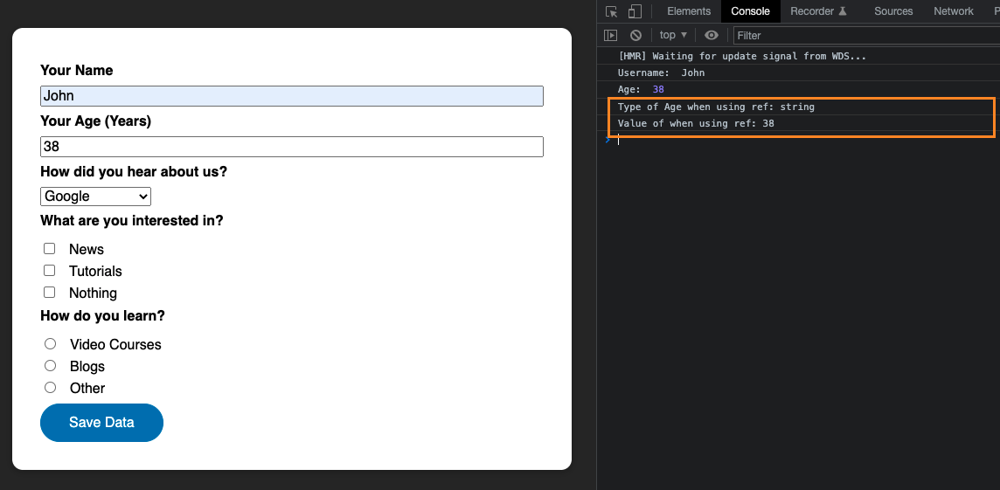
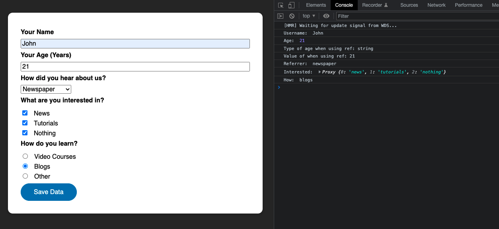
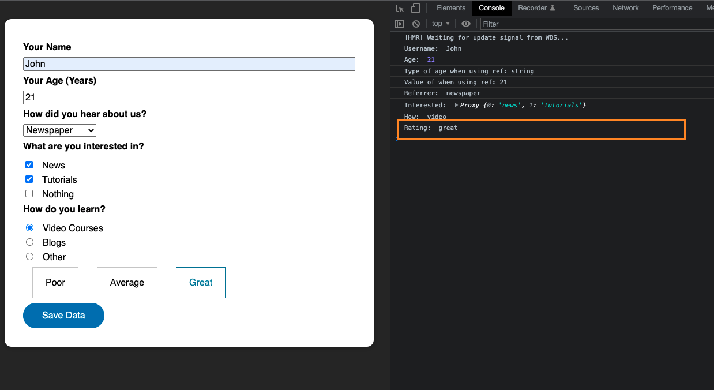

# Working with Form

## Preparing

Download starting source code at https://gitlab.com/pav-training-program/source-code/vue-starting-source-code/-/tree/main/working-with-form and start the application with below commands:

```sh
npm install
npm run serve
```

The application is just a simple form



This form contains common HTML elements that you usually use them in projects. In this chapter, we will learn how to work with them in Vue.

## Handling Submit Form

If you try to enter some text to inputs, and click _Save Data_ to submit the form. You can see that page is reloaded, and all entered data is lost. It is not a good way to handle form submit in Vue.

As we learned in previous chapter, we will use [Event Modifier](./basic-concept.md#working-with-event-modifiers) to handle submit form. At this time, when user submits the form, use just output a log message "*The form is submitted*"

```js
<script>
export default {
  methods: {
    submitForm() {
      console.log('Form is submitted');
    }
  }
}
</script>
```

> File *working-with-form/src/components/TheForm.vue*

```vue
<template>
  <form @submit.prevent="submitForm">
    <!-- Keep current form elements -->
    ....
  </form>
</template>

<script>
export default {
  methods: {
    submitForm() {
      console.log("Form is submitted");
    },
  },
};
</script>

<style scoped>
/* Keep current css */
...
</style>
```

Now, if you submit form (click on button Save Data), you can see log message "Form is submitted", and page will not be reloaded.



## Handling input with *v-model*

Easiest way to set-get data for inputs that using [v-model](./basic-concept.md#two-way-binding-with-v-model). Let use *v-model* to get inputs data (name, age) in _submitForm_ methods.

> File *working-with-form/src/components/TheForm.vue*

```vue
<template>
  <form @submit.prevent="submitForm">
    <div class="form-control">
      <label for="user-name">Your Name</label>
      <input id="user-name" name="user-name" type="text" v-model="userName" />
    </div>
    <div class="form-control">
      <label for="age">Your Age (Years)</label>
      <input id="age" name="age" type="number" v-model="age" />
    </div>
    <div class="form-control">
      <label for="referrer">How did you hear about us?</label>
      <select id="referrer" name="referrer">
        <option value="google">Google</option>
        <option value="wom">Word of mouth</option>
        <option value="newspaper">Newspaper</option>
      </select>
    </div>
    <div class="form-control">
      <h2>What are you interested in?</h2>
      <div>
        <input id="interest-news" name="interest" type="checkbox" />
        <label for="interest-news">News</label>
      </div>
      <div>
        <input id="interest-tutorials" name="interest" type="checkbox" />
        <label for="interest-tutorials">Tutorials</label>
      </div>
      <div>
        <input id="interest-nothing" name="interest" type="checkbox" />
        <label for="interest-nothing">Nothing</label>
      </div>
    </div>
    <div class="form-control">
      <h2>How do you learn?</h2>
      <div>
        <input id="how-video" name="how" type="radio" />
        <label for="how-video">Video Courses</label>
      </div>
      <div>
        <input id="how-blogs" name="how" type="radio" />
        <label for="how-blogs">Blogs</label>
      </div>
      <div>
        <input id="how-other" name="how" type="radio" />
        <label for="how-other">Other</label>
      </div>
    </div>
    <div>
      <button>Save Data</button>
    </div>
  </form>
</template>

<script>
export default {
  data() {
    return {
      userName: "",
      age: null,
    };
  },
  methods: {
    submitForm() {
      console.log("Username: ", this.userName);
      console.log("Age: ", this.age);
    },
  },
};
</script>

<style scoped>
.../* Keep style as current */;
</style>
```

After updated, try to input name, age and click _Save Data_ to submit form, you can see these value show in console log



## v-model Modifiers

*v-model.lazy*: By default, *v-model* syncs the input with the data after each _input_ event. You can add the lazy modifier to instead sync after _change_ events:

*v-model.number*: If you want user input to be automatically typecast as a Number, you can add the number modifier to your *v-model* managed inputs. For example, you can change the input for _Age_:

```html
<input id="age" name="age" type="number" v-model.number="age" />
```

*v-model.trim*: If you want whitespace from user input to be trimmed automatically, you can add the trim modifier to your v-model-managed *Your Name* like:

```html
<input id="user-name" name="user-name" type="text" v-model.trim="userName" />
```

## Understanding about using refs.

When you use *ref* to get value, it always return data type String. You can confirm it by use *ref* for *input* Age.

```html
<input id="age" name="age" type="number" v-model.number="age" ref="age" />
```

Update method *submitForm* to get data.

```js
submitForm() {
  console.log("Username: ", this.userName);
  console.log("Age: ", this.age);
  console.log("Type of Age when using ref:", typeof this.$refs.age.value);
  console.log("Value of when using ref:", this.$refs.age.value);
}
```

Now, enter a number to *Age* input and submit form, you can see logs in console:



As above screenshot, you can see that when using *ref*, the data type is string (when using v-model, it's number).

## Handling dropdown with v-model

We also can handle dropdown with *v-model*, it is the same with inputs.

You can update select box (dropdown box) as below:

```html
<select id="referrer" name="referrer" v-model="referrer">
  <option value="google">Google</option>
  <option value="wom">Word of mouth</option>
  <option value="newspaper">Newspaper</option>
</select>
```

And define data to manage the value of the select box

```js
return {
  userName: "",
  age: null,
  referrer: "newspaper", // set default selected is newspaper
};
```

Now you can access to the value of the select box in _submitForm_ method

```js
submitForm() {
  console.log("Username: ", this.userName);
  console.log("Age: ", this.age);
  console.log("Type of Age when using ref:", typeof this.$refs.age.value);
  console.log("Value of when using ref:", this.$refs.age.value);
  console.log("Referrer: ", this.referrer);
}
```

## Handling checkboxes and radio buttons with v-model

Using *v-model* with checkboxes and radio buttons are almost the same with input and select box. But because checkboxes is multiple choices, so that we need an array to contains checkbox's values. 

> File *working-with-form/src/components/TheForm.vue*
```vue
<template>
  <form @submit.prevent="submitForm">
    <div class="form-control">
      <label for="user-name">Your Name</label>
      <input id="user-name" name="user-name" type="text" v-model.trim="userName" />
    </div>
    <div class="form-control">
      <label for="age">Your Age (Years)</label>
      <input id="age" name="age" type="number" v-model.number="age" ref="age" />
    </div>
    <div class="form-control">
      <label for="referrer">How did you hear about us?</label>
      <select id="referrer" name="referrer" v-model="referrer">
        <option value="google">Google</option>
        <option value="wom">Word of mouth</option>
        <option value="newspaper">Newspaper</option>
      </select>
    </div>
    <div class="form-control">
      <h2>What are you interested in?</h2>
      <div>
        <input id="interest-news" name="interest" type="checkbox" value="news" v-model="interest" />
        <label for="interest-news">News</label>
      </div>
      <div>
        <input id="interest-tutorials" name="interest" type="checkbox" value="tutorials" v-model="interest" />
        <label for="interest-tutorials">Tutorials</label>
      </div>
      <div>
        <input id="interest-nothing" name="interest" type="checkbox" value="nothing" v-model="interest" />
        <label for="interest-nothing">Nothing</label>
      </div>
    </div>
    <div class="form-control">
      <h2>How do you learn?</h2>
      <div>
        <input id="how-video" name="how" value="video" type="radio" v-model="how" />
        <label for="how-video">Video Courses</label>
      </div>
      <div>
        <input id="how-blogs" name="how" value="blogs" type="radio" v-model="how" />
        <label for="how-blogs">Blogs</label>
      </div>
      <div>
        <input id="how-other" name="how" value="others" type="radio" v-model="how" />
        <label for="how-other">Other</label>
      </div>
    </div>
    <div>
      <button>Save Data</button>
    </div>
  </form>
</template>

<script>
export default {
  data() {
    return {
      userName: '',
      age: '',
      referrer: "newspaper", // set default selected is newspaper
      interest: [],
      how: null,
    }
  },
  methods: {
    submitForm() {
      console.log("Username: ", this.userName);
      console.log("Age: ", this.age);
      console.log("Type of age when using ref:", typeof this.$refs.age.value);
      console.log("Value of when using ref:", this.$refs.age.value);
      console.log("Referrer: ", this.referrer);
      console.log("Interested: ", this.interest);
      console.log("How: ", this.how);
    }
  }
}
</script>

<style scoped>
....
</style>
```

Now, fill information into the form and submit, you can see form data show in console log. 



In this chapter, we just learn how to get-set form data. We will learn how to submit form data to server side in next chapter.

## Form Validation

The basic way that you can use event binder such *@blur, @change* to validate an input. 

Example, for the form validation, we will show a message "Your name is invalid* if the input *Your Name* is empty

```vue
<template>
  <form @submit.prevent="submitForm">
    <div class="form-control">
      <label for="user-name">Your Name</label>
      <input id="user-name" name="user-name" type="text" v-model.trim="userName" @blur="validateInput" />
      <p v-if="isNameValid === false">Your name is invalid</p>
    </div>
    ...
    <!-- keep old HTML here !-->
  </form>
</template>

<script>
export default {
  data() {
    return {
      userName: '',
      age: '',
      referrer: "newspaper", // set default selected is newspaper
      interest: [],
      how: null,
      isNameValid: true,
    }
  },
  methods: {
    submitForm() {
      console.log("Username: ", this.userName);
      console.log("Age: ", this.age);
      console.log("Type of age when using ref:", typeof this.$refs.age.value);
      console.log("Value of when using ref:", this.$refs.age.value);
      console.log("Referrer: ", this.referrer);
      console.log("Interested: ", this.interest);
      console.log("How: ", this.how);
    },
    validateInput() {
      if (this.userName.length === 0) {
        this.isNameValid = false;
      } else {
        this.isNameValid = true;
      }
    }
  }
}
</script>

<style scoped>
....
/* Keel old css here */
</style>
```

Now, open the form, if you let *Your Name* blank and focus-out the input, you can see error message.


## *v-model* with custom component

Suppose that we have a component for rating with 3 options *Poor, Average, Great*

> File **
```vue
<template>
  <ul>
    <li :class="{active: activeOption === 'poor'}">
      <button type="button" @click="activate('poor')">Poor</button>
    </li>
    <li :class="{active: activeOption === 'average'}">
      <button type="button" @click="activate('average')">Average</button>
    </li>
    <li :class="{active: activeOption === 'great'}">
      <button type="button" @click="activate('great')">Great</button>
    </li>
  </ul>
</template>

<script>
export default {
  data() {
    return {
      activeOption: null,
    };
  },
  methods: {
    activate(option) {
      this.activeOption = option;
    },
  },
};
</script>

<style scoped>
.active {
  border-color: #007ba0;
}

.active button {
  color: #007ba0;
}

ul {
  list-style: none;
  margin: 0.5rem 0;
  padding: 0;
  display: flex;
}

li {
  margin: 0 1rem;
  border: 1px solid #ccc;
  padding: 1rem;
  display: flex;
  justify-content: center;
  align-items: center;
}

button {
  font: inherit;
  border: none;
  background-color: transparent;
  cursor: pointer;
}
</style>
```

Now, if you want to use this Component in the form. Then how to get-set value from the component when user select  *Poor/Average/Great*

Firs, let use *v-model* as a normal input

```html
<rating-control v-model="rating"></rating-control>
```

By using *v-model*, it implicitly pass *model-value* and custom event *@update:modelValue* to *rating-control*. It is the same with `<rating-control :model-value="" @update:modelValue="">`

And inside the component *RatingControl*, we just handle the *prop* and *emitting custom event*. You can check how to emit custom event again [here](./component-communication.md#emitting-custom-events)

> File *working-with-form/src/components/RatingControl.vue*
```vue
<template>
  <ul>
    <li :class="{active: modelValue === 'poor'}">
      <button type="button" @click="activate('poor')">Poor</button>
    </li>
    <li :class="{active: modelValue === 'average'}">
      <button type="button" @click="activate('average')">Average</button>
    </li>
    <li :class="{active: modelValue === 'great'}">
      <button type="button" @click="activate('great')">Great</button>
    </li>
  </ul>
</template>

<script>
export default {
  props: ['modelValue'],
  emits: ['update:modelValue'],
  methods: {
    activate(option) {
      this.$emit('update:modelValue', option);
    },
  },
};
</script>
<style scoped>
...
/* Keep old CSS here */
</style>
```

Then in *TheForm* component, we can use *v-model* for *RatingControl*
> File 
```vue
<template>
  <form @submit.prevent="submitForm">
    <div class="form-control">
      <label for="user-name">Your Name</label>
      <input id="user-name" name="user-name" type="text" v-model.trim="userName" @blur="validateInput" />
      <p v-if="isNameValid === false">Your name is invalid</p>
    </div>
    <div class="form-control">
      <label for="age">Your Age (Years)</label>
      <input id="age" name="age" type="number" v-model.number="age" ref="age" />
    </div>
    <div class="form-control">
      <label for="referrer">How did you hear about us?</label>
      <select id="referrer" name="referrer" v-model="referrer">
        <option value="google">Google</option>
        <option value="wom">Word of mouth</option>
        <option value="newspaper">Newspaper</option>
      </select>
    </div>
    <div class="form-control">
      <h2>What are you interested in?</h2>
      <div>
        <input id="interest-news" name="interest" type="checkbox" value="news" v-model="interest" />
        <label for="interest-news">News</label>
      </div>
      <div>
        <input id="interest-tutorials" name="interest" type="checkbox" value="tutorials" v-model="interest" />
        <label for="interest-tutorials">Tutorials</label>
      </div>
      <div>
        <input id="interest-nothing" name="interest" type="checkbox" value="nothing" v-model="interest" />
        <label for="interest-nothing">Nothing</label>
      </div>
    </div>
    <div class="form-control">
      <h2>How do you learn?</h2>
      <div>
        <input id="how-video" name="how" value="video" type="radio" v-model="how" />
        <label for="how-video">Video Courses</label>
      </div>
      <div>
        <input id="how-blogs" name="how" value="blogs" type="radio" v-model="how" />
        <label for="how-blogs">Blogs</label>
      </div>
      <div>
        <input id="how-other" name="how" value="others" type="radio" v-model="how" />
        <label for="how-other">Other</label>
      </div>
    </div>
    <div class="form-control">
      <rating-control v-model="rating"></rating-control>
    </div>
    <div>
      <button>Save Data</button>
    </div>
  </form>
</template>

<script>
import RatingControl from './RatingControl.vue';

export default {
  components: {
    RatingControl
  },
  data() {
    return {
      userName: '',
      age: '',
      referrer: "newspaper", // set default selected is newspaper
      interest: [],
      how: null,
      isNameValid: true,
      rating: null,
    }
  },
  methods: {
    submitForm() {
      console.log("Username: ", this.userName);
      console.log("Age: ", this.age);
      console.log("Type of age when using ref:", typeof this.$refs.age.value);
      console.log("Value of when using ref:", this.$refs.age.value);
      console.log("Referrer: ", this.referrer);
      console.log("Interested: ", this.interest);
      console.log("How: ", this.how);
      console.log("Rating: ", this.rating);
    },
    validateInput() {
      if (this.userName.length === 0) {
        this.isNameValid = false;
      } else {
        this.isNameValid = true;
      }
    }
  }
}
</script>

<style scoped>
......
</style>
```

Open the form to confirm the result, you see that we can set and get value for rating.



## Exercise

1. Add validation for the input *Your Age*, if age less than 10 or greater than 100, show the error message *Age is invalid* under the input.
2. Add a text area *Comment* and show its value when submit form.

[Next: Sending HTTP Request](./sending-http-request.md)